# LecturaPR - Route Hierarchy & Page Structure

**Last Updated:** October 25, 2025  
**Purpose:** Visual map of all routes, navigation flows, and page relationships in the platform

---

## Route Hierarchy Diagram

```mermaid
graph TB
    subgraph "Public Routes"
        Root["/"]
        Login["/login"]
        Signup["/signup"]
        NotFound["/* - 404"]
    end

    subgraph "Authenticated Routes"
        Profile["/profile"]
        
        subgraph "Student Portal"
            StudentDash["/student-dashboard"]
            Reading["/reading/:exerciseId"]
            VoiceTest["/voice-test"]
            AvailableAssess["/available-assessments"]
        end
        
        subgraph "Teacher Portal"
            TeacherDash["/teacher-dashboard"]
            TeacherAssess["/teacher-assessments"]
            ClassView["/class-view"]
        end
        
        subgraph "Admin Portal"
            AdminDash["/admin-dashboard"]
            CreateAssess["/create-assessment"]
            ViewAssess1["/assessment/:id"]
            ViewAssess2["/view-assessment/:id"]
            PDFDemo["/pdf-demo"]
            PDFView["/pdf-viewer"]
            GenContent["/generate-content"]
            GenContentAdmin["/generate-content-admin"]:::orphan
        end
        
        subgraph "Family Portal"
            FamilyDash["/family-dashboard"]
        end
        
        subgraph "Utility Pages"
            DemoUsers["/create-demo-users"]
        end
    end

    %% Navigation from Root
    Root -->|Guest| Login
    Root -->|Guest| Signup
    Root -->|Authenticated| StudentDash
    Root -->|Authenticated| TeacherDash
    Root -->|Authenticated| AdminDash
    Root -->|Authenticated| FamilyDash

    %% Student Portal Flow
    StudentDash --> Reading
    StudentDash --> VoiceTest
    StudentDash --> AvailableAssess

    %% Teacher Portal Flow
    TeacherDash --> TeacherAssess
    TeacherDash --> ClassView
    TeacherAssess --> ViewAssess1

    %% Admin Portal Flow
    AdminDash --> CreateAssess
    AdminDash --> ViewAssess1
    AdminDash --> PDFDemo
    AdminDash --> TeacherAssess
    CreateAssess --> ViewAssess1
    PDFDemo --> PDFView

    %% Header Navigation (All Roles)
    StudentDash -.-> Profile
    TeacherDash -.-> Profile
    AdminDash -.-> Profile
    FamilyDash -.-> Profile

    %% Orphaned/Isolated Pages
    GenContent:::orphan
    GenContentAdmin:::orphan

    classDef orphan fill:#ff6b6b,stroke:#c92a2a,color:#fff
    classDef duplicate fill:#ffd43b,stroke:#fab005,color:#000
    
    class ViewAssess2 duplicate
```



---

## Critical Findings

### 🔴 Orphaned Pages (Not Accessible via Navigation)

1. **`/generate-content-admin`** ⚠️ **CRITICAL**
   - **What:** AI-powered content generation interface
   - **Impact:** Main content creation tool is inaccessible
   - **Current Access:** Direct URL only
   - **Recommended Fix:** Add to Admin Dashboard quick actions

2. **`/generate-content`**
   - **What:** Alternative content generation page
   - **Status:** Unclear purpose vs. `/generate-content-admin`
   - **Recommended Action:** Clarify purpose or deprecate

3. **`/available-assessments`**
   - **What:** Assessment browsing interface
   - **Impact:** Students/teachers cannot discover assessments
   - **Recommended Fix:** Add to Student Dashboard or Teacher Dashboard

### 🟡 Duplicate Routes

- **`/assessment/:id`** and **`/view-assessment/:id`**
  - Both render `ViewAssessment` component
  - Creates confusion in navigation
  - **Recommended Fix:** Consolidate to single route

---

## Route Categories

### Public Routes (No Authentication Required)
| Route | Component | Purpose |
|-------|-----------|---------|
| `/` | Index | Landing page with role detection |
| `/login` | Login | User authentication |
| `/signup` | Signup | New user registration |
| `/*` | NotFound | 404 error page |

### Student Routes
| Route | Component | Purpose | Navigation From |
|-------|-----------|---------|------------------|
| `/student-dashboard` | StudentDashboard | Student home | Header, Index |
| `/reading/:exerciseId` | ReadingExercise | Interactive reading | Student Dashboard |
| `/voice-test` | VoiceTest | Voice recognition practice | Student Dashboard |
| `/available-assessments` | AvailableAssessments | Browse assessments | **ORPHANED** |

### Teacher Routes
| Route | Component | Purpose | Navigation From |
|-------|-----------|---------|------------------|
| `/teacher-dashboard` | TeacherDashboard | Teacher home | Header, Index |
| `/teacher-assessments` | TeacherAssessments | Manage assessments | Teacher Dashboard, Admin Dashboard |
| `/class-view` | ClassView | Student progress | Teacher Dashboard |

### Admin Routes
| Route | Component | Purpose | Navigation From |
|-------|-----------|---------|------------------|
| `/admin-dashboard` | AdminDashboard | Admin home | Header, Index |
| `/create-assessment` | CreateAssessment | Assessment builder | Admin Dashboard (opens in new tab) |
| `/assessment/:id` | ViewAssessment | View/edit assessment | Admin Dashboard, Teacher Assessments (opens in new tab) |
| `/view-assessment/:id` | ViewAssessment | **DUPLICATE** | (duplicate of above) |
| `/pdf-demo` | PDFDemo | Upload/process PDFs | Admin Dashboard (opens in new tab) |
| `/pdf-viewer` | PDFViewer | View PDF content | PDF Demo |
| `/generate-content` | GenerateContent | Content generator | **ORPHANED** |
| `/generate-content-admin` | GenerateContentAdmin | **AI Content Generator** | **ORPHANED** ⚠️ |

### Family Routes
| Route | Component | Purpose | Navigation From |
|-------|-----------|---------|------------------|
| `/family-dashboard` | FamilyDashboard | Family home | Header, Index |

### Utility Routes
| Route | Component | Purpose | Navigation From |
|-------|-----------|---------|------------------|
| `/profile` | Profile | User settings | Header dropdown (all roles) |
| `/create-demo-users` | CreateDemoUsers | Demo data setup | Direct URL only |

---

## Navigation Flow Analysis

### Header Navigation (Global)
**Available to all authenticated users:**
- Logo → Role-based dashboard
- Profile → `/profile`
- Sign Out → `/login`
- Student-specific: "Reset Progress" action

**Role-specific links:**
- **Student:** Dashboard, Voice Practice
- **Teacher:** Dashboard, Classes, Assessments
- **Admin:** Dashboard, Assessments, PDF Upload, **Content Generator** (missing)
- **Family:** Dashboard

### Dashboard Quick Actions

#### Admin Dashboard Actions
```typescript
// Current quick actions (line 304-324)
[
  { title: "Create Assessment", path: "/create-assessment" },
  { title: "View Assessments", path: "/teacher-assessments" },
  { title: "Upload PDF", path: "/pdf-demo" },
  // MISSING: { title: "Generate AI Content", path: "/generate-content-admin" }
]
```

---

## Recent Changes (Last Diff)

**Admin Dashboard navigation updated to open in new tabs:**
- Edit Assessment → Opens in new tab
- Quick action cards → Open in new tab
- Create New Assessment → Opens in new tab
- View Assessment cards → Open in new tab
- Upload PDF actions → Open in new tab

**Impact:** Multi-tab workflow for admin users, allows parallel work on multiple assessments/PDFs.

---

## Recommendations

### Priority 1: Fix Critical Orphaned Pages

1. **Add `/generate-content-admin` to Admin Dashboard**
   ```tsx
   // In AdminDashboard.tsx quick actions
   {
     title: t("Generar Contenido IA", "Generate AI Content"),
     description: t("Crear ejercicios con IA", "Create exercises with AI"),
     icon: Sparkles,
     path: "/generate-content-admin",
     color: "text-purple-500"
   }
   ```

2. **Add `/generate-content-admin` to Header navigation**
   ```tsx
   // In Header.tsx for admin users
   { label: "AI Content", href: "/generate-content-admin", icon: Sparkles }
   ```

### Priority 2: Consolidate Duplicate Routes

1. **Remove `/view-assessment/:id`**
   - Update all references to use `/assessment/:id`
   - Remove duplicate route definition

### Priority 3: Integrate Available Assessments

1. **Add to Student Dashboard**
   - Link from "Browse Assessments" card
   
2. **Add to Teacher Dashboard**
   - Link from "Available Resources" section

### Priority 4: Clarify Content Generation Routes

**Option A:** Deprecate `/generate-content`
- Keep only `/generate-content-admin`
- Update all references

**Option B:** Differentiate by role
- `/generate-content` → Student/teacher simplified version
- `/generate-content-admin` → Admin advanced version

---

## Architecture Notes

### Role-Based Access Control
- **Implementation:** `AuthContext` with role checking
- **Navigation:** `Header.tsx` uses `has_role()` function
- **Protection:** Routes rely on authentication state, not explicit guards

### Multi-Tab Admin Workflow
- Admin dashboard actions open in new tabs
- Allows parallel work on multiple resources
- Implemented via `window.open(path, '_blank')`

### Dynamic Route Parameters
- `:exerciseId` → Reading exercise selection
- `:id` → Assessment identification
- No route validation on invalid IDs (404 handled by component)

---

## Navigation Map Summary

```
Total Routes: 24
├── Public: 4
├── Student: 4 (1 orphaned)
├── Teacher: 3
├── Admin: 9 (2 orphaned, 1 duplicate)
├── Family: 1
└── Utility: 2

Navigation Coverage:
✅ Well-connected: 18 routes
⚠️ Orphaned: 3 routes
🔄 Duplicate: 1 route (2 paths)
```

---

## Files Referenced

- `src/App.tsx` - Route definitions (lines 40-85)
- `src/components/Header.tsx` - Global navigation (lines 37-325)
- `src/pages/AdminDashboard.tsx` - Admin quick actions (lines 304-324, 247-642)

---

**Next Steps:**
1. Add `/generate-content-admin` to Admin Dashboard and Header
2. Remove duplicate `/view-assessment/:id` route
3. Integrate `/available-assessments` into Student/Teacher dashboards
4. Document or deprecate `/generate-content` vs `/generate-content-admin`
