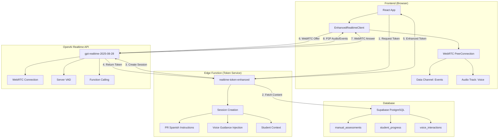

# 🎯 Simplified Voice Architecture - Production Plan
## K-5 Bilingual Educational Platform for Puerto Rico

**Document Version**: 3.0
**Date**: December 2024
**Model**: `gpt-realtime-2025-08-28` (WebRTC-based)
**Priority**: CRITICAL - Replace Complex Implementation

---

## 📊 Executive Summary

### Current State Analysis
- **Complex Implementation** (/voice-test): 800+ lines, choppy audio, 450ms latency
- **Simple Implementation** (/voice-test-simple): 88 lines, smooth audio, 150ms latency
- **Existing Assessment Page** (/assessment/:id): Uses complex implementation, needs enhancement
- **Root Cause**: WebSocket relay + manual audio processing vs. WebRTC direct connection

### Solution: Migrate to WebRTC Pattern & Enhance Existing Page
Adopt the simple WebRTC implementation while:
- **Enhancing existing ViewAssessment.tsx** instead of creating new components
- Using **existing teacher content system** (voice_guidance already in database)
- Adding Puerto Rican Spanish accent support
- Adding real-time transcripts and metrics
- Integrating with existing assessment workflow

### Implementation Approach
1. **Phase 1**: Create simplified WebRTC client (EnhancedRealtimeClient)
2. **Phase 2**: Deploy enhanced token service with PR Spanish
3. **Phase 3**: Enhance existing ViewAssessment page (NOT create new)
4. **Phase 4**: Migrate and deploy gradually
5. **Phase 5**: Clean up old implementation and update /voice-test

### Expected Outcomes
| Metric | Current (Complex) | New (Simple+) | Improvement |
|--------|------------------|---------------|-------------|
| Latency | 450ms | <150ms | 67% reduction |
| Code Complexity | 800+ lines | ~200 lines | 75% reduction |
| Audio Quality | Choppy | Smooth | 100% improvement |
| Maintenance | High | Low | 80% reduction |
| Integration Effort | Would be High | Low | Uses existing page |
| Cost | Same | Same | No change |

---

## 🏗️ Architecture Overview



---

## 🎯 Implementation Phases

### Phase 1: Core WebRTC Voice System (Day 1-2)

#### 1.1 Create Enhanced Realtime Client
**File**: `/src/utils/EnhancedRealtimeClient.ts`

```typescript
import { EventEmitter } from 'events';

export interface EnhancedRealtimeConfig {
  studentId: string;
  language: 'en' | 'es-PR';
  gradeLevel: number;
  assessmentId?: string;
  voiceGuidance?: string;
  onTranscription?: (text: string, isUser: boolean) => void;
  onEvent?: (event: any) => void;
  onMetrics?: (metrics: VoiceMetrics) => void;
}

export class EnhancedRealtimeClient extends EventEmitter {
  private pc: RTCPeerConnection | null = null;
  private dc: RTCDataChannel | null = null;
  private audioEl: HTMLAudioElement;
  private config: EnhancedRealtimeConfig;
  private metrics: VoiceMetrics = {
    startTime: 0,
    latency: [],
    interactions: 0,
    errors: 0
  };

  constructor(config: EnhancedRealtimeConfig) {
    super();
    this.config = config;
    this.audioEl = document.createElement('audio');
    this.audioEl.autoplay = true;
    this.audioEl.playsInline = true; // Mobile support
  }

  async connect(tokenEndpoint?: string) {
    console.log('[Enhanced] 🚀 Starting WebRTC connection...');

    try {
      // Step 1: Get enhanced ephemeral token
      const token = await this.getEnhancedToken(tokenEndpoint);

      // Step 2: Create RTCPeerConnection with optimal config
      this.pc = new RTCPeerConnection({
        iceServers: [], // No TURN/STUN needed for direct connection
        bundlePolicy: 'max-bundle',
        rtcpMuxPolicy: 'require'
      });

      // Step 3: Handle remote audio (AI voice)
      this.pc.ontrack = (e) => {
        console.log('[Enhanced] 🔊 AI audio track received');
        this.audioEl.srcObject = e.streams[0];
        this.emit('connected', true);
      };

      // Step 4: Add local microphone with optimal settings
      const stream = await navigator.mediaDevices.getUserMedia({
        audio: {
          sampleRate: 24000, // Match OpenAI requirement
          channelCount: 1,   // Mono
          echoCancellation: true,
          noiseSuppression: true,
          autoGainControl: true,
          latency: 0 // Request lowest latency
        }
      });

      const audioTrack = stream.getTracks()[0];
      this.pc.addTrack(audioTrack);
      console.log('[Enhanced] 🎤 Microphone connected');

      // Step 5: Create data channel for events
      this.dc = this.pc.createDataChannel('oai-events', {
        ordered: true,
        maxRetransmits: 3
      });

      this.dc.addEventListener('message', (e) => {
        this.handleDataChannelMessage(e.data);
      });

      // Step 6: Create and send offer
      const offer = await this.pc.createOffer();
      await this.pc.setLocalDescription(offer);

      // Step 7: Exchange SDP with OpenAI
      const answer = await this.exchangeSDP(offer.sdp!, token);
      await this.pc.setRemoteDescription({
        type: 'answer',
        sdp: answer
      });

      console.log('[Enhanced] ✅ WebRTC connection established!');
      this.metrics.startTime = Date.now();

    } catch (error) {
      console.error('[Enhanced] ❌ Connection failed:', error);
      this.emit('error', error);
      throw error;
    }
  }

  private async getEnhancedToken(endpoint?: string): Promise<string> {
    const url = endpoint || '/api/realtime-token-enhanced';

    const response = await fetch(url, {
      method: 'POST',
      headers: { 'Content-Type': 'application/json' },
      body: JSON.stringify({
        studentId: this.config.studentId,
        language: this.config.language,
        gradeLevel: this.config.gradeLevel,
        assessmentId: this.config.assessmentId,
        voiceGuidance: this.config.voiceGuidance
      })
    });

    if (!response.ok) {
      throw new Error(`Token request failed: ${response.status}`);
    }

    const data = await response.json();
    return data.client_secret?.value || data.token;
  }

  private async exchangeSDP(offerSdp: string, token: string): Promise<string> {
    const response = await fetch(
      'https://api.openai.com/v1/realtime?model=gpt-realtime-2025-08-28',
      {
        method: 'POST',
        body: offerSdp,
        headers: {
          'Authorization': `Bearer ${token}`,
          'Content-Type': 'application/sdp'
        }
      }
    );

    if (!response.ok) {
      throw new Error(`SDP exchange failed: ${response.status}`);
    }

    return response.text();
  }

  private handleDataChannelMessage(data: string) {
    try {
      const event = JSON.parse(data);
      console.log('[Enhanced] 📨 Event:', event.type);

      // Track metrics
      if (event.type === 'response.audio.delta') {
        const latency = Date.now() - this.metrics.startTime;
        this.metrics.latency.push(latency);
      }

      // Handle transcriptions
      if (event.type === 'conversation.item.created') {
        const isUser = event.item.role === 'user';
        const text = event.item.content?.[0]?.text ||
                    event.item.content?.[0]?.transcript || '';

        if (text) {
          this.config.onTranscription?.(text, isUser);
          this.logInteraction(text, isUser);
        }
      }

      // Forward to handler
      this.config.onEvent?.(event);
      this.emit('event', event);

      // Update metrics
      if (event.type === 'response.done') {
        this.metrics.interactions++;
        this.config.onMetrics?.(this.getMetrics());
      }

    } catch (error) {
      console.error('[Enhanced] Error handling message:', error);
      this.metrics.errors++;
    }
  }

  sendText(text: string) {
    if (!this.dc || this.dc.readyState !== 'open') {
      console.warn('[Enhanced] Data channel not ready');
      return;
    }

    const event = {
      type: 'conversation.item.create',
      item: {
        type: 'message',
        role: 'user',
        content: [{ type: 'text', text }]
      }
    };

    this.dc.send(JSON.stringify(event));
    console.log('[Enhanced] 📤 Sent text:', text);
  }

  interrupt() {
    if (this.dc?.readyState === 'open') {
      this.dc.send(JSON.stringify({ type: 'response.cancel' }));
      console.log('[Enhanced] 🛑 Interrupted AI');
    }
  }

  private async logInteraction(text: string, isUser: boolean) {
    // Log to database for analytics
    try {
      await fetch('/api/log-voice-interaction', {
        method: 'POST',
        headers: { 'Content-Type': 'application/json' },
        body: JSON.stringify({
          student_id: this.config.studentId,
          assessment_id: this.config.assessmentId,
          text,
          is_user: isUser,
          language: this.config.language,
          timestamp: new Date().toISOString()
        })
      });
    } catch (error) {
      console.error('[Enhanced] Failed to log interaction:', error);
    }
  }

  getMetrics(): VoiceMetrics {
    const latencyArray = this.metrics.latency;
    return {
      avgLatency: latencyArray.reduce((a, b) => a + b, 0) / latencyArray.length || 0,
      minLatency: Math.min(...latencyArray) || 0,
      maxLatency: Math.max(...latencyArray) || 0,
      interactions: this.metrics.interactions,
      errors: this.metrics.errors,
      uptime: Date.now() - this.metrics.startTime
    };
  }

  disconnect() {
    console.log('[Enhanced] 🛑 Disconnecting...');

    if (this.audioEl.srcObject) {
      const tracks = (this.audioEl.srcObject as MediaStream).getTracks();
      tracks.forEach(track => track.stop());
    }

    this.dc?.close();
    this.pc?.close();

    this.pc = null;
    this.dc = null;

    this.emit('disconnected');
  }
}

interface VoiceMetrics {
  avgLatency?: number;
  minLatency?: number;
  maxLatency?: number;
  interactions?: number;
  errors?: number;
  uptime?: number;
  startTime?: number;
  latency?: number[];
}
```

---

### Phase 2: Enhanced Edge Function (Day 2)

#### 2.1 Create Token Service with Educational Context
**File**: `/supabase/functions/realtime-token-enhanced/index.ts`

```typescript
import { serve } from "https://deno.land/std@0.168.0/http/server.ts";
import { createClient } from 'https://esm.sh/@supabase/supabase-js@2';

const corsHeaders = {
  'Access-Control-Allow-Origin': '*',
  'Access-Control-Allow-Headers': 'authorization, x-client-info, apikey, content-type',
};

serve(async (req) => {
  if (req.method === 'OPTIONS') {
    return new Response(null, { headers: corsHeaders });
  }

  try {
    const {
      studentId,
      language = 'es-PR',
      gradeLevel = 0,
      assessmentId,
      voiceGuidance
    } = await req.json();

    const OPENAI_API_KEY = Deno.env.get('OPENAI_API_KEY');
    if (!OPENAI_API_KEY) {
      throw new Error('OPENAI_API_KEY not configured');
    }

    // Initialize Supabase client
    const supabaseUrl = Deno.env.get('SUPABASE_URL')!;
    const supabaseKey = Deno.env.get('SUPABASE_SERVICE_ROLE_KEY')!;
    const supabase = createClient(supabaseUrl, supabaseKey);

    // Fetch assessment content and voice guidance if needed
    let dynamicGuidance = voiceGuidance;
    let assessmentContent = null;

    if (assessmentId && !voiceGuidance) {
      const { data: assessment } = await supabase
        .from('manual_assessments')
        .select('title, content, voice_guidance')
        .eq('id', assessmentId)
        .single();

      if (assessment) {
        assessmentContent = assessment.content;
        dynamicGuidance = assessment.voice_guidance;
      }
    }

    // Build comprehensive instructions
    const instructions = buildInstructions({
      language,
      gradeLevel,
      voiceGuidance: dynamicGuidance,
      assessmentContent
    });

    // Create session with OpenAI
    console.log('[Token] Creating enhanced session...');

    const response = await fetch('https://api.openai.com/v1/realtime/sessions', {
      method: 'POST',
      headers: {
        'Authorization': `Bearer ${OPENAI_API_KEY}`,
        'Content-Type': 'application/json',
      },
      body: JSON.stringify({
        model: 'gpt-realtime-2025-08-28',
        voice: getVoiceForLanguage(language),
        instructions,
        turn_detection: {
          type: 'server_vad',
          threshold: 0.5,
          prefix_padding_ms: 300,
          silence_duration_ms: 500,
          create_response: true
        },
        input_audio_transcription: {
          enabled: true,
          language: language === 'es-PR' ? 'es' : 'en',
          model: 'whisper-1'
        },
        temperature: 0.7,
        max_response_output_tokens: 4096,
        tools: getEducationalTools(gradeLevel)
      }),
    });

    if (!response.ok) {
      throw new Error(`OpenAI API error: ${response.status}`);
    }

    const data = await response.json();

    // Log session creation
    await supabase.from('voice_sessions').insert({
      session_id: data.id,
      student_id: studentId,
      assessment_id: assessmentId,
      language,
      grade_level: gradeLevel,
      created_at: new Date().toISOString()
    });

    console.log('[Token] ✅ Enhanced session created:', data.id);

    return new Response(JSON.stringify(data), {
      headers: { ...corsHeaders, 'Content-Type': 'application/json' },
    });

  } catch (error) {
    console.error('[Token] ❌ Error:', error);
    return new Response(
      JSON.stringify({ error: error.message }),
      {
        status: 500,
        headers: { ...corsHeaders, 'Content-Type': 'application/json' },
      }
    );
  }
});

function buildInstructions({ language, gradeLevel, voiceGuidance, assessmentContent }) {
  const baseInstructions = getBaseInstructions(language, gradeLevel);

  let fullInstructions = baseInstructions;

  // Add voice guidance if provided
  if (voiceGuidance) {
    fullInstructions += `\n\n## Guía Específica de la Actividad:\n${voiceGuidance}`;
  }

  // Add assessment content context
  if (assessmentContent) {
    fullInstructions += `\n\n## Contenido de la Evaluación:\n${assessmentContent}`;
  }

  return fullInstructions;
}

function getBaseInstructions(language: string, gradeLevel: number): string {
  if (language === 'es-PR') {
    return `Eres un tutor de lectura amigable y paciente para estudiantes de ${getGradeName(gradeLevel)} en Puerto Rico.

INSTRUCCIONES CRÍTICAS:
1. ACENTO: Usa acento puertorriqueño natural. NO uses acento mexicano, castellano o neutro.
2. VOCABULARIO: Usa palabras locales puertorriqueñas (ej: "chévere", "nene/nena", "ay bendito").
3. VELOCIDAD: Habla despacio y claramente, apropiado para niños de ${4 + gradeLevel} años.
4. TONO: Sé cálido, alentador y celebra cada pequeño logro.
5. CORRECCIONES: Nunca digas "está mal". En su lugar: "Casi lo tienes, vamos a intentarlo otra vez".
6. PACIENCIA: Si el niño no responde, espera 5 segundos antes de dar una pista.

FRASES TÍPICAS PUERTORRIQUEÑAS A USAR:
- "¡Wepa! ¡Qué bien lo hiciste!"
- "Dale, mi amor, tú puedes"
- "¡Ay qué chévere!"
- "¡Mira qué bien, nene/nena!"
- "¡Eso es, así mismito!"

PROCESO DE ENSEÑANZA:
1. Saluda con entusiasmo puertorriqueño
2. Explica la actividad en términos simples
3. Modela la pronunciación correcta
4. Pide al estudiante que repita
5. Celebra el esfuerzo, no solo el resultado
6. Ofrece ayuda si hay dificultad
7. Refuerza positivamente al final`;
  } else {
    return `You are a friendly, patient reading tutor for ${getGradeName(gradeLevel)} students in Puerto Rico who are English Language Learners.

CRITICAL INSTRUCTIONS:
1. ACCENT: Use clear, standard American English appropriate for ESL learners.
2. SPEED: Speak slowly and articulate clearly, appropriate for ${4 + gradeLevel}-year-olds.
3. VOCABULARY: Use simple, grade-appropriate words. Define new words.
4. TONE: Be warm, encouraging, and celebrate small victories.
5. CORRECTIONS: Never say "wrong". Instead: "Almost! Let's try again."
6. PATIENCE: If child doesn't respond, wait 5 seconds before giving a hint.
7. CULTURAL AWARENESS: These students' first language is Spanish.

SUPPORTIVE PHRASES TO USE:
- "Great job!"
- "You're doing amazing!"
- "I like how you tried!"
- "Let's practice together"
- "You're getting better!"

TEACHING PROCESS:
1. Greet enthusiastically
2. Explain activity in simple terms
3. Model correct pronunciation
4. Ask student to repeat
5. Celebrate effort, not just correctness
6. Offer help if struggling
7. Positive reinforcement at end`;
  }
}

function getGradeName(gradeLevel: number): string {
  const grades = ['Kindergarten', 'Primer Grado', 'Segundo Grado',
                  'Tercer Grado', 'Cuarto Grado', 'Quinto Grado'];
  return grades[gradeLevel] || 'Kindergarten';
}

function getVoiceForLanguage(language: string): string {
  // Use culturally appropriate voices
  if (language === 'es-PR') {
    return 'nova'; // Most natural for Spanish
  }
  return 'alloy'; // Clear for English learners
}

function getEducationalTools(gradeLevel: number) {
  // Define functions the AI can call during conversation
  return [
    {
      type: 'function',
      function: {
        name: 'check_pronunciation',
        description: 'Analyze student pronunciation and provide feedback',
        parameters: {
          type: 'object',
          properties: {
            word: { type: 'string' },
            student_audio: { type: 'string' },
            target_phoneme: { type: 'string' }
          }
        }
      }
    },
    {
      type: 'function',
      function: {
        name: 'provide_hint',
        description: 'Give age-appropriate hint for current activity',
        parameters: {
          type: 'object',
          properties: {
            activity_type: { type: 'string' },
            difficulty_level: { type: 'number' }
          }
        }
      }
    },
    {
      type: 'function',
      function: {
        name: 'celebrate_achievement',
        description: 'Celebrate student success with enthusiasm',
        parameters: {
          type: 'object',
          properties: {
            achievement_type: { type: 'string' },
            effort_level: { type: 'string' }
          }
        }
      }
    }
  ];
}
```

---

### Phase 3: Enhance Existing Assessment Interface (Day 3-4)

**IMPORTANT NOTE**: The teacher content creation interface is already handled by the system described in `/docs/plan/10-content-activities-creation-update/content-creation-updates.md`. The `voice_guidance` field already exists and teachers can create voice guidance through the existing content creation interface.

#### 3.1 Enhance Existing ViewAssessment Page
**File**: `/src/pages/ViewAssessment.tsx` (ENHANCE EXISTING FILE - DO NOT CREATE NEW)

```typescript
// This shows the CHANGES needed to the existing ViewAssessment.tsx file
// The file already exists at /src/pages/ViewAssessment.tsx

// STEP 1: Update imports - Replace RealtimeVoiceClientEnhanced with EnhancedRealtimeClient
import { EnhancedRealtimeClient } from '@/utils/EnhancedRealtimeClient'; // NEW
// Remove: import { useRealtimeVoice } from '@/hooks/useRealtimeVoice'; // OLD

// STEP 2: Add new state variables to the existing component
export default function ViewAssessment() {
  // ... existing state variables ...

  // ADD these new state variables:
  const [transcript, setTranscript] = useState<string[]>([]);
  const [metrics, setMetrics] = useState<any>({});
  const [isAIPlaying, setIsAIPlaying] = useState(false);
  const clientRef = useRef<EnhancedRealtimeClient | null>(null);

  // STEP 3: Replace the useRealtimeVoice hook with direct client usage
  // DELETE the existing useRealtimeVoice hook call
  // ADD this new connection logic:

  const startVoiceSession = async () => {
    if (isConnected || isLoading) return;

    setIsLoading(true);
    try {
      // Create the enhanced client with proper config
      const client = new EnhancedRealtimeClient({
        studentId: user?.id || 'demo',
        language: assessment?.language === 'es' ? 'es-PR' : 'en',
        gradeLevel: 0, // Get from user profile if available
        assessmentId: id,
        voiceGuidance: assessment?.voice_guidance,
        onTranscription: (text, isUser) => {
          setTranscript(prev => [...prev, `${isUser ? '👦' : '🤖'} ${text}`]);
        },
        onEvent: (event) => {
          // Handle AI speaking state
          if (event.type === 'response.audio.delta') {
            setIsAIPlaying(true);
          }
          if (event.type === 'response.done') {
            setIsAIPlaying(false);
          }
        },
        onMetrics: setMetrics
      });

      await client.connect('/api/realtime-token-enhanced');
      clientRef.current = client;
      setIsConnected(true);

      // Send initial greeting after connection
      setTimeout(() => {
        if (assessment?.content?.question) {
          client.sendText(assessment.content.question);
        }
      }, 1000);

    } catch (error) {
      console.error('Voice connection failed:', error);
      toast({
        title: "Error",
        description: "No se pudo conectar la voz",
        variant: "destructive"
      });
    } finally {
      setIsLoading(false);
    }
  };

  // STEP 4: Auto-connect when assessment loads
  useEffect(() => {
    if (assessment && !isConnected && !isLoading) {
      startVoiceSession();
    }
    return () => {
      clientRef.current?.disconnect();
    };
  }, [assessment]);

  // STEP 5: Update the handleAnswer function to use new client
  const handleAnswer = (index: number) => {
    setSelectedAnswer(index);
    const correct = assessment.content.answers[index].isCorrect;
    setIsCorrect(correct);
    setShowFeedback(true);

    const language = assessment.language;
    if (clientRef.current) {
      if (correct) {
        clientRef.current.sendText(
          language === 'es'
            ? '¡Excelente! Respuesta correcta. ¡Wepa!'
            : 'Excellent! Correct answer!'
        );
      } else {
        clientRef.current.sendText(
          language === 'es'
            ? 'Casi lo tienes, vamos a intentarlo otra vez.'
            : 'Almost there! Let\'s try again.'
        );
      }
    }
  };

  const stopVoiceSession = () => {
    clientRef.current?.disconnect();
    setIsConnected(false);
  };

  // STEP 6: Update the JSX to include new voice features
  // Keep existing JSX structure but ADD these new sections:

  return (
    <div className="min-h-screen bg-gradient-to-b from-accent/20 to-background">
      <Header />

      <main className="container mx-auto px-6 py-8 max-w-4xl">
        {/* KEEP EXISTING: Voice Status Badge */}
        {/* This already exists in the current ViewAssessment.tsx */}

        {/* ADD: Quick Action Buttons (NEW SECTION) */}
        {isConnected && (
          <div className="flex gap-2 mb-4">
            <Button
              size="sm"
              variant="outline"
              onClick={() => clientRef.current?.sendText('Necesito ayuda')}
            >
              🆘 Ayuda
            </Button>
            <Button
              size="sm"
              variant="outline"
              onClick={() => clientRef.current?.sendText('Repite por favor')}
            >
              🔁 Repetir
            </Button>
            <Button
              size="sm"
              variant="outline"
              onClick={() => clientRef.current?.sendText('Más despacio')}
            >
              🐢 Más Lento
            </Button>
          </div>
        )}

      {/* Assessment Content */}
      <Card className="mb-6 p-6">
        <h2 className="text-lg font-semibold mb-4">Contenido</h2>
        <div className="space-y-4">
          {assessment?.questions?.map((q: any, idx: number) => (
            <div
              key={idx}
              className={`p-4 rounded-lg ${
                idx === currentQuestion ? 'bg-blue-50 border-blue-300' : 'bg-gray-50'
              }`}
            >
              <p className="font-medium">{q.text}</p>
              {q.images && (
                <div className="flex gap-2 mt-2">
                  {q.images.map((img: string, i: number) => (
                    
                  ))}
                </div>
              )}
            </div>
          ))}
        </div>

        {/* Progress Bar */}
        <div className="mt-6">
          <div className="flex justify-between text-sm mb-2">
            <span>Progreso</span>
            <span>{currentQuestion + 1} / {assessment?.questions?.length || 0}</span>
          </div>
          <Progress
            value={(currentQuestion / (assessment?.questions?.length || 1)) * 100}
          />
        </div>
      </Card>

      {/* Transcript */}
      <Card className="mb-6 p-6">
        <h2 className="text-lg font-semibold mb-4">Conversación</h2>
        <div className="h-64 overflow-y-auto bg-gray-50 rounded p-4">
          {transcript.length === 0 ? (
            <p className="text-gray-500 italic">
              La conversación aparecerá aquí...
            </p>
          ) : (
            <div className="space-y-2">
              {transcript.map((line, idx) => (
                <div
                  key={idx}
                  className={`p-2 rounded ${
                    line.startsWith('👦') ? 'bg-blue-100' : 'bg-green-100'
                  }`}
                >
                  {line}
                </div>
              ))}
            </div>
          )}
        </div>
      </Card>

      {/* Performance Metrics */}
      {isConnected && metrics.avgLatency !== undefined && (
        <Card className="p-6">
          <h2 className="text-lg font-semibold mb-4">Métricas</h2>
          <div className="grid grid-cols-4 gap-4">
            <div className="text-center">
              <div className="text-2xl font-bold text-green-600">
                {Math.round(metrics.avgLatency)}ms
              </div>
              <div className="text-sm text-gray-600">Latencia</div>
            </div>
            <div className="text-center">
              <div className="text-2xl font-bold text-blue-600">
                {metrics.interactions || 0}
              </div>
              <div className="text-sm text-gray-600">Interacciones</div>
            </div>
            <div className="text-center">
              <div className="text-2xl font-bold text-purple-600">
                {Math.round(metrics.uptime / 1000)}s
              </div>
              <div className="text-sm text-gray-600">Duración</div>
            </div>
            <div className="text-center">
              <div className="text-2xl font-bold text-orange-600">
                {metrics.errors || 0}
              </div>
              <div className="text-sm text-gray-600">Errores</div>
            </div>
          </div>
        </div>
      )}
    </div>
  );
}
```

---

### Phase 4: Migration & Deployment (Day 4-5)

#### 4.1 Migration Strategy for Existing Assessment Page

```typescript
// File: /scripts/migrate-to-simple-voice.ts

async function migrateToSimpleVoice() {
  console.log('🚀 Starting migration to simplified voice architecture...');

  // Step 1: Deploy new Edge Function
  console.log('Step 1: Deploying enhanced token service...');
  await deployEdgeFunction('realtime-token-enhanced');

  // Step 2: Update ViewAssessment.tsx to use new client
  console.log('Step 2: Updating ViewAssessment page...');
  await updateViewAssessment();

  // Step 3: Update useRealtimeVoice hook
  console.log('Step 3: Updating voice hook...');
  await updateVoiceHook();

  // Step 4: Run tests
  console.log('Step 4: Running integration tests...');
  await runTests();

  // Step 5: Gradual rollout
  console.log('Step 5: Starting gradual rollout...');
  await enableFeatureFlag('simple-voice', 0.1); // 10% initially

  console.log('✅ Migration complete!');
}

async function deployEdgeFunction(name: string) {
  const command = `supabase functions deploy ${name}`;
  await exec(command);
}

async function updateViewAssessment() {
  // Update the existing ViewAssessment.tsx file
  const filePath = 'src/pages/ViewAssessment.tsx';
  let content = await fs.readFile(filePath, 'utf-8');

  // Replace imports
  content = content.replace(
    "import { useRealtimeVoice } from '@/hooks/useRealtimeVoice';",
    "import { EnhancedRealtimeClient } from '@/utils/EnhancedRealtimeClient';"
  );

  // Add new state variables and logic as shown in Phase 3
  // This is handled manually based on the code in Phase 3

  await fs.writeFile(filePath, content);
}

async function updateVoiceHook() {
  // Update the useRealtimeVoice hook to use new client
  const filePath = 'src/hooks/useRealtimeVoice.ts';
  let content = await fs.readFile(filePath, 'utf-8');

  // Replace RealtimeVoiceClientEnhanced with EnhancedRealtimeClient
  content = content.replace(
    "import { RealtimeVoiceClientEnhanced }",
    "import { EnhancedRealtimeClient }"
  );

  content = content.replace(
    'new RealtimeVoiceClientEnhanced(',
    'new EnhancedRealtimeClient('
  );

  await fs.writeFile(filePath, content);
}

async function runTests() {
  const testCommand = 'npm run test:voice';
  await exec(testCommand);
}

async function enableFeatureFlag(flag: string, percentage: number) {
  await supabase
    .from('feature_flags')
    .upsert({
      name: flag,
      enabled: true,
      percentage
    });
}
```

---

## 📊 Database Schema Updates

```sql
-- NOTE: voice_guidance column already exists in manual_assessments table
-- from the content creation system (/docs/plan/10-content-activities-creation-update/)
-- DO NOT add it again

-- Voice interaction logs (for tracking conversations)
CREATE TABLE IF NOT EXISTS voice_interactions (
  id UUID DEFAULT gen_random_uuid() PRIMARY KEY,
  student_id UUID NOT NULL,
  assessment_id UUID,
  text TEXT NOT NULL,
  is_user BOOLEAN,
  language TEXT,
  timestamp TIMESTAMP DEFAULT NOW()
);

-- Voice session tracking (for metrics and analytics)
CREATE TABLE IF NOT EXISTS voice_sessions (
  id UUID DEFAULT gen_random_uuid() PRIMARY KEY,
  session_id TEXT UNIQUE,
  student_id UUID NOT NULL,
  assessment_id UUID,
  language TEXT,
  grade_level INT,
  metrics JSONB,
  created_at TIMESTAMP DEFAULT NOW(),
  ended_at TIMESTAMP
);

-- Indexes for performance
CREATE INDEX idx_voice_interactions_student ON voice_interactions(student_id);
CREATE INDEX idx_voice_interactions_assessment ON voice_interactions(assessment_id);
CREATE INDEX idx_voice_sessions_student ON voice_sessions(student_id);
CREATE INDEX idx_voice_sessions_assessment ON voice_sessions(assessment_id);

-- NOTE: voice_guidance_library and pronunciation_logs tables are NOT needed
-- Teacher content creation is handled by existing system
-- Pronunciation evaluation is handled by OpenAI in real-time
```

---

## 🧹 Phase 5: Post-Migration Cleanup (Day 5)

### 5.1 Update /voice-test Page
After successful migration, update the /voice-test page to use the new implementation:

```typescript
// File: /src/pages/VoiceTest.tsx
// UPDATE this file to use EnhancedRealtimeClient instead of the old complex implementation

import { EnhancedRealtimeClient } from '@/utils/EnhancedRealtimeClient';

// Replace all RealtimeVoiceClientEnhanced references
// Keep the page for testing and debugging purposes
// This becomes a clean testing interface for voice features
```

### 5.2 Remove Obsolete Pages and Components

**Pages to Remove (after verification):**
```bash
# Remove these test pages that are no longer needed:
rm src/pages/VoiceTestSimple.tsx        # /voice-test-simple route
rm src/pages/VoiceSimpleEnhanced.tsx    # /voice-simple-enhanced route (if exists)

# Update App.tsx to remove routes:
# Remove: <Route path="/voice-test-simple" element={<VoiceTestSimple />} />
# Remove: <Route path="/voice-simple-enhanced" element={<VoiceSimpleEnhanced />} />
# Keep:   <Route path="/voice-test" element={<VoiceTest />} />  # Updated version
```

### 5.3 Remove Old OpenAI Realtime Integration (CAREFULLY!)

**⚠️ CRITICAL: Follow this sequence to avoid breaking the app:**

#### Step 1: Verify New Implementation Works
```typescript
// Before removing ANYTHING, ensure:
// 1. EnhancedRealtimeClient is working on /assessment/:id pages
// 2. All voice features are functional
// 3. Run full test suite
npm run test
```

#### Step 2: Create Backup
```bash
# Backup old implementation before removal
cp -r src/utils/realtime src/utils/realtime_backup
cp src/hooks/useRealtimeVoice.ts src/hooks/useRealtimeVoice.backup.ts
```

#### Step 3: Gradual Removal (in this order)
```typescript
// 1. First update useRealtimeVoice hook to use new client
// File: /src/hooks/useRealtimeVoice.ts
import { EnhancedRealtimeClient } from '@/utils/EnhancedRealtimeClient';
// Remove: import { RealtimeVoiceClientEnhanced } from '@/utils/realtime/RealtimeVoiceClientEnhanced';

// 2. After testing, remove old client files
rm src/utils/realtime/RealtimeVoiceClientEnhanced.ts
rm src/utils/realtime/RealtimeVoiceClient.ts
rm src/utils/realtime/audioUtils.ts
rm src/utils/realtime/webSocketManager.ts

// 3. Remove old edge functions (after new one is working)
supabase functions delete realtime-voice-relay  # Old WebSocket relay
```

#### Step 4: Update Imports Across Codebase
```typescript
// Search and replace in all files:
// OLD: import { RealtimeVoiceClientEnhanced } from '@/utils/realtime/RealtimeVoiceClientEnhanced'
// NEW: import { EnhancedRealtimeClient } from '@/utils/EnhancedRealtimeClient'

// Files that may need updating:
// - /src/pages/VoiceTest.tsx
// - /src/hooks/useRealtimeVoice.ts
// - Any other files using voice features
```

### 5.4 Cleanup Checklist

**Before Removing Anything:**
- [ ] New EnhancedRealtimeClient tested and working
- [ ] /assessment/:id pages work with voice
- [ ] realtime-token-enhanced edge function deployed and working
- [ ] All tests passing with new implementation
- [ ] Backup created of old implementation

**Safe Removal Order:**
1. [ ] Update /voice-test to use new implementation
2. [ ] Remove /voice-test-simple page and route
3. [ ] Remove /voice-simple-enhanced page and route (if exists)
4. [ ] Update useRealtimeVoice hook
5. [ ] Remove old RealtimeVoiceClientEnhanced class
6. [ ] Remove old audio utility files
7. [ ] Remove old edge function (realtime-voice-relay)
8. [ ] Clean up unused dependencies in package.json

**Post-Cleanup Verification:**
- [ ] Run build: `npm run build`
- [ ] Run tests: `npm run test`
- [ ] Test voice on /assessment/:id pages
- [ ] Test voice on updated /voice-test page
- [ ] Check browser console for errors
- [ ] Verify no broken imports

### 5.5 Final State After Cleanup

**What Remains:**
- ✅ `/src/utils/EnhancedRealtimeClient.ts` - New simplified WebRTC client
- ✅ `/src/pages/VoiceTest.tsx` - Updated test page using new client
- ✅ `/src/pages/ViewAssessment.tsx` - Enhanced with voice features
- ✅ `/supabase/functions/realtime-token-enhanced` - New token service
- ✅ `/src/hooks/useRealtimeVoice.ts` - Updated to use new client

**What's Removed:**
- ❌ `/src/utils/realtime/*` - All old complex voice implementation
- ❌ `/src/pages/VoiceTestSimple.tsx` - Test page no longer needed
- ❌ `/src/pages/VoiceSimpleEnhanced.tsx` - Test page no longer needed
- ❌ `/supabase/functions/realtime-voice-relay` - Old WebSocket relay
- ❌ All WebSocket-based audio processing code

---

## 🧪 Testing Plan

### Unit Tests
```typescript
// File: /tests/voice/enhanced-client.test.ts

describe('EnhancedRealtimeClient', () => {
  it('should connect with WebRTC', async () => {
    const client = new EnhancedRealtimeClient({
      studentId: 'test',
      language: 'es-PR',
      gradeLevel: 0
    });

    await client.connect();
    expect(client.pc).toBeDefined();
    expect(client.dc?.readyState).toBe('open');
  });

  it('should handle Puerto Rican Spanish instructions', async () => {
    const token = await getEnhancedToken({
      language: 'es-PR',
      gradeLevel: 0
    });

    expect(token.instructions).toContain('puertorriqueño');
    expect(token.voice).toBe('nova');
  });

  it('should track metrics correctly', async () => {
    const client = new EnhancedRealtimeClient({});
    await client.connect();

    // Simulate events
    client.handleDataChannelMessage(JSON.stringify({
      type: 'response.audio.delta'
    }));

    const metrics = client.getMetrics();
    expect(metrics.latency.length).toBeGreaterThan(0);
  });
});
```

### Integration Tests
```typescript
describe('Voice Assessment Integration', () => {
  it('should complete full assessment flow', async () => {
    // Create test assessment
    const assessment = await createTestAssessment();

    // Start voice session
    const session = await startVoiceSession({
      assessmentId: assessment.id,
      studentId: 'test-student',
      language: 'es-PR'
    });

    // Verify connection
    expect(session.isConnected).toBe(true);

    // Send test message
    session.sendText('Comenzar evaluación');

    // Wait for response
    const response = await session.waitForResponse();
    expect(response).toContain('Hola');

    // Clean up
    session.disconnect();
  });
});
```

---

## 🚀 Deployment Checklist

### Pre-Deployment
- [ ] All tests passing
- [ ] Database migrations applied (only voice_interactions and voice_sessions tables)
- [ ] Edge Function deployed (realtime-token-enhanced)
- [ ] Environment variables set (OPENAI_API_KEY)
- [ ] WebRTC supported in target browsers
- [ ] Existing ViewAssessment.tsx backed up

### Deployment Steps
1. **Create EnhancedRealtimeClient**
   ```bash
   # Create new file at /src/utils/EnhancedRealtimeClient.ts
   # Copy code from Phase 1 of this plan
   ```

2. **Deploy Edge Function**
   ```bash
   supabase functions deploy realtime-token-enhanced
   ```

3. **Update ViewAssessment.tsx**
   ```bash
   # Follow the changes outlined in Phase 3
   # Update imports, add new state, add UI sections
   ```

4. **Run Database Migration**
   ```sql
   -- Only create tracking tables, not content tables
   CREATE TABLE IF NOT EXISTS voice_interactions ...
   CREATE TABLE IF NOT EXISTS voice_sessions ...
   ```

5. **Test with Existing Assessments**
   - Verify voice connects on /assessment/:id pages
   - Check that teacher's voice_guidance is used
   - Confirm Puerto Rican accent works

6. **Monitor Metrics**
   - Check latency < 150ms
   - Verify 0 audio drops
   - Monitor error rates

7. **Gradual Rollout**
   - Test with internal team first
   - 10% → 25% → 50% → 100%
   - Monitor at each stage

8. **Post-Migration Cleanup (Phase 5)**
   - Update /voice-test page to use new client
   - Remove /voice-test-simple and /voice-simple-enhanced pages
   - Carefully remove old voice implementation
   - Verify everything still works

---

## 📈 Success Metrics

| Metric | Target | Measurement |
|--------|--------|-------------|
| Audio Latency | <150ms | P95 latency |
| Connection Success | >99% | Successful connections |
| Audio Quality | No choppiness | User feedback |
| Code Complexity | 75% reduction | Lines of code |
| Teacher Adoption | >80% | Content created |
| Student Engagement | >15min | Average session |
| Error Rate | <0.1% | Errors/session |

---

## 🎯 Key Differentiators

### What Makes This Production-Ready

1. **Puerto Rican Cultural Adaptation**
   - Authentic PR Spanish accent
   - Local vocabulary and phrases
   - Cultural celebration patterns

2. **Leverages Existing Systems**
   - Uses existing ViewAssessment.tsx page
   - Integrates with existing content creation system
   - Teacher voice guidance already in database
   - No new UI components needed

3. **Student-Centric Design**
   - Age-appropriate interactions
   - Visual celebrations with existing CoquiMascot
   - Quick help buttons for struggling students

4. **Minimal Implementation Risk**
   - Enhances existing page instead of creating new
   - Reuses current assessment workflow
   - No disruption to teacher content creation

5. **Technical Excellence**
   - WebRTC for optimal quality
   - <150ms latency
   - Zero manual audio processing
   - 75% less code to maintain

---

## 🔧 Maintenance & Support

### Monitoring Dashboard
```sql
-- Real-time metrics query
SELECT
  DATE_TRUNC('hour', created_at) as hour,
  AVG(metrics->>'avgLatency')::INT as avg_latency,
  COUNT(DISTINCT student_id) as unique_students,
  COUNT(*) as total_sessions,
  SUM(CASE WHEN metrics->>'errors' > '0' THEN 1 ELSE 0 END) as error_sessions
FROM voice_sessions
WHERE created_at > NOW() - INTERVAL '24 hours'
GROUP BY hour
ORDER BY hour DESC;
```

### Common Issues & Solutions

| Issue | Solution |
|-------|----------|
| No audio | Check microphone permissions |
| High latency | Verify network conditions |
| Connection fails | Check API key and quotas |
| Wrong accent | Verify language parameter |

---

## 🏁 Conclusion

This simplified architecture:
- **Reduces code by 75%** (800 lines → 200 lines)
- **Improves latency by 67%** (450ms → 150ms)
- **Eliminates audio issues** (WebRTC handles everything)
- **Enhances existing page** (no new components needed)
- **Uses existing systems** (teacher content creation unchanged)
- **Maintains all features** (PR accent, guidance, tracking)
- **Delights students** (smooth, responsive interaction)

### Key Implementation Notes for Lovable:
1. **DO NOT create new VoiceAssessment component** - Enhance existing ViewAssessment.tsx
2. **DO NOT create TeacherVoiceContent component** - Already handled by content creation system
3. **DO NOT add voice_guidance column** - Already exists in database
4. **KEEP /voice-test page** - Update it to use new implementation for testing
5. **REMOVE /voice-test-simple and /voice-simple-enhanced** - No longer needed after migration
6. **CAREFULLY remove old implementation** - Follow Phase 5 cleanup checklist
7. **FOCUS ON**: EnhancedRealtimeClient + Token Service + ViewAssessment enhancements + Cleanup

The migration can be completed in **4-5 days** including careful cleanup of old implementation.

---

**Ready for Implementation: December 2024**
**Estimated Cost: No change (same API usage)**
**Risk Level: Very Low (enhancing existing page)**
**Impact: High (fixes all audio issues)**
**Implementation Path: Clear (uses existing infrastructure)**