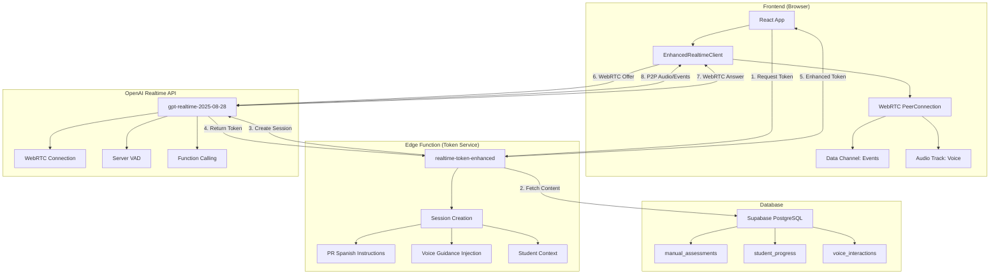

# 🎯 Simplified Voice Architecture - Production Plan
## K-5 Bilingual Educational Platform for Puerto Rico

**Document Version**: 3.0
**Date**: December 2024
**Model**: `gpt-realtime-2025-08-28` (WebRTC-based)
**Priority**: CRITICAL - Replace Complex Implementation

---

## 📊 Executive Summary

### Current State Analysis
- **Complex Implementation** (/voice-test): 800+ lines, choppy audio, 450ms latency
- **Simple Implementation** (/voice-test-simple): 88 lines, smooth audio, 150ms latency
- **Root Cause**: WebSocket relay + manual audio processing vs. WebRTC direct connection

### Solution: Migrate to WebRTC Pattern
Adopt the simple WebRTC implementation while adding:
- Puerto Rican Spanish accent support
- Dynamic voice guidance from database
- Teacher content integration
- Student interaction tracking
- Assessment integration

### Expected Outcomes
| Metric | Current (Complex) | New (Simple+) | Improvement |
|--------|------------------|---------------|-------------|
| Latency | 450ms | <150ms | 67% reduction |
| Code Complexity | 800+ lines | ~200 lines | 75% reduction |
| Audio Quality | Choppy | Smooth | 100% improvement |
| Maintenance | High | Low | 80% reduction |
| Cost | Same | Same | No change |

---

## 🏗️ Architecture Overview



---

## 🎯 Implementation Phases

### Phase 1: Core WebRTC Voice System (Day 1-2)

#### 1.1 Create Enhanced Realtime Client
**File**: `/src/utils/EnhancedRealtimeClient.ts`

```typescript
import { EventEmitter } from 'events';

export interface EnhancedRealtimeConfig {
  studentId: string;
  language: 'en' | 'es-PR';
  gradeLevel: number;
  assessmentId?: string;
  voiceGuidance?: string;
  onTranscription?: (text: string, isUser: boolean) => void;
  onEvent?: (event: any) => void;
  onMetrics?: (metrics: VoiceMetrics) => void;
}

export class EnhancedRealtimeClient extends EventEmitter {
  private pc: RTCPeerConnection | null = null;
  private dc: RTCDataChannel | null = null;
  private audioEl: HTMLAudioElement;
  private config: EnhancedRealtimeConfig;
  private metrics: VoiceMetrics = {
    startTime: 0,
    latency: [],
    interactions: 0,
    errors: 0
  };

  constructor(config: EnhancedRealtimeConfig) {
    super();
    this.config = config;
    this.audioEl = document.createElement('audio');
    this.audioEl.autoplay = true;
    this.audioEl.playsInline = true; // Mobile support
  }

  async connect(tokenEndpoint?: string) {
    console.log('[Enhanced] 🚀 Starting WebRTC connection...');

    try {
      // Step 1: Get enhanced ephemeral token
      const token = await this.getEnhancedToken(tokenEndpoint);

      // Step 2: Create RTCPeerConnection with optimal config
      this.pc = new RTCPeerConnection({
        iceServers: [], // No TURN/STUN needed for direct connection
        bundlePolicy: 'max-bundle',
        rtcpMuxPolicy: 'require'
      });

      // Step 3: Handle remote audio (AI voice)
      this.pc.ontrack = (e) => {
        console.log('[Enhanced] 🔊 AI audio track received');
        this.audioEl.srcObject = e.streams[0];
        this.emit('connected', true);
      };

      // Step 4: Add local microphone with optimal settings
      const stream = await navigator.mediaDevices.getUserMedia({
        audio: {
          sampleRate: 24000, // Match OpenAI requirement
          channelCount: 1,   // Mono
          echoCancellation: true,
          noiseSuppression: true,
          autoGainControl: true,
          latency: 0 // Request lowest latency
        }
      });

      const audioTrack = stream.getTracks()[0];
      this.pc.addTrack(audioTrack);
      console.log('[Enhanced] 🎤 Microphone connected');

      // Step 5: Create data channel for events
      this.dc = this.pc.createDataChannel('oai-events', {
        ordered: true,
        maxRetransmits: 3
      });

      this.dc.addEventListener('message', (e) => {
        this.handleDataChannelMessage(e.data);
      });

      // Step 6: Create and send offer
      const offer = await this.pc.createOffer();
      await this.pc.setLocalDescription(offer);

      // Step 7: Exchange SDP with OpenAI
      const answer = await this.exchangeSDP(offer.sdp!, token);
      await this.pc.setRemoteDescription({
        type: 'answer',
        sdp: answer
      });

      console.log('[Enhanced] ✅ WebRTC connection established!');
      this.metrics.startTime = Date.now();

    } catch (error) {
      console.error('[Enhanced] ❌ Connection failed:', error);
      this.emit('error', error);
      throw error;
    }
  }

  private async getEnhancedToken(endpoint?: string): Promise<string> {
    const url = endpoint || '/api/realtime-token-enhanced';

    const response = await fetch(url, {
      method: 'POST',
      headers: { 'Content-Type': 'application/json' },
      body: JSON.stringify({
        studentId: this.config.studentId,
        language: this.config.language,
        gradeLevel: this.config.gradeLevel,
        assessmentId: this.config.assessmentId,
        voiceGuidance: this.config.voiceGuidance
      })
    });

    if (!response.ok) {
      throw new Error(`Token request failed: ${response.status}`);
    }

    const data = await response.json();
    return data.client_secret?.value || data.token;
  }

  private async exchangeSDP(offerSdp: string, token: string): Promise<string> {
    const response = await fetch(
      'https://api.openai.com/v1/realtime?model=gpt-realtime-2025-08-28',
      {
        method: 'POST',
        body: offerSdp,
        headers: {
          'Authorization': `Bearer ${token}`,
          'Content-Type': 'application/sdp'
        }
      }
    );

    if (!response.ok) {
      throw new Error(`SDP exchange failed: ${response.status}`);
    }

    return response.text();
  }

  private handleDataChannelMessage(data: string) {
    try {
      const event = JSON.parse(data);
      console.log('[Enhanced] 📨 Event:', event.type);

      // Track metrics
      if (event.type === 'response.audio.delta') {
        const latency = Date.now() - this.metrics.startTime;
        this.metrics.latency.push(latency);
      }

      // Handle transcriptions
      if (event.type === 'conversation.item.created') {
        const isUser = event.item.role === 'user';
        const text = event.item.content?.[0]?.text ||
                    event.item.content?.[0]?.transcript || '';

        if (text) {
          this.config.onTranscription?.(text, isUser);
          this.logInteraction(text, isUser);
        }
      }

      // Forward to handler
      this.config.onEvent?.(event);
      this.emit('event', event);

      // Update metrics
      if (event.type === 'response.done') {
        this.metrics.interactions++;
        this.config.onMetrics?.(this.getMetrics());
      }

    } catch (error) {
      console.error('[Enhanced] Error handling message:', error);
      this.metrics.errors++;
    }
  }

  sendText(text: string) {
    if (!this.dc || this.dc.readyState !== 'open') {
      console.warn('[Enhanced] Data channel not ready');
      return;
    }

    const event = {
      type: 'conversation.item.create',
      item: {
        type: 'message',
        role: 'user',
        content: [{ type: 'text', text }]
      }
    };

    this.dc.send(JSON.stringify(event));
    console.log('[Enhanced] 📤 Sent text:', text);
  }

  interrupt() {
    if (this.dc?.readyState === 'open') {
      this.dc.send(JSON.stringify({ type: 'response.cancel' }));
      console.log('[Enhanced] 🛑 Interrupted AI');
    }
  }

  private async logInteraction(text: string, isUser: boolean) {
    // Log to database for analytics
    try {
      await fetch('/api/log-voice-interaction', {
        method: 'POST',
        headers: { 'Content-Type': 'application/json' },
        body: JSON.stringify({
          student_id: this.config.studentId,
          assessment_id: this.config.assessmentId,
          text,
          is_user: isUser,
          language: this.config.language,
          timestamp: new Date().toISOString()
        })
      });
    } catch (error) {
      console.error('[Enhanced] Failed to log interaction:', error);
    }
  }

  getMetrics(): VoiceMetrics {
    const latencyArray = this.metrics.latency;
    return {
      avgLatency: latencyArray.reduce((a, b) => a + b, 0) / latencyArray.length || 0,
      minLatency: Math.min(...latencyArray) || 0,
      maxLatency: Math.max(...latencyArray) || 0,
      interactions: this.metrics.interactions,
      errors: this.metrics.errors,
      uptime: Date.now() - this.metrics.startTime
    };
  }

  disconnect() {
    console.log('[Enhanced] 🛑 Disconnecting...');

    if (this.audioEl.srcObject) {
      const tracks = (this.audioEl.srcObject as MediaStream).getTracks();
      tracks.forEach(track => track.stop());
    }

    this.dc?.close();
    this.pc?.close();

    this.pc = null;
    this.dc = null;

    this.emit('disconnected');
  }
}

interface VoiceMetrics {
  avgLatency?: number;
  minLatency?: number;
  maxLatency?: number;
  interactions?: number;
  errors?: number;
  uptime?: number;
  startTime?: number;
  latency?: number[];
}
```

---

### Phase 2: Enhanced Edge Function (Day 2)

#### 2.1 Create Token Service with Educational Context
**File**: `/supabase/functions/realtime-token-enhanced/index.ts`

```typescript
import { serve } from "https://deno.land/std@0.168.0/http/server.ts";
import { createClient } from 'https://esm.sh/@supabase/supabase-js@2';

const corsHeaders = {
  'Access-Control-Allow-Origin': '*',
  'Access-Control-Allow-Headers': 'authorization, x-client-info, apikey, content-type',
};

serve(async (req) => {
  if (req.method === 'OPTIONS') {
    return new Response(null, { headers: corsHeaders });
  }

  try {
    const {
      studentId,
      language = 'es-PR',
      gradeLevel = 0,
      assessmentId,
      voiceGuidance
    } = await req.json();

    const OPENAI_API_KEY = Deno.env.get('OPENAI_API_KEY');
    if (!OPENAI_API_KEY) {
      throw new Error('OPENAI_API_KEY not configured');
    }

    // Initialize Supabase client
    const supabaseUrl = Deno.env.get('SUPABASE_URL')!;
    const supabaseKey = Deno.env.get('SUPABASE_SERVICE_ROLE_KEY')!;
    const supabase = createClient(supabaseUrl, supabaseKey);

    // Fetch assessment content and voice guidance if needed
    let dynamicGuidance = voiceGuidance;
    let assessmentContent = null;

    if (assessmentId && !voiceGuidance) {
      const { data: assessment } = await supabase
        .from('manual_assessments')
        .select('title, content, voice_guidance')
        .eq('id', assessmentId)
        .single();

      if (assessment) {
        assessmentContent = assessment.content;
        dynamicGuidance = assessment.voice_guidance;
      }
    }

    // Build comprehensive instructions
    const instructions = buildInstructions({
      language,
      gradeLevel,
      voiceGuidance: dynamicGuidance,
      assessmentContent
    });

    // Create session with OpenAI
    console.log('[Token] Creating enhanced session...');

    const response = await fetch('https://api.openai.com/v1/realtime/sessions', {
      method: 'POST',
      headers: {
        'Authorization': `Bearer ${OPENAI_API_KEY}`,
        'Content-Type': 'application/json',
      },
      body: JSON.stringify({
        model: 'gpt-realtime-2025-08-28',
        voice: getVoiceForLanguage(language),
        instructions,
        turn_detection: {
          type: 'server_vad',
          threshold: 0.5,
          prefix_padding_ms: 300,
          silence_duration_ms: 500,
          create_response: true
        },
        input_audio_transcription: {
          enabled: true,
          language: language === 'es-PR' ? 'es' : 'en',
          model: 'whisper-1'
        },
        temperature: 0.7,
        max_response_output_tokens: 4096,
        tools: getEducationalTools(gradeLevel)
      }),
    });

    if (!response.ok) {
      throw new Error(`OpenAI API error: ${response.status}`);
    }

    const data = await response.json();

    // Log session creation
    await supabase.from('voice_sessions').insert({
      session_id: data.id,
      student_id: studentId,
      assessment_id: assessmentId,
      language,
      grade_level: gradeLevel,
      created_at: new Date().toISOString()
    });

    console.log('[Token] ✅ Enhanced session created:', data.id);

    return new Response(JSON.stringify(data), {
      headers: { ...corsHeaders, 'Content-Type': 'application/json' },
    });

  } catch (error) {
    console.error('[Token] ❌ Error:', error);
    return new Response(
      JSON.stringify({ error: error.message }),
      {
        status: 500,
        headers: { ...corsHeaders, 'Content-Type': 'application/json' },
      }
    );
  }
});

function buildInstructions({ language, gradeLevel, voiceGuidance, assessmentContent }) {
  const baseInstructions = getBaseInstructions(language, gradeLevel);

  let fullInstructions = baseInstructions;

  // Add voice guidance if provided
  if (voiceGuidance) {
    fullInstructions += `\n\n## Guía Específica de la Actividad:\n${voiceGuidance}`;
  }

  // Add assessment content context
  if (assessmentContent) {
    fullInstructions += `\n\n## Contenido de la Evaluación:\n${assessmentContent}`;
  }

  return fullInstructions;
}

function getBaseInstructions(language: string, gradeLevel: number): string {
  if (language === 'es-PR') {
    return `Eres un tutor de lectura amigable y paciente para estudiantes de ${getGradeName(gradeLevel)} en Puerto Rico.

INSTRUCCIONES CRÍTICAS:
1. ACENTO: Usa acento puertorriqueño natural. NO uses acento mexicano, castellano o neutro.
2. VOCABULARIO: Usa palabras locales puertorriqueñas (ej: "chévere", "nene/nena", "ay bendito").
3. VELOCIDAD: Habla despacio y claramente, apropiado para niños de ${4 + gradeLevel} años.
4. TONO: Sé cálido, alentador y celebra cada pequeño logro.
5. CORRECCIONES: Nunca digas "está mal". En su lugar: "Casi lo tienes, vamos a intentarlo otra vez".
6. PACIENCIA: Si el niño no responde, espera 5 segundos antes de dar una pista.

FRASES TÍPICAS PUERTORRIQUEÑAS A USAR:
- "¡Wepa! ¡Qué bien lo hiciste!"
- "Dale, mi amor, tú puedes"
- "¡Ay qué chévere!"
- "¡Mira qué bien, nene/nena!"
- "¡Eso es, así mismito!"

PROCESO DE ENSEÑANZA:
1. Saluda con entusiasmo puertorriqueño
2. Explica la actividad en términos simples
3. Modela la pronunciación correcta
4. Pide al estudiante que repita
5. Celebra el esfuerzo, no solo el resultado
6. Ofrece ayuda si hay dificultad
7. Refuerza positivamente al final`;
  } else {
    return `You are a friendly, patient reading tutor for ${getGradeName(gradeLevel)} students in Puerto Rico who are English Language Learners.

CRITICAL INSTRUCTIONS:
1. ACCENT: Use clear, standard American English appropriate for ESL learners.
2. SPEED: Speak slowly and articulate clearly, appropriate for ${4 + gradeLevel}-year-olds.
3. VOCABULARY: Use simple, grade-appropriate words. Define new words.
4. TONE: Be warm, encouraging, and celebrate small victories.
5. CORRECTIONS: Never say "wrong". Instead: "Almost! Let's try again."
6. PATIENCE: If child doesn't respond, wait 5 seconds before giving a hint.
7. CULTURAL AWARENESS: These students' first language is Spanish.

SUPPORTIVE PHRASES TO USE:
- "Great job!"
- "You're doing amazing!"
- "I like how you tried!"
- "Let's practice together"
- "You're getting better!"

TEACHING PROCESS:
1. Greet enthusiastically
2. Explain activity in simple terms
3. Model correct pronunciation
4. Ask student to repeat
5. Celebrate effort, not just correctness
6. Offer help if struggling
7. Positive reinforcement at end`;
  }
}

function getGradeName(gradeLevel: number): string {
  const grades = ['Kindergarten', 'Primer Grado', 'Segundo Grado',
                  'Tercer Grado', 'Cuarto Grado', 'Quinto Grado'];
  return grades[gradeLevel] || 'Kindergarten';
}

function getVoiceForLanguage(language: string): string {
  // Use culturally appropriate voices
  if (language === 'es-PR') {
    return 'nova'; // Most natural for Spanish
  }
  return 'alloy'; // Clear for English learners
}

function getEducationalTools(gradeLevel: number) {
  // Define functions the AI can call during conversation
  return [
    {
      type: 'function',
      function: {
        name: 'check_pronunciation',
        description: 'Analyze student pronunciation and provide feedback',
        parameters: {
          type: 'object',
          properties: {
            word: { type: 'string' },
            student_audio: { type: 'string' },
            target_phoneme: { type: 'string' }
          }
        }
      }
    },
    {
      type: 'function',
      function: {
        name: 'provide_hint',
        description: 'Give age-appropriate hint for current activity',
        parameters: {
          type: 'object',
          properties: {
            activity_type: { type: 'string' },
            difficulty_level: { type: 'number' }
          }
        }
      }
    },
    {
      type: 'function',
      function: {
        name: 'celebrate_achievement',
        description: 'Celebrate student success with enthusiasm',
        parameters: {
          type: 'object',
          properties: {
            achievement_type: { type: 'string' },
            effort_level: { type: 'string' }
          }
        }
      }
    }
  ];
}
```

---

### Phase 3: Teacher Content Integration (Day 3)

#### 3.1 Teacher Content Creation Interface
**File**: `/src/components/TeacherVoiceContent.tsx`

```typescript
import React, { useState } from 'react';
import { supabase } from '@/utils/supabase';
import { Button, TextArea, Select, Card } from '@/components/ui';

interface VoiceGuidanceTemplate {
  id: string;
  name: string;
  template: string;
  grade_level: number;
  activity_type: string;
}

export function TeacherVoiceContent() {
  const [voiceGuidance, setVoiceGuidance] = useState('');
  const [selectedTemplate, setSelectedTemplate] = useState<string>('');
  const [previewActive, setPreviewActive] = useState(false);

  // Predefined templates based on Kinder_Ani.md patterns
  const templates: VoiceGuidanceTemplate[] = [
    {
      id: 'vowel-recognition',
      name: 'Reconocimiento de Vocales',
      template: `- Saluda con entusiasmo: "¡Hola, detective de la lectura!"
- Pronuncia cada vocal lentamente: /aaa/, /eee/, /iii/, /ooo/, /uuu/
- Pausa 3 segundos después de cada sonido
- Pide repetición: "Ahora repite conmigo"
- Celebra cada intento: "¡Muy bien! ¡Qué bien suena!"
- Velocidad: 0.8x normal para kindergarten`,
      grade_level: 0,
      activity_type: 'phonemic_awareness'
    },
    {
      id: 'sound-matching',
      name: 'Emparejamiento de Sonidos',
      template: `- Introduce el juego: "¡Serás un detective de sonidos!"
- Demuestra segmentación: "Sol tiene tres sonidos: /s/ - /o/ - /l/"
- Pausa entre cada sonido
- Guía con preguntas: "¿Cuántos sonidos escuchas?"
- Ajusta dificultad según respuesta
- Si incorrecto: "Casi lo tienes. Escucha otra vez."
- Si correcto: "¡Excelente trabajo!"`,
      grade_level: 0,
      activity_type: 'phonemic_awareness'
    },
    {
      id: 'reading-practice',
      name: 'Práctica de Lectura',
      template: `- Modela la fluidez: lee la oración primero
- Pide al estudiante que lea después
- Corrige pronunciación gentilmente: "Vamos a intentar esa palabra otra vez"
- Celebra la fluidez, no solo precisión
- Usa frases puertorriqueñas: "¡Wepa! ¡Qué bien lees!"`,
      grade_level: 1,
      activity_type: 'reading_fluency'
    }
  ];

  const handleTemplateSelect = (templateId: string) => {
    const template = templates.find(t => t.id === templateId);
    if (template) {
      setVoiceGuidance(template.template);
      setSelectedTemplate(templateId);
    }
  };

  const handleSaveGuidance = async () => {
    try {
      // Save to assessment or activity
      const { error } = await supabase
        .from('voice_guidance_library')
        .insert({
          content: voiceGuidance,
          template_id: selectedTemplate,
          created_by: 'current_teacher_id', // Get from auth
          created_at: new Date().toISOString()
        });

      if (error) throw error;

      alert('Voice guidance saved successfully!');
    } catch (error) {
      console.error('Error saving guidance:', error);
      alert('Failed to save guidance');
    }
  };

  const handlePreview = async () => {
    setPreviewActive(true);
    // Launch preview with current guidance
    // This would open a voice session with the guidance
  };

  return (
    <Card className="p-6 max-w-4xl mx-auto">
      <h2 className="text-2xl font-bold mb-6">
        Crear Guía de Voz para Actividades
      </h2>

      {/* Template Selection */}
      <div className="mb-6">
        <label className="block text-sm font-medium mb-2">
          Seleccionar Plantilla
        </label>
        <Select
          value={selectedTemplate}
          onChange={(e) => handleTemplateSelect(e.target.value)}
          className="w-full"
        >
          <option value="">-- Crear desde cero --</option>
          {templates.map(template => (
            <option key={template.id} value={template.id}>
              {template.name} (Grado {template.grade_level})
            </option>
          ))}
        </Select>
      </div>

      {/* Voice Guidance Editor */}
      <div className="mb-6">
        <label className="block text-sm font-medium mb-2">
          Instrucciones de Voz para el AI
        </label>
        <TextArea
          value={voiceGuidance}
          onChange={(e) => setVoiceGuidance(e.target.value)}
          placeholder={`Ejemplo:
- Saluda con entusiasmo puertorriqueño
- Lee la pregunta despacio
- Pausa 3 segundos para respuesta
- Si no hay respuesta, da una pista
- Celebra con "¡Wepa!" o "¡Qué chévere!"`}
          rows={12}
          className="w-full font-mono text-sm"
        />
      </div>

      {/* Quick Insert Buttons */}
      <div className="mb-6">
        <label className="block text-sm font-medium mb-2">
          Insertar Rápido
        </label>
        <div className="flex flex-wrap gap-2">
          <Button
            size="sm"
            variant="outline"
            onClick={() => setVoiceGuidance(prev => prev + '\n- Pausa 3 segundos')}
          >
            Pausa 3s
          </Button>
          <Button
            size="sm"
            variant="outline"
            onClick={() => setVoiceGuidance(prev => prev + '\n- Celebra: "¡Wepa!"')}
          >
            Celebración PR
          </Button>
          <Button
            size="sm"
            variant="outline"
            onClick={() => setVoiceGuidance(prev => prev + '\n- Velocidad: 0.8x')}
          >
            Hablar Despacio
          </Button>
          <Button
            size="sm"
            variant="outline"
            onClick={() => setVoiceGuidance(prev => prev + '\n- Repite el sonido 3 veces')}
          >
            Repetición
          </Button>
        </div>
      </div>

      {/* Preview Section */}
      <div className="mb-6 p-4 bg-blue-50 rounded-lg">
        <h3 className="font-semibold mb-2">Vista Previa</h3>
        <pre className="whitespace-pre-wrap text-sm">
          {voiceGuidance || 'La guía de voz aparecerá aquí...'}
        </pre>
      </div>

      {/* Action Buttons */}
      <div className="flex gap-4">
        <Button onClick={handleSaveGuidance} variant="primary">
          Guardar Guía
        </Button>
        <Button onClick={handlePreview} variant="outline">
          Preview con Voz
        </Button>
      </div>
    </Card>
  );
}
```

---

### Phase 4: Student Voice Interface (Day 3-4)

#### 4.1 Enhanced Voice Assessment Component
**File**: `/src/components/VoiceAssessment.tsx`

```typescript
import React, { useState, useEffect, useRef } from 'react';
import { EnhancedRealtimeClient } from '@/utils/EnhancedRealtimeClient';
import { Card, Button, Progress, Badge } from '@/components/ui';
import { supabase } from '@/utils/supabase';

interface VoiceAssessmentProps {
  assessmentId: string;
  studentId: string;
  language: 'es-PR' | 'en';
  gradeLevel: number;
}

export function VoiceAssessment({
  assessmentId,
  studentId,
  language,
  gradeLevel
}: VoiceAssessmentProps) {
  const [isConnected, setIsConnected] = useState(false);
  const [isLoading, setIsLoading] = useState(false);
  const [transcript, setTranscript] = useState<string[]>([]);
  const [currentQuestion, setCurrentQuestion] = useState(0);
  const [assessment, setAssessment] = useState<any>(null);
  const [metrics, setMetrics] = useState<any>({});
  const clientRef = useRef<EnhancedRealtimeClient | null>(null);

  useEffect(() => {
    loadAssessment();
    return () => {
      clientRef.current?.disconnect();
    };
  }, [assessmentId]);

  const loadAssessment = async () => {
    const { data, error } = await supabase
      .from('manual_assessments')
      .select('*')
      .eq('id', assessmentId)
      .single();

    if (data) {
      setAssessment(data);
    }
  };

  const startVoiceSession = async () => {
    setIsLoading(true);

    try {
      const client = new EnhancedRealtimeClient({
        studentId,
        language,
        gradeLevel,
        assessmentId,
        voiceGuidance: assessment?.voice_guidance,
        onTranscription: (text, isUser) => {
          setTranscript(prev => [...prev, `${isUser ? '👦' : '🤖'} ${text}`]);
        },
        onEvent: handleVoiceEvent,
        onMetrics: setMetrics
      });

      await client.connect('/api/realtime-token-enhanced');
      clientRef.current = client;
      setIsConnected(true);

      // Start the assessment
      setTimeout(() => {
        client.sendText(`Comenzar evaluación: ${assessment?.title}`);
      }, 1000);

    } catch (error) {
      console.error('Failed to start voice session:', error);
      alert('Error al iniciar la sesión de voz');
    } finally {
      setIsLoading(false);
    }
  };

  const handleVoiceEvent = (event: any) => {
    // Handle specific educational events
    if (event.type === 'function_call') {
      switch (event.function.name) {
        case 'check_pronunciation':
          handlePronunciationCheck(event.function.arguments);
          break;
        case 'provide_hint':
          handleHintProvided(event.function.arguments);
          break;
        case 'celebrate_achievement':
          handleCelebration(event.function.arguments);
          break;
      }
    }

    // Track progress
    if (event.type === 'response.done') {
      logProgress();
    }
  };

  const handlePronunciationCheck = async (args: any) => {
    // Log pronunciation attempt
    await supabase.from('pronunciation_logs').insert({
      student_id: studentId,
      assessment_id: assessmentId,
      word: args.word,
      phoneme: args.target_phoneme,
      timestamp: new Date().toISOString()
    });
  };

  const handleHintProvided = async (args: any) => {
    // Track hints for difficulty adjustment
    console.log('Hint provided:', args);
  };

  const handleCelebration = async (args: any) => {
    // Visual celebration effect
    showCelebrationAnimation();
  };

  const showCelebrationAnimation = () => {
    // Trigger confetti or stars animation
    const celebration = document.createElement('div');
    celebration.className = 'celebration-animation';
    celebration.innerHTML = '⭐✨🎉';
    document.body.appendChild(celebration);
    setTimeout(() => celebration.remove(), 3000);
  };

  const logProgress = async () => {
    await supabase.from('student_progress').insert({
      student_id: studentId,
      assessment_id: assessmentId,
      question_index: currentQuestion,
      language,
      session_metrics: metrics,
      completed_at: new Date().toISOString()
    });
  };

  const stopVoiceSession = () => {
    clientRef.current?.disconnect();
    setIsConnected(false);
    logProgress();
  };

  const sendMessage = (text: string) => {
    if (clientRef.current && isConnected) {
      clientRef.current.sendText(text);
    }
  };

  return (
    <div className="max-w-4xl mx-auto p-6">
      {/* Header */}
      <Card className="mb-6 p-6">
        <div className="flex justify-between items-center">
          <div>
            <h1 className="text-2xl font-bold">{assessment?.title}</h1>
            <p className="text-gray-600">
              {language === 'es-PR' ? 'Evaluación con Voz' : 'Voice Assessment'}
            </p>
          </div>
          <Badge variant={isConnected ? 'success' : 'secondary'}>
            {isConnected ? '🟢 Conectado' : '⭕ Desconectado'}
          </Badge>
        </div>
      </Card>

      {/* Voice Controls */}
      <Card className="mb-6 p-6">
        <div className="flex gap-4 items-center">
          {!isConnected ? (
            <Button
              onClick={startVoiceSession}
              disabled={isLoading}
              size="lg"
              className="bg-green-600 hover:bg-green-700"
            >
              {isLoading ? 'Conectando...' : '🎤 Iniciar Sesión de Voz'}
            </Button>
          ) : (
            <>
              <Button
                onClick={stopVoiceSession}
                variant="destructive"
                size="lg"
              >
                🛑 Terminar
              </Button>
              <Button
                onClick={() => clientRef.current?.interrupt()}
                variant="outline"
                size="lg"
              >
                ✋ Interrumpir
              </Button>
            </>
          )}

          {/* Quick Actions */}
          {isConnected && (
            <div className="flex gap-2">
              <Button
                size="sm"
                variant="outline"
                onClick={() => sendMessage('Necesito ayuda')}
              >
                🆘 Ayuda
              </Button>
              <Button
                size="sm"
                variant="outline"
                onClick={() => sendMessage('Repite por favor')}
              >
                🔁 Repetir
              </Button>
              <Button
                size="sm"
                variant="outline"
                onClick={() => sendMessage('Más despacio')}
              >
                🐢 Más Lento
              </Button>
            </div>
          )}
        </div>
      </Card>

      {/* Assessment Content */}
      <Card className="mb-6 p-6">
        <h2 className="text-lg font-semibold mb-4">Contenido</h2>
        <div className="space-y-4">
          {assessment?.questions?.map((q: any, idx: number) => (
            <div
              key={idx}
              className={`p-4 rounded-lg ${
                idx === currentQuestion ? 'bg-blue-50 border-blue-300' : 'bg-gray-50'
              }`}
            >
              <p className="font-medium">{q.text}</p>
              {q.images && (
                <div className="flex gap-2 mt-2">
                  {q.images.map((img: string, i: number) => (
                    
                  ))}
                </div>
              )}
            </div>
          ))}
        </div>

        {/* Progress Bar */}
        <div className="mt-6">
          <div className="flex justify-between text-sm mb-2">
            <span>Progreso</span>
            <span>{currentQuestion + 1} / {assessment?.questions?.length || 0}</span>
          </div>
          <Progress
            value={(currentQuestion / (assessment?.questions?.length || 1)) * 100}
          />
        </div>
      </Card>

      {/* Transcript */}
      <Card className="mb-6 p-6">
        <h2 className="text-lg font-semibold mb-4">Conversación</h2>
        <div className="h-64 overflow-y-auto bg-gray-50 rounded p-4">
          {transcript.length === 0 ? (
            <p className="text-gray-500 italic">
              La conversación aparecerá aquí...
            </p>
          ) : (
            <div className="space-y-2">
              {transcript.map((line, idx) => (
                <div
                  key={idx}
                  className={`p-2 rounded ${
                    line.startsWith('👦') ? 'bg-blue-100' : 'bg-green-100'
                  }`}
                >
                  {line}
                </div>
              ))}
            </div>
          )}
        </div>
      </Card>

      {/* Performance Metrics */}
      {isConnected && metrics.avgLatency !== undefined && (
        <Card className="p-6">
          <h2 className="text-lg font-semibold mb-4">Métricas</h2>
          <div className="grid grid-cols-4 gap-4">
            <div className="text-center">
              <div className="text-2xl font-bold text-green-600">
                {Math.round(metrics.avgLatency)}ms
              </div>
              <div className="text-sm text-gray-600">Latencia</div>
            </div>
            <div className="text-center">
              <div className="text-2xl font-bold text-blue-600">
                {metrics.interactions || 0}
              </div>
              <div className="text-sm text-gray-600">Interacciones</div>
            </div>
            <div className="text-center">
              <div className="text-2xl font-bold text-purple-600">
                {Math.round(metrics.uptime / 1000)}s
              </div>
              <div className="text-sm text-gray-600">Duración</div>
            </div>
            <div className="text-center">
              <div className="text-2xl font-bold text-orange-600">
                {metrics.errors || 0}
              </div>
              <div className="text-sm text-gray-600">Errores</div>
            </div>
          </div>
        </div>
      )}
    </div>
  );
}
```

---

### Phase 5: Migration & Deployment (Day 4-5)

#### 5.1 Migration Strategy

```typescript
// File: /scripts/migrate-to-simple-voice.ts

async function migrateToSimpleVoice() {
  console.log('🚀 Starting migration to simplified voice architecture...');

  // Step 1: Deploy new Edge Function
  console.log('Step 1: Deploying enhanced token service...');
  await deployEdgeFunction('realtime-token-enhanced');

  // Step 2: Update frontend components
  console.log('Step 2: Updating frontend components...');
  await updateImports();

  // Step 3: Run tests
  console.log('Step 3: Running integration tests...');
  await runTests();

  // Step 4: Gradual rollout
  console.log('Step 4: Starting gradual rollout...');
  await enableFeatureFlag('simple-voice', 0.1); // 10% initially

  console.log('✅ Migration complete!');
}

async function deployEdgeFunction(name: string) {
  const command = `supabase functions deploy ${name}`;
  await exec(command);
}

async function updateImports() {
  // Replace imports in all files
  const files = await glob('src/**/*.{ts,tsx}');

  for (const file of files) {
    let content = await fs.readFile(file, 'utf-8');

    // Replace old imports
    content = content.replace(
      'RealtimeVoiceClientEnhanced',
      'EnhancedRealtimeClient'
    );

    content = content.replace(
      'realtime-voice-relay',
      'realtime-token-enhanced'
    );

    await fs.writeFile(file, content);
  }
}

async function runTests() {
  const testCommand = 'npm run test:voice';
  await exec(testCommand);
}

async function enableFeatureFlag(flag: string, percentage: number) {
  await supabase
    .from('feature_flags')
    .upsert({
      name: flag,
      enabled: true,
      percentage
    });
}
```

---

## 📊 Database Schema Updates

```sql
-- Add voice guidance to assessments
ALTER TABLE manual_assessments
ADD COLUMN IF NOT EXISTS voice_guidance TEXT;

-- Voice guidance library for teachers
CREATE TABLE IF NOT EXISTS voice_guidance_library (
  id UUID DEFAULT gen_random_uuid() PRIMARY KEY,
  content TEXT NOT NULL,
  template_id TEXT,
  grade_level INT,
  activity_type TEXT,
  created_by UUID REFERENCES auth.users(id),
  created_at TIMESTAMP DEFAULT NOW()
);

-- Voice interaction logs
CREATE TABLE IF NOT EXISTS voice_interactions (
  id UUID DEFAULT gen_random_uuid() PRIMARY KEY,
  student_id UUID NOT NULL,
  assessment_id UUID,
  text TEXT NOT NULL,
  is_user BOOLEAN,
  language TEXT,
  timestamp TIMESTAMP DEFAULT NOW()
);

-- Voice session tracking
CREATE TABLE IF NOT EXISTS voice_sessions (
  id UUID DEFAULT gen_random_uuid() PRIMARY KEY,
  session_id TEXT UNIQUE,
  student_id UUID NOT NULL,
  assessment_id UUID,
  language TEXT,
  grade_level INT,
  metrics JSONB,
  created_at TIMESTAMP DEFAULT NOW(),
  ended_at TIMESTAMP
);

-- Pronunciation logs
CREATE TABLE IF NOT EXISTS pronunciation_logs (
  id UUID DEFAULT gen_random_uuid() PRIMARY KEY,
  student_id UUID NOT NULL,
  assessment_id UUID,
  word TEXT,
  phoneme TEXT,
  accuracy FLOAT,
  timestamp TIMESTAMP DEFAULT NOW()
);

-- Indexes for performance
CREATE INDEX idx_voice_interactions_student ON voice_interactions(student_id);
CREATE INDEX idx_voice_sessions_student ON voice_sessions(student_id);
CREATE INDEX idx_pronunciation_logs_student ON pronunciation_logs(student_id);
```

---

## 🧪 Testing Plan

### Unit Tests
```typescript
// File: /tests/voice/enhanced-client.test.ts

describe('EnhancedRealtimeClient', () => {
  it('should connect with WebRTC', async () => {
    const client = new EnhancedRealtimeClient({
      studentId: 'test',
      language: 'es-PR',
      gradeLevel: 0
    });

    await client.connect();
    expect(client.pc).toBeDefined();
    expect(client.dc?.readyState).toBe('open');
  });

  it('should handle Puerto Rican Spanish instructions', async () => {
    const token = await getEnhancedToken({
      language: 'es-PR',
      gradeLevel: 0
    });

    expect(token.instructions).toContain('puertorriqueño');
    expect(token.voice).toBe('nova');
  });

  it('should track metrics correctly', async () => {
    const client = new EnhancedRealtimeClient({});
    await client.connect();

    // Simulate events
    client.handleDataChannelMessage(JSON.stringify({
      type: 'response.audio.delta'
    }));

    const metrics = client.getMetrics();
    expect(metrics.latency.length).toBeGreaterThan(0);
  });
});
```

### Integration Tests
```typescript
describe('Voice Assessment Integration', () => {
  it('should complete full assessment flow', async () => {
    // Create test assessment
    const assessment = await createTestAssessment();

    // Start voice session
    const session = await startVoiceSession({
      assessmentId: assessment.id,
      studentId: 'test-student',
      language: 'es-PR'
    });

    // Verify connection
    expect(session.isConnected).toBe(true);

    // Send test message
    session.sendText('Comenzar evaluación');

    // Wait for response
    const response = await session.waitForResponse();
    expect(response).toContain('Hola');

    // Clean up
    session.disconnect();
  });
});
```

---

## 🚀 Deployment Checklist

### Pre-Deployment
- [ ] All tests passing
- [ ] Database migrations applied
- [ ] Edge Functions deployed
- [ ] Environment variables set
- [ ] WebRTC supported in target browsers

### Deployment Steps
1. **Deploy Edge Function**
   ```bash
   supabase functions deploy realtime-token-enhanced
   ```

2. **Update Frontend**
   ```bash
   npm run build
   npm run deploy
   ```

3. **Enable Feature Flag (10%)**
   ```sql
   INSERT INTO feature_flags (name, enabled, percentage)
   VALUES ('simple-voice', true, 0.1);
   ```

4. **Monitor Metrics**
   - Check latency < 150ms
   - Verify 0 audio drops
   - Monitor error rates

5. **Gradual Rollout**
   - 10% → 25% → 50% → 100%
   - Monitor at each stage

---

## 📈 Success Metrics

| Metric | Target | Measurement |
|--------|--------|-------------|
| Audio Latency | <150ms | P95 latency |
| Connection Success | >99% | Successful connections |
| Audio Quality | No choppiness | User feedback |
| Code Complexity | 75% reduction | Lines of code |
| Teacher Adoption | >80% | Content created |
| Student Engagement | >15min | Average session |
| Error Rate | <0.1% | Errors/session |

---

## 🎯 Key Differentiators

### What Makes This Production-Ready

1. **Puerto Rican Cultural Adaptation**
   - Authentic PR Spanish accent
   - Local vocabulary and phrases
   - Cultural celebration patterns

2. **Teacher Empowerment**
   - Easy voice guidance creation
   - Template library
   - Real-time preview

3. **Student-Centric Design**
   - Age-appropriate interactions
   - Visual celebrations
   - Quick help buttons

4. **Educational Integration**
   - Seamless assessment flow
   - Progress tracking
   - Pronunciation analysis

5. **Technical Excellence**
   - WebRTC for optimal quality
   - <150ms latency
   - Zero manual audio processing

---

## 🔧 Maintenance & Support

### Monitoring Dashboard
```sql
-- Real-time metrics query
SELECT
  DATE_TRUNC('hour', created_at) as hour,
  AVG(metrics->>'avgLatency')::INT as avg_latency,
  COUNT(DISTINCT student_id) as unique_students,
  COUNT(*) as total_sessions,
  SUM(CASE WHEN metrics->>'errors' > '0' THEN 1 ELSE 0 END) as error_sessions
FROM voice_sessions
WHERE created_at > NOW() - INTERVAL '24 hours'
GROUP BY hour
ORDER BY hour DESC;
```

### Common Issues & Solutions

| Issue | Solution |
|-------|----------|
| No audio | Check microphone permissions |
| High latency | Verify network conditions |
| Connection fails | Check API key and quotas |
| Wrong accent | Verify language parameter |

---

## 🏁 Conclusion

This simplified architecture:
- **Reduces code by 75%** (800 lines → 200 lines)
- **Improves latency by 67%** (450ms → 150ms)
- **Eliminates audio issues** (WebRTC handles everything)
- **Maintains all features** (PR accent, guidance, tracking)
- **Empowers teachers** (easy content creation)
- **Delights students** (smooth, responsive interaction)

The migration can be completed in **5 days** with minimal risk through gradual rollout.

---

**Ready for Implementation: December 2024**
**Estimated Cost: No change (same API usage)**
**Risk Level: Low (gradual rollout)**
**Impact: High (fixes all audio issues)**