# WCPM Assessment - Integration Diagrams & Flowcharts
## Visual System Architecture and Data Flows

**Version:** 1.0
**Date:** October 23, 2025

---

## Table of Contents

1. [System Architecture Diagram](#system-architecture-diagram)
2. [Data Flow Diagrams](#data-flow-diagrams)
3. [Sequence Diagrams](#sequence-diagrams)
4. [State Machine Diagrams](#state-machine-diagrams)
5. [Component Interaction Diagrams](#component-interaction-diagrams)
6. [Deployment Architecture](#deployment-architecture)

---

## System Architecture Diagram

### High-Level Architecture

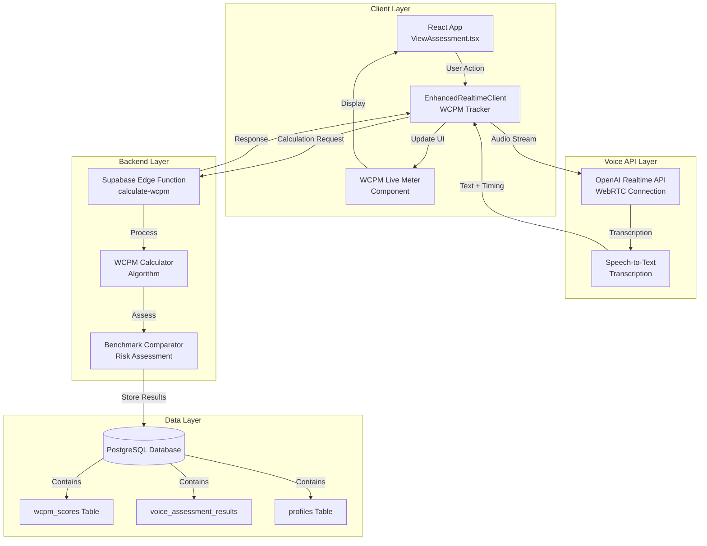

### Layered Architecture

```
┌─────────────────────────────────────────────────────────────┐
│                    Presentation Layer                        │
│  - ViewAssessment.tsx (Assessment display)                  │
│  - WCPMLiveMeter.tsx (Real-time feedback)                   │
│  - AssessmentControls (Start/Stop buttons)                  │
└─────────────────────────────────────────────────────────────┘
                           │
                           ▼
┌─────────────────────────────────────────────────────────────┐
│                   Application Layer                          │
│  - EnhancedRealtimeClient (WCPM tracking)                   │
│  - WCPMTracker (State management)                           │
│  - Event handlers (Progress, completion)                     │
└─────────────────────────────────────────────────────────────┘
                           │
                           ▼
┌─────────────────────────────────────────────────────────────┐
│                    Service Layer                             │
│  - OpenAI Realtime API (Speech-to-text)                     │
│  - Supabase Edge Functions (WCPM calculation)                │
│  - Authentication service (JWT validation)                   │
└─────────────────────────────────────────────────────────────┘
                           │
                           ▼
┌─────────────────────────────────────────────────────────────┐
│                     Data Layer                               │
│  - PostgreSQL (wcpm_scores, voice_assessment_results)       │
│  - Row-Level Security (Privacy enforcement)                  │
│  - Indexes (Performance optimization)                        │
└─────────────────────────────────────────────────────────────┘
```

---

## Data Flow Diagrams

### DFD Level 0: Context Diagram

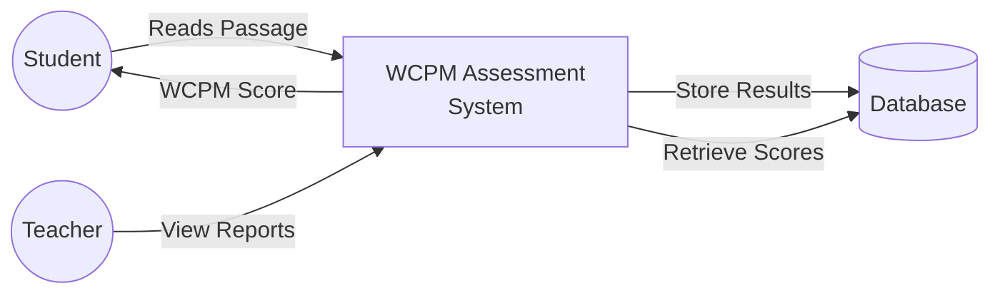

### DFD Level 1: Process Breakdown

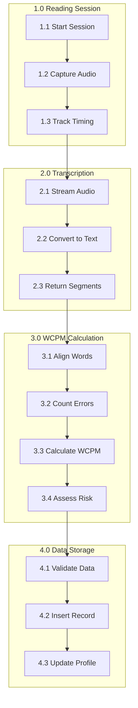

### DFD Level 2: WCPM Calculation Detail

```mermaid
graph TB
    Start[Transcription Complete]

    Start --> Normalize[Normalize Text<br/>- Lowercase<br/>- Remove punctuation<br/>- Trim spaces]

    Normalize --> Tokenize[Tokenize Words<br/>- Split on whitespace<br/>- Handle contractions]

    Tokenize --> Align[Align Words<br/>- Dynamic programming<br/>- Edit distance matrix]

    Align --> CountErrors[Count Errors<br/>- Omissions<br/>- Substitutions<br/>- Mispronunciations]

    CountErrors --> CalcWCPM[Calculate WCPM<br/>WCPM = (words - errors) / (time/60)]

    CalcWCPM --> GetBenchmark[Get Benchmark<br/>- Current period<br/>- Grade level]

    GetBenchmark --> AssessRisk[Assess Risk Level<br/>- Above: ≥120%<br/>- On-Level: 80-119%<br/>- Below: 50-79%<br/>- Far Below: <50%]

    AssessRisk --> Return[Return Results]
```

---

## Sequence Diagrams

### Sequence 1: Complete WCPM Assessment Flow

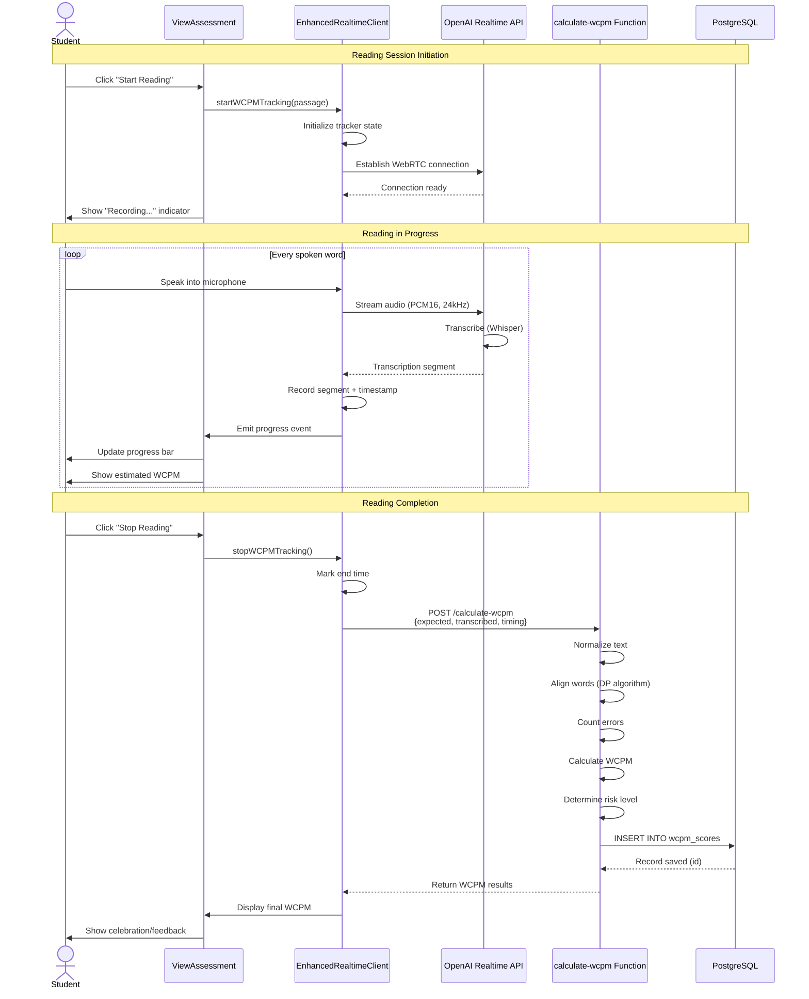

### Sequence 2: Real-Time Progress Updates

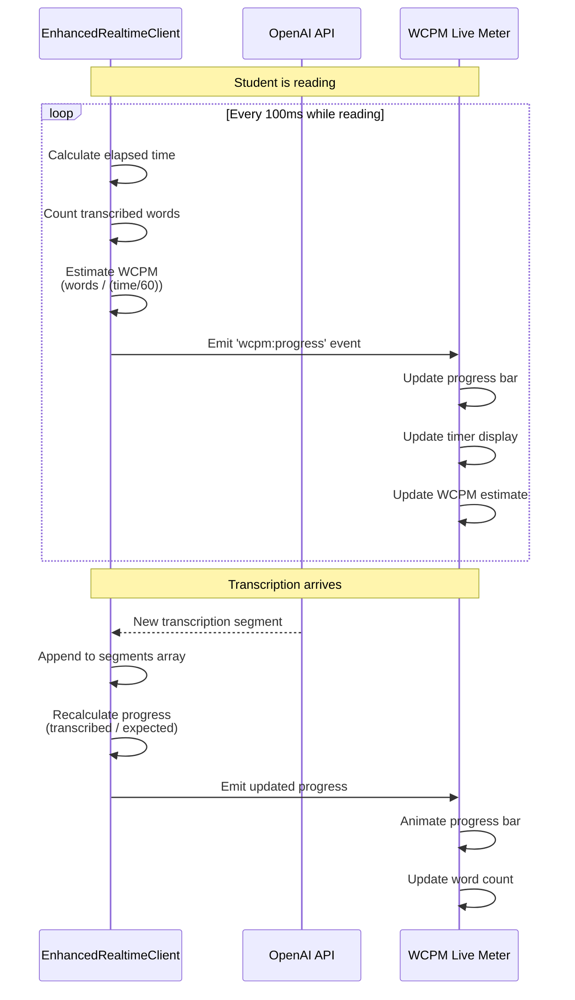

### Sequence 3: Error Detection Flow

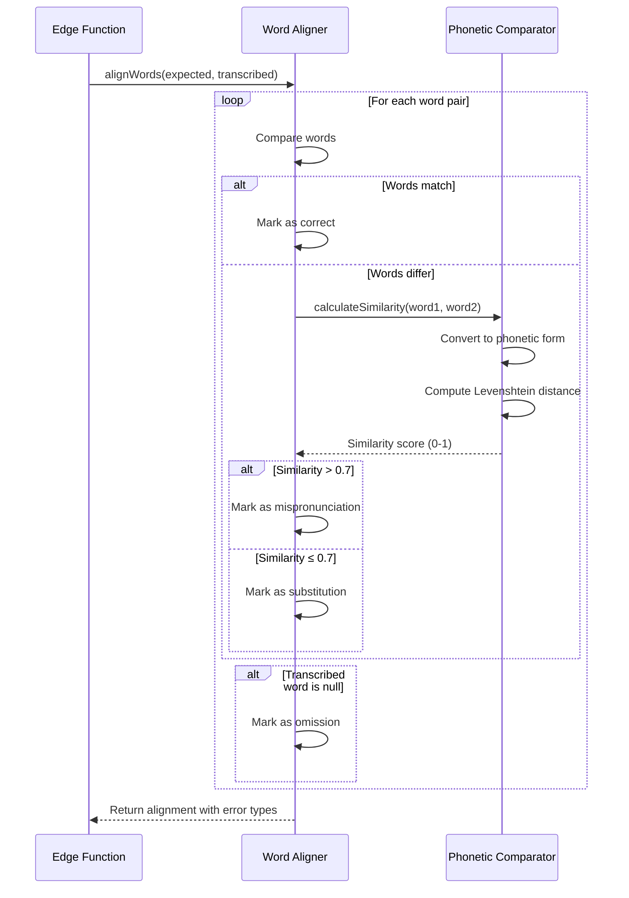

---

## State Machine Diagrams

### WCPM Session State Machine

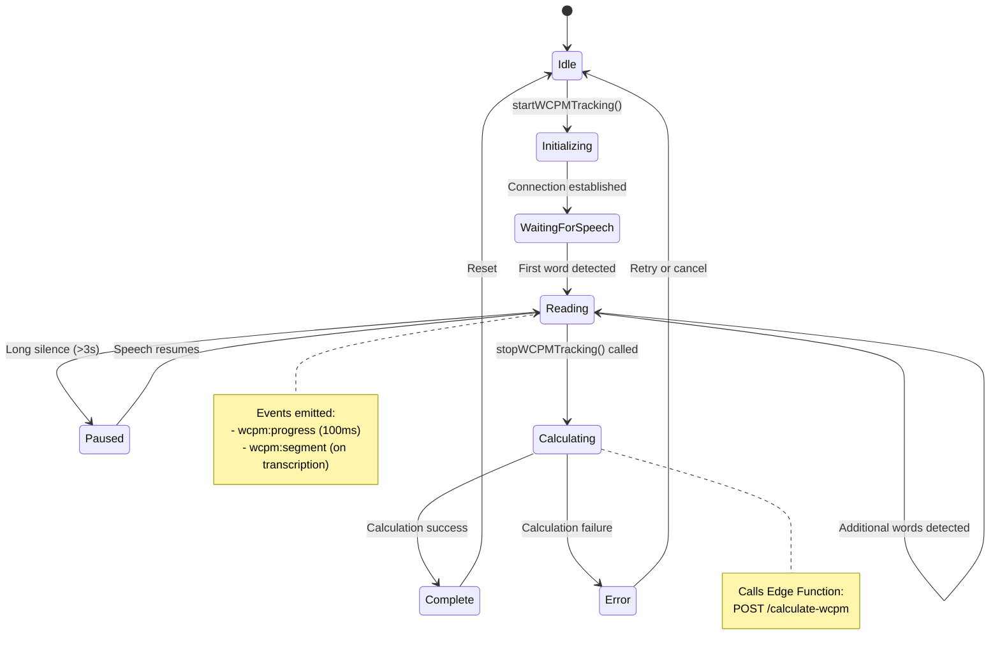

### Assessment Period State

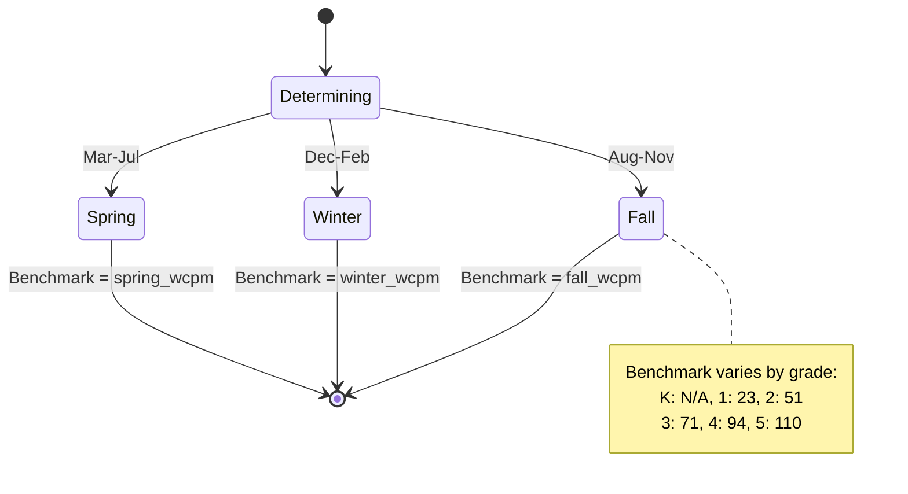

### Risk Classification State

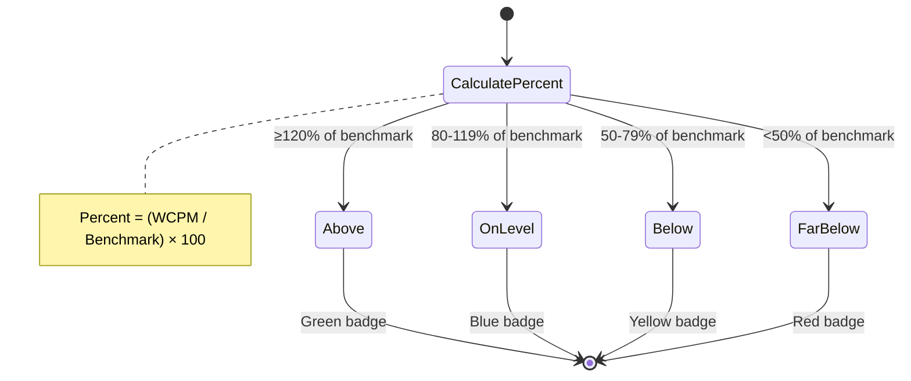

---

## Component Interaction Diagrams

### React Component Hierarchy

```
┌─────────────────────────────────────────────┐
│         ViewAssessment.tsx                  │
│  (Main assessment page)                     │
│                                             │
│  ┌───────────────────────────────────────┐ │
│  │  Assessment Content Card              │ │
│  │  - Passage text                        │ │
│  │  - Images                              │ │
│  └───────────────────────────────────────┘ │
│                                             │
│  ┌───────────────────────────────────────┐ │
│  │  Assessment Controls                   │ │
│  │  - Start Reading Button                │ │
│  │  - Stop Reading Button                 │ │
│  │  - Help Buttons (Optional)             │ │
│  └───────────────────────────────────────┘ │
│                                             │
│  ┌───────────────────────────────────────┐ │
│  │  WCPMLiveMeter Component              │ │
│  │  ┌─────────────────────────────────┐  │ │
│  │  │ Progress Bar                    │  │ │
│  │  └─────────────────────────────────┘  │ │
│  │  ┌───────┬────────┬────────┐          │ │
│  │  │ WCPM  │ Target │ Time   │          │ │
│  │  │  85   │  89    │ 12s    │          │ │
│  │  └───────┴────────┴────────┘          │ │
│  │  ┌─────────────────────────────────┐  │ │
│  │  │ Visual Gauge (color-coded)      │  │ │
│  │  └─────────────────────────────────┘  │ │
│  │  Badge: On-Level (Blue)                │ │
│  └───────────────────────────────────────┘ │
│                                             │
│  ┌───────────────────────────────────────┐ │
│  │  Transcript Display (Optional)         │ │
│  │  - User speech segments                │ │
│  │  - AI responses                        │ │
│  └───────────────────────────────────────┘ │
└─────────────────────────────────────────────┘
```

### Component Communication Flow

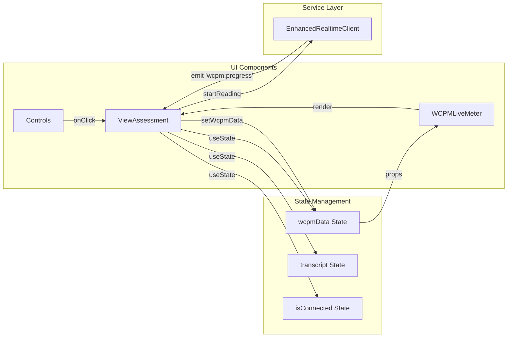

---

## Deployment Architecture

### Infrastructure Diagram

```
┌─────────────────────────────────────────────────────────────┐
│                      Internet                                │
└───────────────────────────┬─────────────────────────────────┘
                            │
                            ▼
┌─────────────────────────────────────────────────────────────┐
│                    Cloudflare CDN                            │
│  - Static assets (JS, CSS, images)                          │
│  - DDoS protection                                           │
│  - SSL/TLS termination                                       │
└───────────────────────────┬─────────────────────────────────┘
                            │
        ┌───────────────────┴───────────────────┐
        │                                       │
        ▼                                       ▼
┌──────────────────┐                 ┌──────────────────┐
│  Lovable CDN     │                 │  Supabase        │
│  - React App     │                 │  Platform        │
│  - Static Build  │                 │                  │
└──────────────────┘                 └────────┬─────────┘
                                              │
                        ┌─────────────────────┼─────────────────────┐
                        │                     │                     │
                        ▼                     ▼                     ▼
            ┌────────────────────┐  ┌────────────────┐  ┌────────────────┐
            │  Edge Functions    │  │  PostgreSQL    │  │  Auth Service  │
            │  - calculate-wcpm  │  │  - wcpm_scores │  │  - JWT tokens  │
            │  - Deno runtime    │  │  - RLS         │  │  - Session mgmt│
            └────────────────────┘  └────────────────┘  └────────────────┘
                        │
                        ▼
            ┌────────────────────┐
            │  OpenAI API        │
            │  - Realtime API    │
            │  - WebRTC endpoint │
            │  - Whisper STT     │
            └────────────────────┘
```

### Network Flow

```
Student Browser
    │
    ├─► [HTTP/2] → Lovable CDN → React App (static)
    │
    ├─► [WebRTC] → OpenAI Realtime API → Audio transcription
    │
    ├─► [HTTPS] → Supabase Edge Functions → calculate-wcpm
    │
    └─► [HTTPS] → Supabase PostgREST → Database queries

Data Flow:
1. HTML/CSS/JS: Lovable CDN (cached, fast)
2. Audio: Direct WebRTC to OpenAI (low latency)
3. Calculations: Edge Functions (serverless, auto-scale)
4. Storage: PostgreSQL (ACID, encrypted)
```

### Scalability Architecture

```
                        [Load Balancer]
                              │
        ┌─────────────────────┼─────────────────────┐
        │                     │                     │
        ▼                     ▼                     ▼
[Edge Function 1]     [Edge Function 2]     [Edge Function 3]
(Auto-scaled)         (Auto-scaled)         (Auto-scaled)
        │                     │                     │
        └─────────────────────┼─────────────────────┘
                              │
                    [Connection Pool]
                              │
                              ▼
                    [PostgreSQL Primary]
                              │
                    ┌─────────┴─────────┐
                    │                   │
                    ▼                   ▼
            [Read Replica 1]    [Read Replica 2]

Scaling Strategy:
- Edge Functions: Auto-scale based on concurrent requests
- Database: Read replicas for analytics queries
- WebRTC: Direct P2P connection (no server load)
```

---

## Error Flow Diagrams

### Error Handling Flow

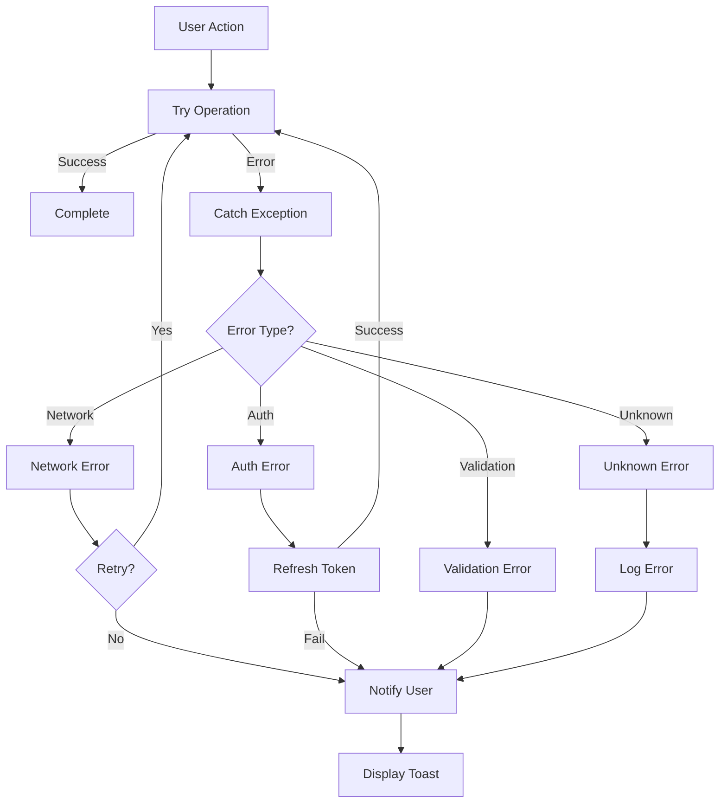

### Retry Logic Flow

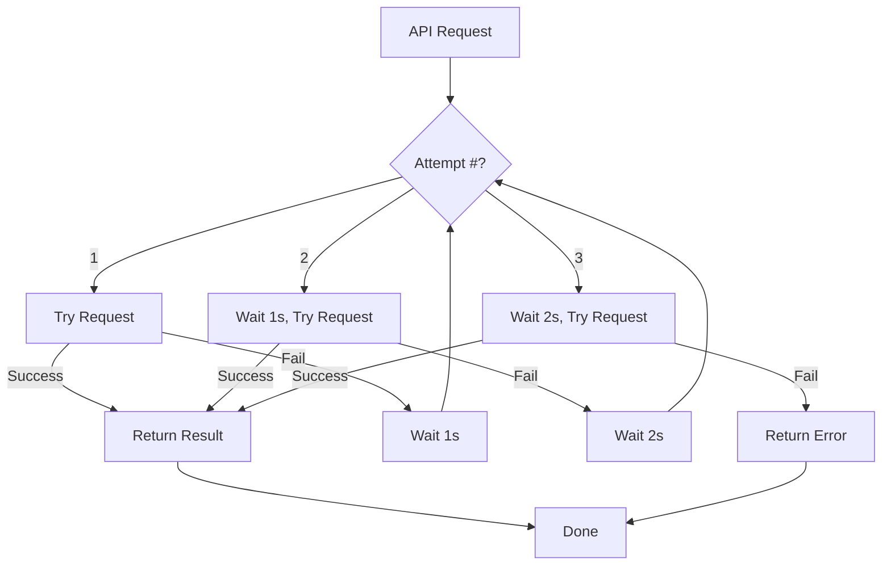

---

## Database Entity-Relationship Diagram

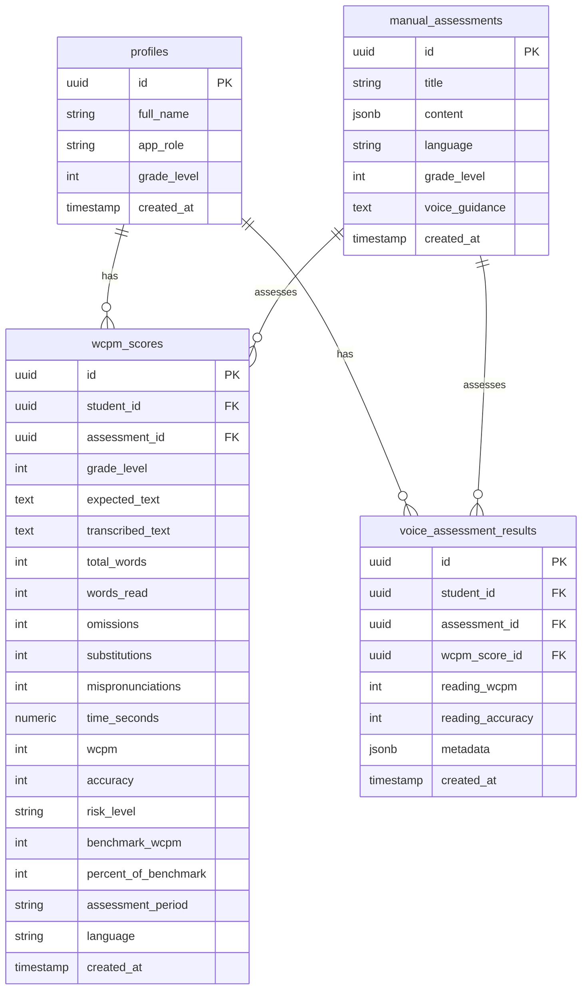

---

## Performance Optimization Flow

```mermaid
graph TB
    Request[WCPM Calculation Request]

    Request --> Cache{In Cache?}
    Cache -->|Yes| Return[Return Cached Result]
    Cache -->|No| Process[Process Calculation]

    Process --> Parallel{Can Parallelize?}
    Parallel -->|Yes| Split[Split into Sub-tasks]
    Split --> Sub1[Normalize Text]
    Split --> Sub2[Get Benchmark]

    Sub1 --> Join[Join Results]
    Sub2 --> Join

    Parallel -->|No| Sequential[Sequential Processing]
    Sequential --> Join

    Join --> Align[Word Alignment<br/>O(n×m) complexity]
    Align --> Count[Count Errors<br/>O(n) complexity]
    Count --> Calc[Calculate WCPM<br/>O(1) complexity]
    Calc --> Store[Store in Database]
    Store --> CacheSet[Set Cache Entry]
    CacheSet --> Return
```

---

## Monitoring Dashboard Layout

```
┌─────────────────────────────────────────────────────────────┐
│                 WCPM System Dashboard                        │
├─────────────────────────────────────────────────────────────┤
│                                                              │
│  ┌────────────┬────────────┬────────────┬────────────┐     │
│  │  Total     │  Success   │  Failed    │  Avg       │     │
│  │  Calcs     │  Rate      │  Rate      │  Latency   │     │
│  │  15,234    │  99.2%     │  0.8%      │  285ms     │     │
│  └────────────┴────────────┴────────────┴────────────┘     │
│                                                              │
│  ┌──────────────────────────────────────────────────────┐  │
│  │  WCPM Distribution by Grade                          │  │
│  │  [Bar Chart]                                          │  │
│  │  K: 28  1: 75  2: 85  3: 95  4: 110  5: 125         │  │
│  └──────────────────────────────────────────────────────┘  │
│                                                              │
│  ┌──────────────────────────────────────────────────────┐  │
│  │  Risk Level Distribution                              │  │
│  │  [Pie Chart]                                          │  │
│  │  Above: 15%  On-Level: 60%  Below: 20%  Far: 5%     │  │
│  └──────────────────────────────────────────────────────┘  │
│                                                              │
│  ┌──────────────────────────────────────────────────────┐  │
│  │  Recent Calculations (Live)                           │  │
│  │  StudentA | Grade 2 | 89 WCPM | On-Level | 2s ago   │  │
│  │  StudentB | Grade 3 | 105 WCPM | Above | 5s ago     │  │
│  │  StudentC | Grade 1 | 65 WCPM | Below | 8s ago      │  │
│  └──────────────────────────────────────────────────────┘  │
│                                                              │
└─────────────────────────────────────────────────────────────┘
```

---

## Conclusion

These diagrams provide a comprehensive visual representation of the WCPM Assessment system architecture, data flows, and component interactions. They serve as:

1. **Development Guide:** Clear blueprints for implementation
2. **Communication Tool:** Visual aids for stakeholder discussions
3. **Documentation:** Permanent record of system design
4. **Troubleshooting Reference:** Quick diagnosis of issues

**All diagrams are in Mermaid format** and can be rendered in:
- GitHub Markdown
- VS Code (with Mermaid extension)
- Mermaid Live Editor (https://mermaid.live)
- Documentation platforms (GitBook, Confluence, etc.)

---

**Document Version:** 1.0
**Last Updated:** October 23, 2025
**Status:** Complete - Ready for development reference
