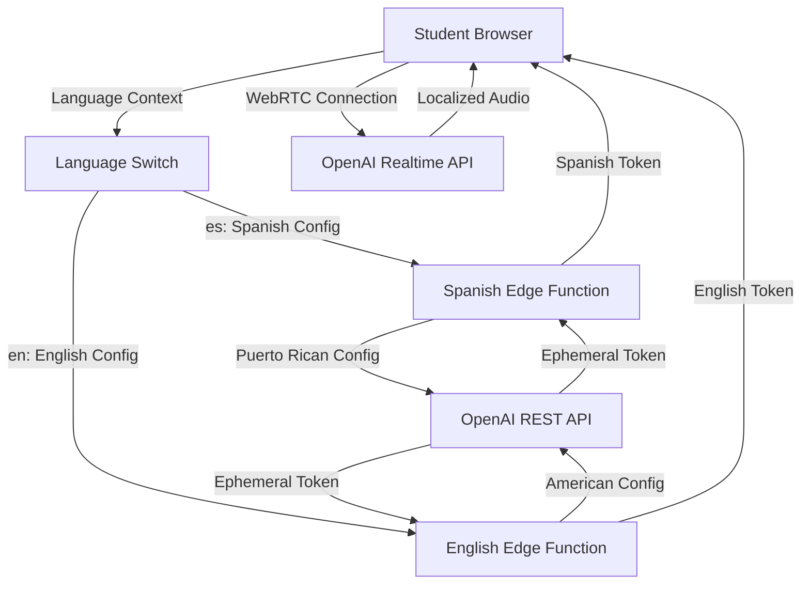

# OpenAI Realtime WebRTC Demo - Bilingual Implementation Plan

## Overview

This plan creates a new, superior realtime voice demo using OpenAI's official WebRTC implementation. This demo will serve as a bilingual student guide for our K-5 platform, featuring ultra-low latency voice interaction with automatic greeting initiation in both Spanish (Puerto Rican) and English (American).

**Key Requirements:**
- Bilingual support: Spanish (Puerto Rican) and English (American)
- Use OpenAI Realtime WebRTC API with standard API key (server-side only)
- Language-specific voice configuration and cultural context
- Auto-initiate conversation with platform introduction in selected language
- Extremely fluid, low-latency experience (<500ms perceived)
- Complete new implementation - NO reuse of existing realtime code
- Integration with existing LanguageContext

## Language-Specific Configuration

### Spanish (Puerto Rican) Demo
- **Voice:** `echo` (most natural for Spanish)
- **Language Code:** `es-PR`
- **Cultural Context:** Puerto Rican vocabulary, expressions, and educational context
- **Instructions:** Tailored for Puerto Rican students with local references

### English (American) Demo  
- **Voice:** `ash` (friendly, natural for children)
- **Language Code:** `en-US`
- **Cultural Context:** American English with K-5 educational standards
- **Instructions:** Optimized for American English speakers

## Architecture Decision: Ephemeral Token Approach

Based on OpenAI documentation, we'll use the **ephemeral token approach** for optimal security and performance:

1. Browser requests ephemeral token from our Supabase Edge Function (with language parameter)
2. Server exchanges standard API key for ephemeral token via OpenAI REST API (language-specific config)
3. Browser uses ephemeral token to establish direct WebRTC connection to OpenAI
4. All audio/data flows directly between browser and OpenAI (optimal latency)

## Bilingual System Architecture



## Implementation Components

### 1. Bilingual Supabase Edge Function: `realtime-student-guide-token`
**Purpose:** Language-aware ephemeral token generation
**Location:** `supabase/functions/realtime-student-guide-token/index.ts`

**Features:**
- Accept language parameter (`es` or `en`) from client
- Generate language-specific configuration
- Call OpenAI `/v1/realtime/sessions` endpoint with proper language setup
- Return complete session object securely
- No database writes (stateless token generation)

**Spanish Configuration:**
```typescript
{
  model: 'gpt-realtime-2025-08-28',
  voice: 'echo',
  instructions: `Eres una guía de aprendizaje amigable para estudiantes de K-5 en Puerto Rico. 
    Habla con vocabulario puertorriqueño natural, usa expresiones locales apropiadas para niños, 
    y ayuda a los estudiantes a navegar nuestra plataforma educativa. Sé cálida, 
    alentadora y usa un tono conversacional que conecte con la cultura puertorriqueña.`,
  turn_detection: {
    type: 'server_vad',
    threshold: 0.5,
    prefix_padding_ms: 300,
    silence_duration_ms: 500
  }
}
```

**English Configuration:**
```typescript
{
  model: 'gpt-realtime-2025-08-28',
  voice: 'ash',
  instructions: `You are a friendly learning guide for K-5 students in the United States. 
    Use American English with age-appropriate vocabulary and encouraging language. 
    Help students navigate our educational platform with enthusiasm and warmth. 
    Be conversational, supportive, and make learning feel fun and accessible.`,
  turn_detection: {
    type: 'server_vad',
    threshold: 0.5,
    prefix_padding_ms: 300,
    silence_duration_ms: 500
  }
}
```

### 2. WebRTC Client Class: `StudentGuideRealtimeClient`
**Purpose:** Language-aware WebRTC peer connection management
**Location:** `src/lib/realtime/StudentGuideRealtimeClient.ts`

**Core Responsibilities:**
- WebRTC peer connection setup and management
- Audio input/output configuration (24kHz mono)
- Data channel for OpenAI event communication
- Language-specific session initialization
- Automatic reconnection with language context preservation
- Audio buffer management for smooth playback

**Key Methods:**
```typescript
class StudentGuideRealtimeClient {
  async connect(ephemeralToken: string, language: 'es' | 'en'): Promise<void>
  async disconnect(): Promise<void>
  sendMessage(text: string): void
  setLanguage(language: 'es' | 'en'): void
  getCurrentLatency(): number
  getConnectionStatus(): ConnectionStatus
}
```

### 3. React Hook: `useStudentGuideRealtime`
**Purpose:** React integration with language context
**Location:** `src/hooks/useStudentGuideRealtime.ts`

**State Management:**
- Integration with existing `useLanguage()` hook
- Connection status per language
- Bilingual transcript history with speaker attribution
- Audio levels and latency metrics
- Language-specific error states and retry capabilities
- Loading states for UI feedback

**Auto-initiation Flow (Language-Aware):**
1. Get current language from LanguageContext
2. Request microphone permission
3. Fetch language-specific ephemeral token
4. Establish WebRTC connection with language config
5. Send language-appropriate initial greeting
6. Handle conversation flow in selected language

### 4. Demo Page: `RealtimeStudentGuideDemo.tsx`
**Purpose:** Bilingual student-facing demo interface
**Location:** `src/pages/demo/RealtimeStudentGuideDemo.tsx`

**UI Components:**
- Language switcher (integrated with LanguageContext)
- Bilingual hero section explaining the guide feature
- Connection status with visual indicators
- Live transcript display with speaker labels
- Audio visualization (optional waveform)
- Manual text input with language detection
- Accessibility controls (mute, retry, captions)
- Language-specific error messages

**Design Principles:**
- Seamless language switching without connection loss
- Cultural sensitivity in visual design elements
- Language-appropriate color schemes and imagery
- Child-friendly interface with clear visual feedback
- Error messages in simple, encouraging language (bilingual)

## Language-Specific Technical Specifications

### Audio Configuration
- **Sample Rate:** 24kHz mono (optimal for OpenAI Realtime)
- **Spanish Voice:** `echo` (natural Spanish pronunciation)
- **English Voice:** `ash` (friendly, child-appropriate)
- **Latency Target:** <500ms end-to-end perceived latency
- **Buffer Management:** Minimal buffering for immediate playback

### Conversation Flow Design

**Spanish Initial Greeting (Auto-sent on connection):**
```
"¡Hola! Soy tu guía de aprendizaje. Estoy aquí para ayudarte a navegar nuestra plataforma y hacer que aprender sea divertido. ¿Cómo te sientes sobre empezar las actividades de hoy?"
```

**English Initial Greeting (Auto-sent on connection):**
```
"Hello! I'm your learning guide. I'm here to help you navigate our platform and make learning fun! How are you feeling about starting today's activities?"
```

**Conversation Management (Bilingual):**
- Maintain language consistency throughout session
- Language-specific cultural references and expressions
- Age-appropriate vocabulary for each language
- Encouraging responses in cultural context
- Guide students through platform features in selected language

## File Structure

```
docs/plan/25-new-realtime-demo/
├── README.md (this file)
├── api-specification.md
├── language-configurations.md
├── ui-mockups/
├── testing-strategy.md
└── deployment-checklist.md

src/
├── pages/demo/
│   └── RealtimeStudentGuideDemo.tsx
├── hooks/
│   └── useStudentGuideRealtime.ts
├── lib/realtime/
│   ├── StudentGuideRealtimeClient.ts
│   ├── languageConfigs.ts
│   └── types.ts
└── components/demo/
    ├── RealtimeTranscript.tsx
    ├── ConnectionStatus.tsx
    ├── LanguageSwitcher.tsx
    └── AudioVisualizer.tsx

supabase/functions/
└── realtime-student-guide-token/
    ├── index.ts
    └── languageConfigs.ts
```

## Bilingual Integration Points

### LanguageContext Integration
```typescript
// Hook integration
const { language, setLanguage, t } = useLanguage();
const { connect, transcript, isConnected } = useStudentGuideRealtime(language);

// Automatic language switching
useEffect(() => {
  if (isConnected) {
    // Reconnect with new language when switched
    reconnectWithLanguage(language);
  }
}, [language]);
```

### Routing Strategy
- Single route: `/demo/realtime-guide`
- Language determined by LanguageContext
- URL can optionally include language parameter for direct access
- Preserves language state across sessions

### UI Text Management
```typescript
// Bilingual text using existing pattern
const welcomeText = t(
  "Bienvenido a tu guía de aprendizaje por voz", 
  "Welcome to your voice learning guide"
);

const connectionStatus = t(
  "Conectando con tu guía en español...",
  "Connecting to your guide in English..."
);
```

## Environment Variables Required

```bash
# Supabase Edge Function
OPENAI_API_KEY=sk-...

# No additional environment variables needed
# Language configuration handled in code
```

## Security Considerations

1. **API Key Protection:** Standard OpenAI API key never leaves server environment
2. **Language Parameter Validation:** Validate language input to prevent injection
3. **Token Expiration:** Ephemeral tokens have built-in expiration
4. **Rate Limiting:** Implement per-user, per-language rate limiting
5. **CORS Configuration:** Restrict to allowed origins only
6. **Student Privacy:** No conversation recording/storage without explicit consent

## Performance Targets (Both Languages)

- **Connection Time:** <2 seconds from page load to ready state
- **Language Switch Time:** <3 seconds to reconnect with new language
- **Audio Latency:** <500ms perceived end-to-end latency
- **Error Recovery:** <3 seconds automatic reconnection on failure
- **Memory Usage:** <50MB for extended conversation sessions

## Browser Compatibility Testing Matrix

**Both Spanish and English demos must be tested on:**
- Chrome Desktop (Windows/Mac/Linux)
- Safari Desktop (Mac)
- Chrome Mobile (Android/iOS)
- Safari Mobile (iOS)
- Edge Desktop (Windows)

**Language-specific testing:**
- Spanish character rendering and pronunciation
- English pronunciation accuracy
- Cultural context appropriateness
- Code-switching behavior (if user speaks other language)

## Success Metrics

1. **Technical Performance (Both Languages):**
   - 95% successful connection rate per language
   - <500ms average perceived latency
   - <5% error rate in production
   - Seamless language switching in <3 seconds

2. **User Experience:**
   - Students can successfully initiate conversation in both languages
   - Clear audio quality with proper pronunciation
   - Intuitive language switching
   - Cultural relevance and appropriateness

3. **Educational Value:**
   - Students understand platform features in their preferred language
   - Increased confidence in using voice features
   - Positive feedback on guide experience across both languages

## Development Timeline

**Phase 1: Core Bilingual Implementation (Week 1)**
- Bilingual edge function development
- Language-aware WebRTC client class
- Basic React hook with language support

**Phase 2: UI and Language Integration (Week 2)**
- Bilingual demo page implementation
- LanguageContext integration
- Language switcher component
- Routing integration

**Phase 3: Testing and Cultural Refinement (Week 3)**
- Cross-browser and cross-language testing
- Cultural appropriateness review
- Performance optimization
- Error handling improvements

**Phase 4: Documentation and Deployment (Week 4)**
- Bilingual user documentation
- Developer documentation
- Production deployment with language monitoring

This comprehensive bilingual plan ensures both Spanish (Puerto Rican) and English (American) students receive culturally appropriate, high-quality voice guidance that showcases the platform's capabilities while providing genuine educational value.