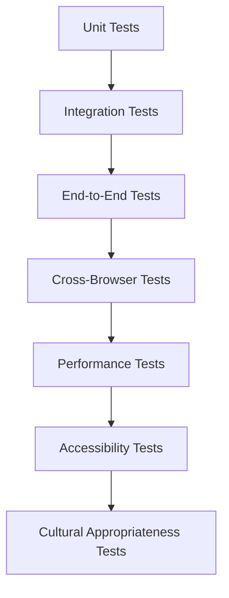

# Testing Strategy - Bilingual Realtime Demo

## Overview

This document outlines the comprehensive testing strategy for the bilingual OpenAI WebRTC realtime demo, covering both Spanish (Puerto Rican) and English (American) implementations across multiple browsers, devices, and network conditions.

## Testing Pyramid



## 1. Unit Testing

### Edge Function Tests
**Location:** `tests/unit/realtime-token-function.test.ts`

```typescript
describe('Realtime Token Function', () => {
  // Language configuration tests
  test('generates correct Spanish configuration', async () => {
    const response = await invokeFunction({ language: 'es' });
    expect(response.voice).toBe('echo');
    expect(response.instructions).toContain('Puerto Rico');
  });

  test('generates correct English configuration', async () => {
    const response = await invokeFunction({ language: 'en' });
    expect(response.voice).toBe('ash');
    expect(response.instructions).toContain('United States');
  });

  // Error handling tests
  test('rejects invalid language parameter', async () => {
    await expect(invokeFunction({ language: 'fr' })).rejects.toThrow();
  });

  test('handles OpenAI API errors gracefully', async () => {
    // Mock OpenAI API failure
    mockOpenAIResponse(500);
    const response = await invokeFunction({ language: 'es' });
    expect(response.error).toBeDefined();
  });
});
```

### WebRTC Client Tests
**Location:** `tests/unit/webrtc-client.test.ts`

```typescript
describe('StudentGuideRealtimeClient', () => {
  let client: StudentGuideRealtimeClient;

  beforeEach(() => {
    client = new StudentGuideRealtimeClient();
  });

  test('initializes with correct default state', () => {
    expect(client.getConnectionStatus()).toBe(ConnectionState.DISCONNECTED);
    expect(client.getCurrentLatency()).toBe(0);
  });

  test('establishes WebRTC connection', async () => {
    const mockToken = 'eph_test_token';
    await client.connect(mockToken, 'es');
    expect(client.getConnectionStatus()).toBe(ConnectionState.CONNECTED);
  });

  test('handles language switching', async () => {
    await client.connect('token', 'en');
    await client.setLanguage('es');
    // Verify language-specific configuration applied
  });

  test('manages audio permissions', async () => {
    mockMediaDevices({ audio: false });
    await expect(client.connect('token', 'en')).rejects.toThrow('AudioError');
  });
});
```

### React Hook Tests
**Location:** `tests/unit/use-student-guide-realtime.test.ts`

```typescript
describe('useStudentGuideRealtime', () => {
  test('integrates with LanguageContext', () => {
    const { result } = renderHook(() => useStudentGuideRealtime('es'), {
      wrapper: LanguageProvider
    });
    
    expect(result.current.isConnected).toBe(false);
    expect(result.current.transcript).toEqual([]);
  });

  test('auto-connects on language change', async () => {
    const { result, rerender } = renderHook(
      ({ lang }) => useStudentGuideRealtime(lang),
      { initialProps: { lang: 'en' } }
    );

    await act(async () => {
      await result.current.connect();
    });

    rerender({ lang: 'es' });
    
    // Should trigger reconnection with Spanish config
    expect(result.current.isConnecting).toBe(true);
  });
});
```

## 2. Integration Testing

### API Integration Tests
**Location:** `tests/integration/realtime-api.test.ts`

```typescript
describe('Realtime API Integration', () => {
  test('end-to-end token generation and WebRTC connection', async () => {
    // Test full flow from token request to active connection
    const tokenResponse = await fetch('/functions/v1/realtime-student-guide-token', {
      method: 'POST',
      body: JSON.stringify({ language: 'es' })
    });
    
    const tokenData = await tokenResponse.json();
    expect(tokenData.client_secret.value).toBeDefined();
    
    // Use token to establish WebRTC connection
    const client = new StudentGuideRealtimeClient();
    await client.connect(tokenData.client_secret.value, 'es');
    
    expect(client.getConnectionStatus()).toBe(ConnectionState.CONNECTED);
  });

  test('bilingual session management', async () => {
    // Test switching between languages within session
    const client = new StudentGuideRealtimeClient();
    
    // Start with Spanish
    const esToken = await getToken('es');
    await client.connect(esToken, 'es');
    
    // Switch to English
    const enToken = await getToken('en');
    await client.connect(enToken, 'en');
    
    // Verify language-specific responses
    const response = await sendMessage('Hello');
    expect(response).toMatch(/English response pattern/);
  });
});
```

### Database Integration Tests
**Location:** `tests/integration/database-integration.test.ts`

```typescript
describe('Database Integration', () => {
  test('logs session metrics correctly', async () => {
    // Test that session data is recorded properly
    // (if we decide to add session logging)
  });

  test('respects user language preferences', async () => {
    // Test integration with user profile language settings
  });
});
```

## 3. End-to-End Testing

### Browser Automation Tests
**Location:** `tests/e2e/realtime-demo.test.ts`

```typescript
describe('Realtime Demo E2E', () => {
  test('complete Spanish demo flow', async () => {
    await page.goto('/demo/realtime-guide');
    
    // Set language to Spanish
    await page.click('[data-testid="language-switch"]');
    await page.click('[data-testid="spanish-option"]');
    
    // Grant microphone permission
    await page.grantPermissions(['microphone']);
    
    // Start demo
    await page.click('[data-testid="start-demo"]');
    
    // Wait for connection
    await page.waitForSelector('[data-testid="connected-status"]');
    
    // Verify Spanish greeting appears
    await page.waitForSelector('[data-testid="transcript-entry"]');
    const greeting = await page.textContent('[data-testid="transcript-entry"]');
    expect(greeting).toContain('¡Hola');
    
    // Test voice interaction (simulated)
    await page.click('[data-testid="speak-button"]');
    await simulateUserVoice('Hola, ¿cómo estás?');
    
    // Verify AI response
    await page.waitForSelector('[data-testid="ai-response"]');
    const response = await page.textContent('[data-testid="ai-response"]');
    expect(response).toMatch(/Spanish response pattern/);
  });

  test('complete English demo flow', async () => {
    await page.goto('/demo/realtime-guide');
    
    // Set language to English
    await page.click('[data-testid="language-switch"]');
    await page.click('[data-testid="english-option"]');
    
    // Similar flow for English
    await page.grantPermissions(['microphone']);
    await page.click('[data-testid="start-demo"]');
    await page.waitForSelector('[data-testid="connected-status"]');
    
    const greeting = await page.textContent('[data-testid="transcript-entry"]');
    expect(greeting).toContain('Hello');
  });

  test('language switching during active session', async () => {
    // Test switching languages mid-conversation
    await page.goto('/demo/realtime-guide');
    await startDemo('es');
    
    // Switch to English mid-session
    await page.click('[data-testid="language-switch"]');
    await page.click('[data-testid="english-option"]');
    
    // Verify reconnection with English config
    await page.waitForSelector('[data-testid="reconnecting-status"]');
    await page.waitForSelector('[data-testid="connected-status"]');
    
    // Verify next response is in English
    await simulateUserVoice('Hello');
    const response = await page.waitForSelector('[data-testid="ai-response"]');
    expect(await response.textContent()).toMatch(/English pattern/);
  });
});
```

## 4. Cross-Browser Testing

### Browser Matrix
| Browser | Desktop | Mobile | Priority |
|---------|---------|---------|----------|
| Chrome | ✅ Windows/Mac/Linux | ✅ Android/iOS | High |
| Safari | ✅ Mac | ✅ iOS | High |
| Edge | ✅ Windows | ➖ | Medium |
| Firefox | ✅ Windows/Mac/Linux | ⚠️ Android | Medium |

### Browser-Specific Tests
**Location:** `tests/cross-browser/browser-compatibility.test.ts`

```typescript
describe('Cross-Browser Compatibility', () => {
  const browsers = ['chromium', 'webkit', 'firefox'];
  
  browsers.forEach(browserName => {
    test(`${browserName}: basic WebRTC functionality`, async () => {
      const browser = await playwright[browserName].launch();
      const page = await browser.newPage();
      
      await page.goto('/demo/realtime-guide');
      
      // Test microphone access
      await page.grantPermissions(['microphone']);
      
      // Test WebRTC connection establishment
      await page.click('[data-testid="start-demo"]');
      await page.waitForSelector('[data-testid="connected-status"]', { timeout: 10000 });
      
      // Verify audio capabilities
      const hasAudioTrack = await page.evaluate(() => {
        return navigator.mediaDevices.getUserMedia({ audio: true })
          .then(() => true)
          .catch(() => false);
      });
      
      expect(hasAudioTrack).toBe(true);
      
      await browser.close();
    });
  });
});
```

### Mobile-Specific Tests
```typescript
describe('Mobile Compatibility', () => {
  test('iOS Safari WebRTC support', async () => {
    const browser = await webkit.launch();
    const context = await browser.newContext({
      userAgent: 'iPhone Safari User Agent'
    });
    const page = await context.newPage();
    
    // Test mobile-specific issues
    await testMobileWebRTC(page);
  });

  test('Android Chrome WebRTC support', async () => {
    const browser = await chromium.launch();
    const context = await browser.newContext({
      userAgent: 'Android Chrome User Agent'
    });
    const page = await context.newPage();
    
    await testMobileWebRTC(page);
  });
});
```

## 5. Performance Testing

### Latency Testing
**Location:** `tests/performance/latency.test.ts`

```typescript
describe('Latency Performance', () => {
  test('measures end-to-end latency', async () => {
    const client = new StudentGuideRealtimeClient();
    await client.connect(await getToken('en'), 'en');
    
    const startTime = Date.now();
    
    // Send message and measure response time
    client.sendMessage('Hello');
    
    await new Promise(resolve => {
      client.on('responseReceived', () => {
        const latency = Date.now() - startTime;
        expect(latency).toBeLessThan(500); // <500ms requirement
        resolve();
      });
    });
  });

  test('measures connection establishment time', async () => {
    const startTime = Date.now();
    const client = new StudentGuideRealtimeClient();
    
    await client.connect(await getToken('es'), 'es');
    
    const connectionTime = Date.now() - startTime;
    expect(connectionTime).toBeLessThan(2000); // <2s requirement
  });
});
```

### Load Testing
**Location:** `tests/performance/load.test.ts`

```typescript
describe('Load Testing', () => {
  test('handles multiple concurrent connections', async () => {
    const connectionPromises = Array.from({ length: 10 }, async () => {
      const client = new StudentGuideRealtimeClient();
      return client.connect(await getToken('en'), 'en');
    });
    
    await Promise.all(connectionPromises);
    
    // Verify all connections established successfully
    // Test should not fail or timeout
  });

  test('edge function rate limiting', async () => {
    // Test rate limiting behavior
    const requests = Array.from({ length: 20 }, () => 
      fetch('/functions/v1/realtime-student-guide-token', {
        method: 'POST',
        body: JSON.stringify({ language: 'en' })
      })
    );
    
    const responses = await Promise.all(requests);
    const rateLimitedResponses = responses.filter(r => r.status === 429);
    
    expect(rateLimitedResponses.length).toBeGreaterThan(0);
  });
});
```

## 6. Accessibility Testing

### ARIA and Screen Reader Tests
**Location:** `tests/accessibility/aria.test.ts`

```typescript
describe('Accessibility', () => {
  test('proper ARIA labels for Spanish interface', async () => {
    await page.goto('/demo/realtime-guide');
    await setLanguage('es');
    
    // Test ARIA attributes
    const speakButton = await page.locator('[data-testid="speak-button"]');
    expect(await speakButton.getAttribute('aria-label')).toBe('Hablar con la guía');
    
    const transcript = await page.locator('[data-testid="transcript"]');
    expect(await transcript.getAttribute('aria-live')).toBe('polite');
  });

  test('keyboard navigation support', async () => {
    await page.goto('/demo/realtime-guide');
    
    // Test tab navigation
    await page.keyboard.press('Tab');
    await page.keyboard.press('Tab');
    await page.keyboard.press('Enter');
    
    // Verify demo starts via keyboard
    await page.waitForSelector('[data-testid="connected-status"]');
  });

  test('screen reader compatibility', async () => {
    // Test with simulated screen reader
    await page.goto('/demo/realtime-guide');
    
    // Verify content is accessible to screen readers
    const accessibleContent = await page.evaluate(() => {
      return Array.from(document.querySelectorAll('[aria-label], [aria-describedby]'))
        .map(el => el.getAttribute('aria-label') || el.getAttribute('aria-describedby'));
    });
    
    expect(accessibleContent.length).toBeGreaterThan(0);
  });
});
```

## 7. Cultural Appropriateness Testing

### Language and Cultural Validation
**Location:** `tests/cultural/language-validation.test.ts`

```typescript
describe('Cultural Appropriateness', () => {
  test('Spanish responses use appropriate Puerto Rican vocabulary', async () => {
    const client = new StudentGuideRealtimeClient();
    await client.connect(await getToken('es'), 'es');
    
    const response = await sendMessageAndGetResponse('¿Cómo estás?');
    
    // Check for Puerto Rican expressions
    expect(response).toMatch(/(mi amor|nene|nena|qué bien)/i);
    
    // Ensure no inappropriate regionalisms
    expect(response).not.toMatch(/(che|vos|wey)/i);
  });

  test('English responses are inclusive and appropriate', async () => {
    const client = new StudentGuideRealtimeClient();
    await client.connect(await getToken('en'), 'en');
    
    const response = await sendMessageAndGetResponse('I need help');
    
    // Check for encouraging, inclusive language
    expect(response).toMatch(/(great|wonderful|you can do this)/i);
    
    // Ensure no exclusive or inappropriate language
    expect(response).not.toMatch(/(guys|dude|weird)/i);
  });

  test('age-appropriate content in both languages', async () => {
    const testCases = [
      { language: 'es', question: 'Esto es muy difícil' },
      { language: 'en', question: 'This is too hard' }
    ];
    
    for (const testCase of testCases) {
      const client = new StudentGuideRealtimeClient();
      await client.connect(await getToken(testCase.language), testCase.language);
      
      const response = await sendMessageAndGetResponse(testCase.question);
      
      // Verify encouraging, age-appropriate response
      expect(response.length).toBeGreaterThan(20); // Substantial response
      expect(response).toMatch(/can|able|try|step/i); // Encouraging words
    }
  });
});
```

## 8. Error Handling and Recovery Testing

### Network Condition Tests
**Location:** `tests/error-handling/network-conditions.test.ts`

```typescript
describe('Error Handling', () => {
  test('handles poor network conditions', async () => {
    // Simulate slow network
    await page.route('**/*', route => {
      setTimeout(() => route.continue(), 2000);
    });
    
    await page.goto('/demo/realtime-guide');
    await startDemo('en');
    
    // Should show appropriate loading states
    await page.waitForSelector('[data-testid="slow-connection-warning"]');
  });

  test('recovers from connection drops', async () => {
    const client = new StudentGuideRealtimeClient();
    await client.connect(await getToken('es'), 'es');
    
    // Simulate connection drop
    client.disconnect();
    
    // Should attempt reconnection
    await waitFor(() => 
      client.getConnectionStatus() === ConnectionState.RECONNECTING
    );
    
    // Should recover
    await waitFor(() => 
      client.getConnectionStatus() === ConnectionState.CONNECTED
    );
  });

  test('handles microphone permission denial gracefully', async () => {
    await page.goto('/demo/realtime-guide');
    
    // Deny microphone permission
    await page.context().grantPermissions([]);
    
    await page.click('[data-testid="start-demo"]');
    
    // Should show user-friendly error message
    await page.waitForSelector('[data-testid="microphone-error"]');
    
    const errorMessage = await page.textContent('[data-testid="microphone-error"]');
    expect(errorMessage).toContain('microphone');
  });
});
```

## 9. Testing Automation and CI/CD

### GitHub Actions Workflow
**Location:** `.github/workflows/realtime-demo-tests.yml`

```yaml
name: Realtime Demo Tests

on:
  push:
    paths:
      - 'src/pages/demo/RealtimeStudentGuideDemo.tsx'
      - 'src/hooks/useStudentGuideRealtime.ts'
      - 'src/lib/realtime/**'
      - 'supabase/functions/realtime-student-guide-token/**'

jobs:
  unit-tests:
    runs-on: ubuntu-latest
    steps:
      - uses: actions/checkout@v3
      - uses: actions/setup-node@v3
      - run: npm ci
      - run: npm run test:unit
      
  integration-tests:
    runs-on: ubuntu-latest
    services:
      supabase:
        image: supabase/supabase:latest
    steps:
      - uses: actions/checkout@v3
      - run: npm run test:integration
      
  e2e-tests:
    runs-on: ubuntu-latest
    strategy:
      matrix:
        browser: [chromium, webkit, firefox]
    steps:
      - uses: actions/checkout@v3
      - uses: actions/setup-node@v3
      - run: npx playwright install ${{ matrix.browser }}
      - run: npm run test:e2e:${{ matrix.browser }}
      
  performance-tests:
    runs-on: ubuntu-latest
    steps:
      - uses: actions/checkout@v3
      - run: npm run test:performance
      
  accessibility-tests:
    runs-on: ubuntu-latest
    steps:
      - uses: actions/checkout@v3
      - run: npm run test:accessibility
```

## 10. Test Data and Mocking

### Mock Configurations
**Location:** `tests/mocks/openai-api.ts`

```typescript
export const mockOpenAIResponses = {
  es: {
    client_secret: { value: 'eph_test_es_token' },
    voice: 'echo',
    instructions: 'Spanish instructions...'
  },
  en: {
    client_secret: { value: 'eph_test_en_token' },
    voice: 'ash',
    instructions: 'English instructions...'
  }
};

export const mockWebRTCEvents = {
  connectionEstablished: { type: 'connection.established' },
  audioReceived: { type: 'response.audio.delta', delta: 'mock_audio_data' },
  transcriptReceived: { type: 'conversation.item.completed', item: { content: 'Test response' } }
};
```

This comprehensive testing strategy ensures the bilingual realtime demo meets all requirements for performance, accessibility, cultural appropriateness, and cross-platform compatibility.