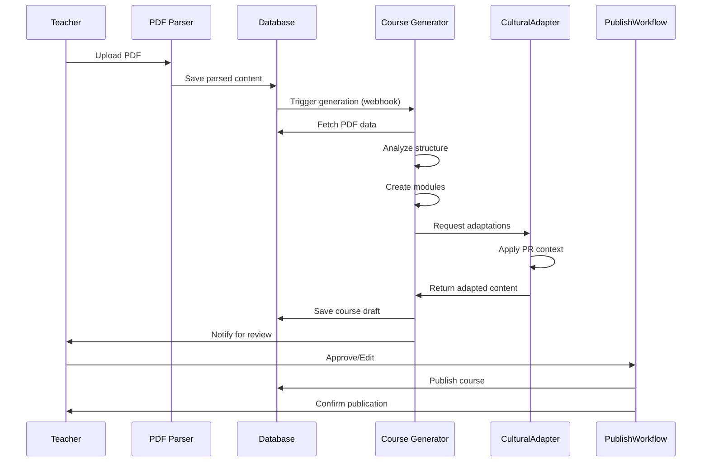

# Course Generation Architecture
## Automated Course Creation from PDF Parsing Results

**Version:** 1.0
**Last Updated:** October 21, 2025
**System:** Supabase Edge Functions + PostgreSQL

---

## Table of Contents

1. [Architecture Overview](#architecture-overview)
2. [Data Flow](#data-flow)
3. [Edge Functions Specification](#edge-functions-specification)
4. [Course Generation Algorithm](#course-generation-algorithm)
5. [Cultural Adaptation Engine](#cultural-adaptation-engine)
6. [Database Schema](#database-schema)
7. [API Endpoints](#api-endpoints)
8. [Code Examples](#code-examples)

---

## Architecture Overview

The course generation system transforms parsed PDF content into structured, bilingual, culturally-adapted courses for K-5 students in Puerto Rico. The architecture follows a serverless, event-driven design using Supabase Edge Functions.

### High-Level Architecture

```
┌─────────────────┐
│   PDF Upload    │
└────────┬────────┘
         │
         ▼
┌─────────────────────────┐
│  PDF Parsing System     │
│  (Existing)             │
│  - Text extraction      │
│  - Image processing     │
│  - Question generation  │
│  - Complexity analysis  │
└────────┬────────────────┘
         │
         │ (Webhook trigger)
         ▼
┌─────────────────────────────────────────┐
│  Edge Function: process-pdf-completion  │
│  - Validates parsing results            │
│  - Triggers course generation           │
└────────┬────────────────────────────────┘
         │
         ▼
┌─────────────────────────────────────────┐
│  Edge Function: generate-course         │
│  - Content structuring                  │
│  - Module creation                      │
│  - Learning objectives extraction       │
│  - Cultural adaptation                  │
└────────┬────────────────────────────────┘
         │
         ├──────────────┬──────────────┐
         ▼              ▼              ▼
┌────────────────┐ ┌────────────┐ ┌──────────────────┐
│ Course Modules │ │ Vocabulary │ │ Cultural Context │
└────────────────┘ └────────────┘ └──────────────────┘
         │
         │ (Human review optional)
         ▼
┌─────────────────────────┐
│  Edge Function:         │
│  publish-course         │
│  - Final validation     │
│  - Publishing workflow  │
│  - Teacher notification │
└─────────────────────────┘
```

### Key Components

1. **PDF Processing Pipeline** (Existing)
   - Outputs: Bilingual text, images, questions, complexity metrics

2. **Course Generator Engine** (New)
   - Input: PDF parsing results
   - Output: Structured course with modules

3. **Cultural Adapter** (New)
   - Puerto Rican context integration
   - Local vocabulary adaptations
   - Cultural reference validation

4. **Publishing Workflow** (New)
   - Quality validation
   - Teacher approval (optional)
   - Student assignment

---

## Data Flow

### Step-by-Step Process



### Data Transformations

**Input (from PDF Parsing):**
```json
{
  "pdf_id": "uuid",
  "extractions": [
    {
      "page_number": 1,
      "text_es": "El zorro astuto cruzó el río.",
      "text_en": "The clever fox crossed the river.",
      "confidence": 0.97
    }
  ],
  "images": [
    {
      "image_id": "uuid",
      "description_es": "Un zorro rojo cruzando un río",
      "description_en": "A red fox crossing a river",
      "educational_relevance": 0.92
    }
  ],
  "questions": [
    {
      "question_es": "¿Qué animal cruzó el río?",
      "question_en": "What animal crossed the river?",
      "options": ["Zorro", "Conejo", "Venado"],
      "correct_answer": "Zorro"
    }
  ],
  "complexity_metrics": {
    "grade_level": 2,
    "lexile_measure": 350,
    "vocabulary_complexity": 0.65
  }
}
```

**Output (Course Structure):**
```json
{
  "course_id": "uuid",
  "title_es": "Animales del Bosque: Cuentos de Astucia",
  "title_en": "Forest Animals: Tales of Cleverness",
  "grade_level": "2",
  "complexity_score": 3.2,
  "cultural_context": {
    "location": "puerto_rico",
    "adaptations_applied": [
      "local_fauna_examples",
      "boricua_vocabulary",
      "cultural_storytelling_style"
    ]
  },
  "modules": [
    {
      "module_number": 1,
      "title_es": "Introducción: Animales Inteligentes",
      "title_en": "Introduction: Intelligent Animals",
      "learning_objectives": [
        {
          "objective_es": "Identificar características de animales astutos",
          "objective_en": "Identify characteristics of clever animals",
          "standard_code": "CCSS.ELA-LITERACY.RL.2.3"
        }
      ],
      "content_blocks": [
        {
          "type": "text",
          "content_es": "El zorro astuto cruzó el río...",
          "content_en": "The clever fox crossed the river...",
          "position": 1
        },
        {
          "type": "image",
          "image_id": "uuid",
          "caption_es": "Un zorro rojo cruzando un río",
          "caption_en": "A red fox crossing a river",
          "position": 2
        },
        {
          "type": "vocabulary",
          "terms": [
            {
              "term_es": "astuto",
              "term_en": "clever",
              "definition_es": "Que actúa con inteligencia y habilidad",
              "cultural_note": "En Puerto Rico también se usa 'vivo' o 'pillo'"
            }
          ],
          "position": 3
        }
      ],
      "estimated_duration_minutes": 25
    }
  ]
}
```

---

## Edge Functions Specification

### 1. `process-pdf-completion`

**Purpose:** Webhook handler triggered when PDF parsing completes

**Trigger:** Database webhook on `pdf_documents` table update

```typescript
// supabase/functions/process-pdf-completion/index.ts
import { serve } from "https://deno.land/std@0.168.0/http/server.ts"
import { createClient } from 'https://esm.sh/@supabase/supabase-js@2'

interface WebhookPayload {
  type: 'UPDATE';
  table: 'pdf_documents';
  record: {
    id: string;
    status: string;
    grade_level: string;
  };
  old_record: any;
}

serve(async (req) => {
  const supabaseClient = createClient(
    Deno.env.get('SUPABASE_URL') ?? '',
    Deno.env.get('SUPABASE_SERVICE_ROLE_KEY') ?? ''
  );

  const payload: WebhookPayload = await req.json();

  // Only process completed PDFs
  if (payload.record.status !== 'completed') {
    return new Response(
      JSON.stringify({ message: 'PDF not yet completed' }),
      { status: 200 }
    );
  }

  console.log(`Processing completed PDF: ${payload.record.id}`);

  // Trigger course generation
  const { data, error } = await supabaseClient.functions.invoke(
    'generate-course',
    {
      body: {
        pdfId: payload.record.id,
        gradeLevel: payload.record.grade_level,
        autoPublish: false, // Requires teacher review
      }
    }
  );

  if (error) {
    console.error('Course generation failed:', error);
    return new Response(
      JSON.stringify({ error: error.message }),
      { status: 500 }
    );
  }

  return new Response(
    JSON.stringify({
      message: 'Course generation triggered',
      courseId: data.courseId
    }),
    {
      status: 200,
      headers: { "Content-Type": "application/json" }
    }
  );
});
```

**Webhook Setup:**
```sql
-- Create webhook for PDF completion
CREATE OR REPLACE FUNCTION notify_pdf_completion()
RETURNS TRIGGER AS $$
BEGIN
  IF NEW.status = 'completed' AND OLD.status != 'completed' THEN
    PERFORM net.http_post(
      url := 'https://<project-ref>.supabase.co/functions/v1/process-pdf-completion',
      headers := jsonb_build_object(
        'Content-Type', 'application/json',
        'Authorization', 'Bearer ' || current_setting('app.service_role_key')
      ),
      body := jsonb_build_object(
        'type', 'UPDATE',
        'table', 'pdf_documents',
        'record', row_to_json(NEW),
        'old_record', row_to_json(OLD)
      )
    );
  END IF;
  RETURN NEW;
END;
$$ LANGUAGE plpgsql SECURITY DEFINER;

CREATE TRIGGER pdf_completion_webhook
  AFTER UPDATE ON pdf_documents
  FOR EACH ROW
  EXECUTE FUNCTION notify_pdf_completion();
```

---

### 2. `generate-course`

**Purpose:** Main course generation orchestrator

```typescript
// supabase/functions/generate-course/index.ts
import { serve } from "https://deno.land/std@0.168.0/http/server.ts";
import { createClient } from 'https://esm.sh/@supabase/supabase-js@2';
import { CourseGenerator } from './lib/course-generator.ts';
import { CulturalAdapter } from './lib/cultural-adapter.ts';
import { QualityValidator } from './lib/quality-validator.ts';

interface GenerateCourseRequest {
  pdfId: string;
  gradeLevel: string;
  autoPublish: boolean;
  teacherId?: string;
}

serve(async (req) => {
  const supabaseClient = createClient(
    Deno.env.get('SUPABASE_URL') ?? '',
    Deno.env.get('SUPABASE_SERVICE_ROLE_KEY') ?? ''
  );

  const { pdfId, gradeLevel, autoPublish, teacherId }: GenerateCourseRequest =
    await req.json();

  try {
    // 1. Fetch PDF parsing results
    const { data: pdfData, error: fetchError } = await supabaseClient
      .from('pdf_documents')
      .select(`
        *,
        pdf_extractions(*),
        pdf_images(*),
        pdf_questions(*),
        vocabulary_terms(*)
      `)
      .eq('id', pdfId)
      .single();

    if (fetchError) throw new Error(`Failed to fetch PDF data: ${fetchError.message}`);

    // 2. Generate course structure
    const generator = new CourseGenerator({
      gradeLevel,
      bilingualMode: true,
      culturalContext: 'puerto_rico',
      maxModulesPerCourse: 8,
      targetModuleDuration: 30 // minutes
    });

    const courseStructure = await generator.createFromPDF(pdfData);

    // 3. Apply cultural adaptations
    const adapter = new CulturalAdapter();
    const adaptedCourse = await adapter.adapt(courseStructure, {
      includeLocalExamples: true,
      vocabularyLocalization: true,
      culturalReferences: true,
      region: 'puerto_rico'
    });

    // 4. Validate quality
    const validator = new QualityValidator();
    const validationResults = await validator.validate(adaptedCourse, {
      minBilingualAccuracy: 0.95,
      minCulturalRelevance: 0.80,
      maxComplexityDeviation: 0.5 // From target grade level
    });

    if (!validationResults.passed) {
      console.warn('Quality validation failed:', validationResults.issues);
      // Continue but flag for human review
      adaptedCourse.requiresReview = true;
      adaptedCourse.reviewNotes = validationResults.issues;
    }

    // 5. Save to database
    const { data: savedCourse, error: saveError } = await supabaseClient
      .from('courses')
      .insert({
        source_pdf_id: pdfId,
        grade_level: gradeLevel,
        title_es: adaptedCourse.title_es,
        title_en: adaptedCourse.title_en,
        description_es: adaptedCourse.description_es,
        description_en: adaptedCourse.description_en,
        complexity_score: adaptedCourse.complexity_score,
        cultural_context: adaptedCourse.cultural_context,
        status: autoPublish && validationResults.passed ? 'published' : 'draft'
      })
      .select()
      .single();

    if (saveError) throw new Error(`Failed to save course: ${saveError.message}`);

    // 6. Create modules
    const modulesWithCourseId = adaptedCourse.modules.map(m => ({
      ...m,
      course_id: savedCourse.id
    }));

    const { error: modulesError } = await supabaseClient
      .from('course_modules')
      .insert(modulesWithCourseId);

    if (modulesError) throw new Error(`Failed to save modules: ${modulesError.message}`);

    // 7. Notify teacher (if specified)
    if (teacherId) {
      await supabaseClient.functions.invoke('send-notification', {
        body: {
          recipientId: teacherId,
          type: 'course_generated',
          data: {
            courseId: savedCourse.id,
            courseTitle: savedCourse.title_es,
            requiresReview: adaptedCourse.requiresReview
          }
        }
      });
    }

    return new Response(
      JSON.stringify({
        success: true,
        courseId: savedCourse.id,
        moduleCount: modulesWithCourseId.length,
        requiresReview: adaptedCourse.requiresReview,
        validationResults
      }),
      {
        status: 200,
        headers: { "Content-Type": "application/json" }
      }
    );

  } catch (error) {
    console.error('Course generation error:', error);
    return new Response(
      JSON.stringify({
        success: false,
        error: error.message
      }),
      {
        status: 500,
        headers: { "Content-Type": "application/json" }
      }
    );
  }
});
```

---

### 3. Course Generator Library

```typescript
// supabase/functions/generate-course/lib/course-generator.ts

interface CourseGeneratorConfig {
  gradeLevel: string;
  bilingualMode: boolean;
  culturalContext: string;
  maxModulesPerCourse: number;
  targetModuleDuration: number; // minutes
}

interface PDFData {
  id: string;
  title: string;
  pdf_extractions: TextExtraction[];
  pdf_images: ImageData[];
  pdf_questions: Question[];
  vocabulary_terms: VocabularyTerm[];
}

interface TextExtraction {
  page_number: number;
  text_es: string;
  text_en: string;
  confidence: number;
}

interface CourseStructure {
  title_es: string;
  title_en: string;
  description_es: string;
  description_en: string;
  complexity_score: number;
  cultural_context: object;
  modules: ModuleStructure[];
  requiresReview?: boolean;
  reviewNotes?: string[];
}

export class CourseGenerator {
  private config: CourseGeneratorConfig;

  constructor(config: CourseGeneratorConfig) {
    this.config = config;
  }

  async createFromPDF(pdfData: PDFData): Promise<CourseStructure> {
    // 1. Analyze content structure
    const contentAnalysis = this.analyzeContent(pdfData);

    // 2. Generate course metadata
    const courseMeta = await this.generateCourseMetadata(pdfData, contentAnalysis);

    // 3. Chunk content into modules
    const modules = await this.createModules(pdfData, contentAnalysis);

    // 4. Extract learning objectives
    const modulesWithObjectives = await this.addLearningObjectives(modules);

    // 5. Calculate complexity
    const complexityScore = this.calculateComplexity(pdfData);

    return {
      ...courseMeta,
      complexity_score: complexityScore,
      modules: modulesWithObjectives,
      cultural_context: {
        source: this.config.culturalContext,
        adaptations_pending: true
      }
    };
  }

  private analyzeContent(pdfData: PDFData) {
    const totalPages = Math.max(...pdfData.pdf_extractions.map(e => e.page_number));
    const totalWords = pdfData.pdf_extractions.reduce((sum, e) =>
      sum + e.text_es.split(/\s+/).length, 0
    );
    const imageCount = pdfData.pdf_images.length;
    const vocabularyCount = pdfData.vocabulary_terms.length;

    // Estimate optimal module count
    const suggestedModules = Math.ceil(totalPages / 3); // ~3 pages per module
    const modulesCount = Math.min(
      suggestedModules,
      this.config.maxModulesPerCourse
    );

    return {
      totalPages,
      totalWords,
      imageCount,
      vocabularyCount,
      suggestedModules: modulesCount,
      wordsPerModule: Math.ceil(totalWords / modulesCount)
    };
  }

  private async generateCourseMetadata(
    pdfData: PDFData,
    analysis: any
  ): Promise<Partial<CourseStructure>> {
    // Use AI to generate engaging titles from content
    const firstPage = pdfData.pdf_extractions
      .find(e => e.page_number === 1);

    const titlePrompt = `
      Based on this educational content for grade ${this.config.gradeLevel},
      generate an engaging bilingual course title (Spanish and English).

      Content preview: ${firstPage?.text_es.substring(0, 500)}

      Respond in JSON format:
      {
        "title_es": "Spanish title",
        "title_en": "English title",
        "description_es": "Spanish description (2-3 sentences)",
        "description_en": "English description (2-3 sentences)"
      }
    `;

    // Call OpenAI or Anthropic API
    const aiResponse = await this.callAI(titlePrompt);

    return aiResponse;
  }

  private async createModules(
    pdfData: PDFData,
    analysis: any
  ): Promise<ModuleStructure[]> {
    const modules: ModuleStructure[] = [];
    const pagesPerModule = Math.ceil(analysis.totalPages / analysis.suggestedModules);

    for (let i = 0; i < analysis.suggestedModules; i++) {
      const startPage = i * pagesPerModule + 1;
      const endPage = Math.min((i + 1) * pagesPerModule, analysis.totalPages);

      // Get content for this module
      const moduleExtractions = pdfData.pdf_extractions.filter(
        e => e.page_number >= startPage && e.page_number <= endPage
      );

      const moduleImages = pdfData.pdf_images.filter(
        img => img.page_number >= startPage && img.page_number <= endPage
      );

      const moduleVocabulary = pdfData.vocabulary_terms.filter(
        term => term.page_number >= startPage && term.page_number <= endPage
      );

      // Generate module title
      const moduleTitle = await this.generateModuleTitle(
        moduleExtractions,
        i + 1
      );

      // Create content blocks
      const contentBlocks = this.createContentBlocks(
        moduleExtractions,
        moduleImages,
        moduleVocabulary
      );

      modules.push({
        module_number: i + 1,
        title_es: moduleTitle.title_es,
        title_en: moduleTitle.title_en,
        content_blocks: contentBlocks,
        estimated_duration_minutes: this.config.targetModuleDuration,
        learning_objectives: [] // Added in next step
      });
    }

    return modules;
  }

  private createContentBlocks(
    extractions: TextExtraction[],
    images: ImageData[],
    vocabulary: VocabularyTerm[]
  ): ContentBlock[] {
    const blocks: ContentBlock[] = [];
    let position = 1;

    // Interleave text, images, and vocabulary
    for (const extraction of extractions) {
      // Add text block
      blocks.push({
        type: 'text',
        content_es: extraction.text_es,
        content_en: extraction.text_en,
        position: position++
      });

      // Add images from this page
      const pageImages = images.filter(img => img.page_number === extraction.page_number);
      for (const image of pageImages) {
        blocks.push({
          type: 'image',
          image_id: image.id,
          caption_es: image.description_es,
          caption_en: image.description_en,
          position: position++
        });
      }
    }

    // Add vocabulary section at end if present
    if (vocabulary.length > 0) {
      blocks.push({
        type: 'vocabulary',
        terms: vocabulary.map(v => ({
          term_es: v.term_es,
          term_en: v.term_en,
          definition_es: v.definition_es,
          definition_en: v.definition_en
        })),
        position: position++
      });
    }

    return blocks;
  }

  private async addLearningObjectives(
    modules: ModuleStructure[]
  ): Promise<ModuleStructure[]> {
    // Use AI to extract/generate learning objectives
    const modulesWithObjectives = await Promise.all(
      modules.map(async (module) => {
        const objectivesPrompt = `
          Based on this module content for grade ${this.config.gradeLevel},
          identify 2-4 clear learning objectives aligned with Common Core standards.

          Module: ${module.title_es}
          Content preview: ${JSON.stringify(module.content_blocks.slice(0, 2))}

          Respond in JSON format:
          {
            "objectives": [
              {
                "objective_es": "Spanish objective",
                "objective_en": "English objective",
                "standard_code": "CCSS.ELA-LITERACY.RL.${this.config.gradeLevel}.X"
              }
            ]
          }
        `;

        const aiResponse = await this.callAI(objectivesPrompt);

        return {
          ...module,
          learning_objectives: aiResponse.objectives
        };
      })
    );

    return modulesWithObjectives;
  }

  private calculateComplexity(pdfData: PDFData): number {
    // Average complexity from all extractions
    const avgConfidence = pdfData.pdf_extractions.reduce(
      (sum, e) => sum + e.confidence, 0
    ) / pdfData.pdf_extractions.length;

    // Vocabulary complexity
    const vocabularyComplexity = pdfData.vocabulary_terms.length /
      pdfData.pdf_extractions.length;

    // Normalize to 1-5 scale
    const complexity = (
      (avgConfidence * 2) +
      (vocabularyComplexity * 3)
    ) / 2;

    return Math.min(5, Math.max(1, complexity));
  }

  private async generateModuleTitle(
    extractions: TextExtraction[],
    moduleNumber: number
  ): Promise<{ title_es: string; title_en: string }> {
    const contentPreview = extractions
      .map(e => e.text_es)
      .join(' ')
      .substring(0, 500);

    const prompt = `
      Generate a concise, engaging title for Module ${moduleNumber}
      based on this content:

      ${contentPreview}

      Respond in JSON:
      {
        "title_es": "Spanish title",
        "title_en": "English title"
      }
    `;

    return await this.callAI(prompt);
  }

  private async callAI(prompt: string): Promise<any> {
    // Use Anthropic Claude or OpenAI
    const response = await fetch('https://api.anthropic.com/v1/messages', {
      method: 'POST',
      headers: {
        'Content-Type': 'application/json',
        'x-api-key': Deno.env.get('ANTHROPIC_API_KEY') ?? '',
        'anthropic-version': '2023-06-01'
      },
      body: JSON.stringify({
        model: 'claude-3-haiku-20240307',
        max_tokens: 1024,
        messages: [{
          role: 'user',
          content: prompt
        }]
      })
    });

    const data = await response.json();
    const textResponse = data.content[0].text;

    // Extract JSON from response
    const jsonMatch = textResponse.match(/\{[\s\S]*\}/);
    if (jsonMatch) {
      return JSON.parse(jsonMatch[0]);
    }

    throw new Error('Invalid AI response format');
  }
}

interface ModuleStructure {
  module_number: number;
  title_es: string;
  title_en: string;
  content_blocks: ContentBlock[];
  estimated_duration_minutes: number;
  learning_objectives: LearningObjective[];
}

interface ContentBlock {
  type: 'text' | 'image' | 'vocabulary';
  position: number;
  content_es?: string;
  content_en?: string;
  image_id?: string;
  caption_es?: string;
  caption_en?: string;
  terms?: VocabularyItem[];
}

interface LearningObjective {
  objective_es: string;
  objective_en: string;
  standard_code: string;
}

interface VocabularyItem {
  term_es: string;
  term_en: string;
  definition_es: string;
  definition_en: string;
  cultural_note?: string;
}
```

---

## Cultural Adaptation Engine

```typescript
// supabase/functions/generate-course/lib/cultural-adapter.ts

interface AdaptationConfig {
  includeLocalExamples: boolean;
  vocabularyLocalization: boolean;
  culturalReferences: boolean;
  region: string;
}

export class CulturalAdapter {
  private puertoRicoContext = {
    fauna: ['coquí', 'iguana', 'loro puertorriqueño', 'manatí'],
    flora: ['ceiba', 'flamboyán', 'yagrumo', 'palma real'],
    geography: ['El Yunque', 'playas', 'montañas', 'ríos'],
    culture: ['bomba', 'plena', 'vejigante', 'Día de Reyes'],
    vocabulary: {
      // Puerto Rican Spanish variations
      'autobús': 'guagua',
      'plátano': 'guineo',
      'comida': 'bienmesabe',
      'niño': 'nene/nena',
      'amigo': 'pana'
    }
  };

  async adapt(
    course: CourseStructure,
    config: AdaptationConfig
  ): Promise<CourseStructure> {
    const adaptedCourse = { ...course };

    if (config.includeLocalExamples) {
      adaptedCourse.modules = await this.addLocalExamples(course.modules);
    }

    if (config.vocabularyLocalization) {
      adaptedCourse.modules = this.localizeVocabulary(course.modules);
    }

    if (config.culturalReferences) {
      adaptedCourse.cultural_context = {
        ...course.cultural_context,
        region: config.region,
        local_examples_count: this.countLocalExamples(adaptedCourse.modules),
        cultural_relevance_score: this.calculateCulturalRelevance(adaptedCourse)
      };
    }

    return adaptedCourse;
  }

  private async addLocalExamples(modules: ModuleStructure[]): Promise<ModuleStructure[]> {
    return modules.map(module => {
      const adaptedBlocks = module.content_blocks.map(block => {
        if (block.type === 'text') {
          // Enhance text with local context
          const enhancedText = this.enhanceWithLocalContext(
            block.content_es || '',
            block.content_en || ''
          );
          return {
            ...block,
            ...enhancedText
          };
        }
        return block;
      });

      return {
        ...module,
        content_blocks: adaptedBlocks
      };
    });
  }

  private enhanceWithLocalContext(textEs: string, textEn: string) {
    // Example: Replace generic animals with Puerto Rican fauna
    let enhancedEs = textEs;
    let enhancedEn = textEn;

    // Replace "frog" with "coquí"
    enhancedEs = enhancedEs.replace(/rana/gi, 'coquí');
    enhancedEn = enhancedEn.replace(/frog/gi, 'coquí');

    // Replace "forest" with "rainforest" or "El Yunque" context
    if (textEs.includes('bosque')) {
      enhancedEs = enhancedEs.replace(
        /bosque/gi,
        'bosque tropical (como El Yunque)'
      );
      enhancedEn = enhancedEn.replace(
        /forest/gi,
        'tropical rainforest (like El Yunque)'
      );
    }

    return {
      content_es: enhancedEs,
      content_en: enhancedEn
    };
  }

  private localizeVocabulary(modules: ModuleStructure[]): ModuleStructure[] {
    return modules.map(module => {
      const adaptedBlocks = module.content_blocks.map(block => {
        if (block.type === 'vocabulary' && block.terms) {
          const localizedTerms = block.terms.map(term => ({
            ...term,
            cultural_note: this.getPuertoRicanVariation(term.term_es)
          }));

          return {
            ...block,
            terms: localizedTerms
          };
        }
        return block;
      });

      return {
        ...module,
        content_blocks: adaptedBlocks
      };
    });
  }

  private getPuertoRicanVariation(term: string): string | undefined {
    const variation = this.puertoRicoContext.vocabulary[term.toLowerCase()];
    if (variation) {
      return `En Puerto Rico se dice "${variation}"`;
    }
    return undefined;
  }

  private countLocalExamples(modules: ModuleStructure[]): number {
    let count = 0;
    modules.forEach(module => {
      module.content_blocks.forEach(block => {
        if (block.type === 'text') {
          const text = (block.content_es || '').toLowerCase();
          // Count mentions of Puerto Rican context
          Object.values(this.puertoRicoContext).forEach(items => {
            if (Array.isArray(items)) {
              items.forEach(item => {
                if (text.includes(item.toLowerCase())) count++;
              });
            }
          });
        }
      });
    });
    return count;
  }

  private calculateCulturalRelevance(course: CourseStructure): number {
    const totalBlocks = course.modules.reduce(
      (sum, m) => sum + m.content_blocks.length,
      0
    );
    const localExamples = this.countLocalExamples(course.modules);

    // Score 0-1 based on local context density
    return Math.min(1, localExamples / (totalBlocks * 0.3)); // Target 30% local context
  }
}
```

---

## Database Schema

See [DATA_FLOW_DIAGRAM.md](/workspaces/k5-poc-1e7850ce/docs/plan/DATA_FLOW_DIAGRAM.md) for complete schema with relationships.

**Key Tables:**

```sql
-- Courses (main course metadata)
CREATE TABLE courses (
  id UUID PRIMARY KEY DEFAULT gen_random_uuid(),
  source_pdf_id UUID REFERENCES pdf_documents(id),
  grade_level VARCHAR(10),
  title_es TEXT NOT NULL,
  title_en TEXT NOT NULL,
  description_es TEXT,
  description_en TEXT,
  complexity_score NUMERIC(4,2),
  cultural_context JSONB,
  status VARCHAR(20) DEFAULT 'draft',
  created_by UUID REFERENCES auth.users(id),
  created_at TIMESTAMPTZ DEFAULT NOW(),
  published_at TIMESTAMPTZ
);

-- Course modules (chunked content)
CREATE TABLE course_modules (
  id UUID PRIMARY KEY DEFAULT gen_random_uuid(),
  course_id UUID REFERENCES courses(id) ON DELETE CASCADE,
  module_number INTEGER NOT NULL,
  title_es TEXT NOT NULL,
  title_en TEXT NOT NULL,
  learning_objectives JSONB,
  content_blocks JSONB,
  estimated_duration_minutes INTEGER,
  created_at TIMESTAMPTZ DEFAULT NOW()
);

-- Indexes for performance
CREATE INDEX idx_courses_grade_level ON courses(grade_level);
CREATE INDEX idx_courses_status ON courses(status);
CREATE INDEX idx_modules_course_id ON course_modules(course_id);
CREATE INDEX idx_modules_module_number ON course_modules(module_number);
```

---

## API Endpoints

### 1. Generate Course from PDF

**Endpoint:** `POST /functions/v1/generate-course`

**Request:**
```json
{
  "pdfId": "uuid",
  "gradeLevel": "2",
  "autoPublish": false,
  "teacherId": "uuid"
}
```

**Response:**
```json
{
  "success": true,
  "courseId": "uuid",
  "moduleCount": 5,
  "requiresReview": false,
  "validationResults": {
    "passed": true,
    "bilingualAccuracy": 0.97,
    "culturalRelevance": 0.85,
    "complexityMatch": true
  }
}
```

### 2. Get Course Details

**Endpoint:** `GET /rest/v1/courses?id=eq.{courseId}&select=*,course_modules(*)`

**Response:**
```json
{
  "id": "uuid",
  "title_es": "Animales del Bosque",
  "title_en": "Forest Animals",
  "grade_level": "2",
  "complexity_score": 3.2,
  "status": "draft",
  "course_modules": [...]
}
```

### 3. Publish Course

**Endpoint:** `POST /functions/v1/publish-course`

**Request:**
```json
{
  "courseId": "uuid",
  "publisherId": "uuid"
}
```

---

## Research Citations

1. **Content Chunking:**
   - Mayer, R. E. (2009). *Multimedia Learning* (2nd ed.). Cambridge University Press.
   - "Segmenting Principle: People learn better when content is presented in learner-paced segments."

2. **Bilingual Education:**
   - García, O., & Wei, L. (2014). *Translanguaging: Language, Bilingualism and Education*. Palgrave Macmillan.
   - Supports simultaneous bilingual content presentation for K-5 learners.

3. **Cultural Adaptation:**
   - Gay, G. (2010). *Culturally Responsive Teaching: Theory, Research, and Practice* (2nd ed.). Teachers College Press.
   - "Culturally relevant pedagogy improves engagement and learning outcomes."

---

**Next Steps:**
1. Review [ASSESSMENT_ENGINE_DESIGN.md](/workspaces/k5-poc-1e7850ce/docs/plan/ASSESSMENT_ENGINE_DESIGN.md) for assessment generation
2. See [EDGE_FUNCTIONS_SPEC.md](/workspaces/k5-poc-1e7850ce/docs/plan/EDGE_FUNCTIONS_SPEC.md) for complete function specifications
3. Refer to [DATA_FLOW_DIAGRAM.md](/workspaces/k5-poc-1e7850ce/docs/plan/DATA_FLOW_DIAGRAM.md) for data relationships
