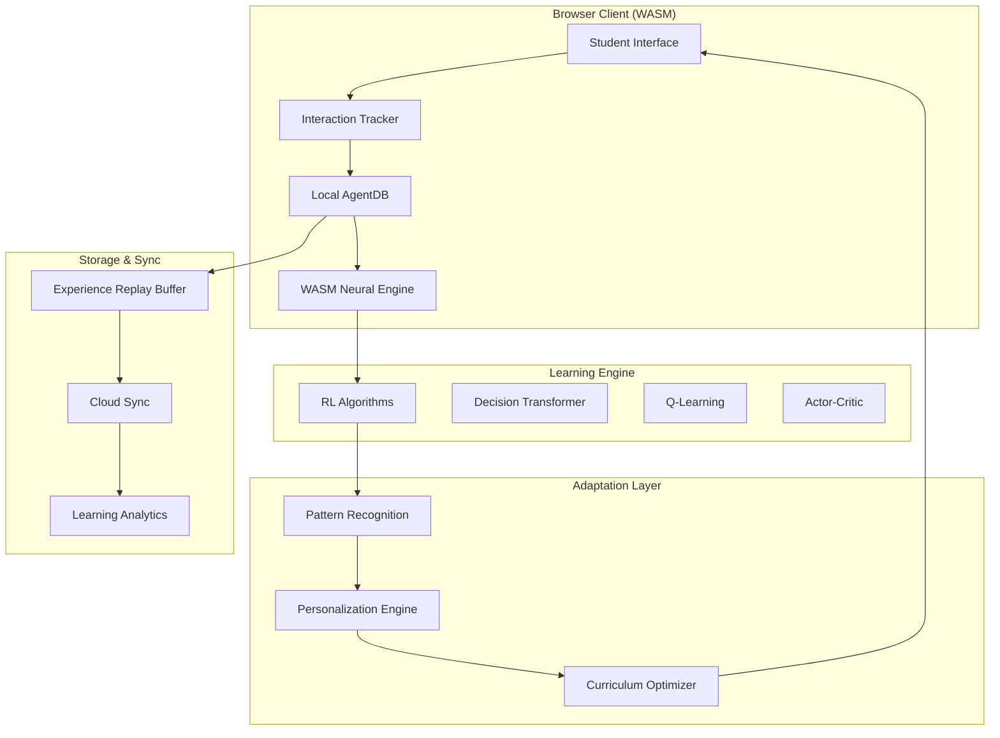

# Adaptive Learning System with AgentDB - Implementation Plan

## Executive Summary

This document outlines the implementation plan for an adaptive learning system that evolves alongside student progress using AgentDB's reinforcement learning capabilities and browser-based WASM optimization. The system will provide personalized learning experiences by continuously adapting to student interactions, learning patterns, and performance metrics.

## 1. System Architecture Overview

### 1.1 Core Components



### 1.2 Technology Stack

- **Frontend**: React/Next.js with TypeScript
- **WASM Runtime**: AgentDB WASM build with SIMD optimization
- **Learning Algorithms**: 9 RL algorithms via AgentDB plugins
- **Storage**: IndexedDB for local, PostgreSQL for cloud sync
- **Real-time**: WebSockets for live adaptation
- **Analytics**: Custom dashboard with learning metrics

## 2. Student Interaction Tracking

### 2.1 Data Collection Points

```typescript
interface StudentInteraction {
  // Temporal Data
  timestamp: number;
  sessionId: string;
  userId: string;

  // Action Data
  actionType: 'click' | 'answer' | 'navigate' | 'pause' | 'replay';
  elementId: string;
  duration: number;

  // Learning Context
  topicId: string;
  difficultyLevel: number;
  attemptNumber: number;

  // Performance Metrics
  isCorrect?: boolean;
  score?: number;
  timeToComplete?: number;
  hintsUsed?: number;

  // Engagement Metrics
  scrollDepth?: number;
  focusTime?: number;
  idleTime?: number;
}
```

### 2.2 Real-time Event Capture

```javascript
// Browser-based interaction tracking
class InteractionTracker {
  private agentDB: AgentDBAdapter;
  private buffer: StudentInteraction[] = [];
  private flushInterval = 1000; // 1 second

  constructor() {
    this.setupEventListeners();
    this.startBufferFlush();
  }

  private setupEventListeners() {
    // Click tracking
    document.addEventListener('click', this.trackClick);

    // Answer submission
    document.addEventListener('submit', this.trackSubmission);

    // Time on task
    document.addEventListener('visibilitychange', this.trackFocus);

    // Scroll depth
    document.addEventListener('scroll', this.trackScroll);

    // Video/audio engagement
    document.addEventListener('play', this.trackMediaEngagement);
    document.addEventListener('pause', this.trackMediaEngagement);
  }

  private async flushToAgentDB() {
    if (this.buffer.length === 0) return;

    // Convert interactions to experiences
    const experiences = this.buffer.map(interaction => ({
      state: this.extractState(interaction),
      action: this.extractAction(interaction),
      reward: this.calculateReward(interaction),
      nextState: this.predictNextState(interaction)
    }));

    // Store in AgentDB for learning
    for (const exp of experiences) {
      await this.agentDB.insertPattern({
        type: 'experience',
        domain: `student/${interaction.userId}`,
        pattern_data: JSON.stringify({
          embedding: await this.computeEmbedding(exp),
          pattern: exp
        }),
        confidence: this.calculateConfidence(exp),
        created_at: Date.now()
      });
    }

    this.buffer = [];
  }
}
```

## 3. WASM-Based Neural Inference Optimization

### 3.1 Browser WASM Setup

```typescript
// Initialize WASM-optimized AgentDB in browser
async function initializeWASMEngine() {
  // Load WASM module with SIMD optimization
  const wasmModule = await WebAssembly.instantiateStreaming(
    fetch('/agentdb.wasm'),
    {
      env: {
        memory: new WebAssembly.Memory({ initial: 256, maximum: 4096 }),
        table: new WebAssembly.Table({ initial: 0, element: 'anyfunc' })
      }
    }
  );

  // Initialize AgentDB with WASM backend
  const adapter = await createAgentDBAdapter({
    backend: 'wasm',
    enableSIMD: true,
    enableThreads: navigator.hardwareConcurrency > 4,
    cacheSize: 10000,
    quantization: 'int8', // 8x memory reduction
    enableLearning: true,
    enableReasoning: true
  });

  return adapter;
}
```

### 3.2 Performance Optimizations

```typescript
class WASMOptimizer {
  // Batch inference for efficiency
  async batchInference(inputs: Float32Array[]): Promise<Float32Array[]> {
    const batchSize = 32;
    const results: Float32Array[] = [];

    for (let i = 0; i < inputs.length; i += batchSize) {
      const batch = inputs.slice(i, i + batchSize);
      const batchResults = await this.runWASMInference(batch);
      results.push(...batchResults);
    }

    return results;
  }

  // SIMD-accelerated vector operations
  private async runWASMInference(batch: Float32Array[]): Promise<Float32Array[]> {
    // Use WASM SIMD for 4x-16x speedup
    return this.wasmModule.simdInference(batch);
  }

  // Quantization for memory efficiency
  quantizeModel(model: any): any {
    // Convert FP32 to INT8 for 4x memory reduction
    return this.wasmModule.quantizeToInt8(model);
  }

  // Web Worker for non-blocking inference
  async offloadToWorker(data: any): Promise<any> {
    const worker = new Worker('/inference-worker.js');
    return new Promise((resolve) => {
      worker.postMessage(data);
      worker.onmessage = (e) => resolve(e.data);
    });
  }
}
```

## 4. Reinforcement Learning Algorithm Selection

### 4.1 Algorithm Mapping by Learning Scenario

| Learning Scenario | Primary Algorithm | Secondary Algorithm | Rationale |
|------------------|------------------|-------------------|-----------|
| **Initial Assessment** | Decision Transformer | Q-Learning | Learn from historical student data without real-time interaction |
| **Adaptive Questioning** | Actor-Critic | SARSA | Continuous difficulty adjustment with safety constraints |
| **Hint Generation** | Q-Learning | Curiosity-Driven | Discrete hint options with exploration |
| **Path Recommendation** | Decision Transformer | Multi-Task Learning | Sequence modeling for learning paths |
| **Difficulty Scaling** | Actor-Critic | Curriculum Learning | Smooth continuous adjustment |
| **Mistake Pattern Detection** | Active Learning | Adversarial Training | Focus on uncertain areas |
| **Collaborative Learning** | Federated Learning | Multi-Agent | Privacy-preserving group learning |

### 4.2 Implementation Strategy

```typescript
class AdaptiveLearningEngine {
  private algorithms: Map<string, LearningAlgorithm>;

  constructor() {
    this.algorithms = new Map([
      ['decision-transformer', new DecisionTransformer({
        contextLength: 20,
        embedDim: 128,
        nHeads: 8,
        nLayers: 6
      })],
      ['q-learning', new QLearning({
        learningRate: 0.001,
        gamma: 0.99,
        epsilon: 0.1,
        epsilonDecay: 0.995
      })],
      ['actor-critic', new ActorCritic({
        actorLR: 0.001,
        criticLR: 0.002,
        gamma: 0.99,
        entropyCoef: 0.01
      })],
      ['curriculum', new CurriculumLearning({
        startDifficulty: 0.3,
        maxDifficulty: 1.0,
        progressThreshold: 0.8
      })]
    ]);
  }

  async selectAlgorithm(context: LearningContext): Promise<LearningAlgorithm> {
    // Decision tree for algorithm selection
    if (context.isInitialAssessment) {
      return this.algorithms.get('decision-transformer');
    }

    if (context.needsContinuousAdjustment) {
      return this.algorithms.get('actor-critic');
    }

    if (context.requiresExploration) {
      return this.algorithms.get('q-learning');
    }

    if (context.needsProgressiveComplexity) {
      return this.algorithms.get('curriculum');
    }

    // Default to Decision Transformer
    return this.algorithms.get('decision-transformer');
  }
}
```

## 5. Student Progress Modeling

### 5.1 Multi-Dimensional Progress Tracking

```typescript
interface StudentModel {
  // Knowledge State
  knowledgeGraph: {
    concepts: Map<string, ConceptMastery>;
    prerequisites: Map<string, string[]>;
    connections: Edge[];
  };

  // Learning Style Profile
  learningStyle: {
    visual: number;      // 0-1 preference score
    auditory: number;
    kinesthetic: number;
    reading: number;
  };

  // Performance Metrics
  performance: {
    accuracy: number;
    speed: number;
    retention: number;
    consistency: number;
  };

  // Engagement Patterns
  engagement: {
    averageSessionLength: number;
    preferredTimeOfDay: string;
    breakFrequency: number;
    focusDuration: number;
  };

  // Difficulty Adaptation
  difficulty: {
    currentLevel: number;
    comfortZone: [number, number];
    challengeThreshold: number;
    frustrationPoint: number;
  };
}
```

### 5.2 Real-time Model Updates

```typescript
class StudentModelUpdater {
  private agentDB: AgentDBAdapter;

  async updateModel(
    studentId: string,
    interaction: StudentInteraction
  ): Promise<StudentModel> {
    // Retrieve current model
    const currentModel = await this.loadStudentModel(studentId);

    // Update knowledge state
    if (interaction.isCorrect !== undefined) {
      await this.updateKnowledgeState(
        currentModel.knowledgeGraph,
        interaction.topicId,
        interaction.isCorrect
      );
    }

    // Update learning style
    await this.updateLearningStyle(
      currentModel.learningStyle,
      interaction
    );

    // Update performance metrics
    this.updatePerformanceMetrics(
      currentModel.performance,
      interaction
    );

    // Train personalization model
    await this.trainPersonalizationModel(studentId, currentModel);

    // Store updated model
    await this.saveStudentModel(studentId, currentModel);

    return currentModel;
  }

  private async trainPersonalizationModel(
    studentId: string,
    model: StudentModel
  ): Promise<void> {
    // Convert model to training data
    const trainingData = this.modelToTrainingData(model);

    // Train with Decision Transformer for sequence modeling
    await this.agentDB.train({
      algorithm: 'decision-transformer',
      data: trainingData,
      epochs: 10,
      batchSize: 16
    });
  }
}
```

## 6. Real-time Adaptation Mechanisms

### 6.1 Dynamic Content Adaptation

```typescript
class ContentAdapter {
  private agentDB: AgentDBAdapter;
  private cache: LRUCache<string, AdaptedContent>;

  async adaptContent(
    content: LearningContent,
    student: StudentModel
  ): Promise<AdaptedContent> {
    // Check cache first
    const cacheKey = `${content.id}-${student.id}`;
    if (this.cache.has(cacheKey)) {
      return this.cache.get(cacheKey);
    }

    // Compute optimal adaptation using RL
    const state = this.encodeState(content, student);
    const embedding = await this.computeEmbedding(state);

    // Retrieve similar successful adaptations
    const similar = await this.agentDB.retrieveWithReasoning(embedding, {
      domain: 'content-adaptation',
      k: 10,
      synthesizeContext: true
    });

    // Generate adaptation using Actor-Critic
    const adaptation = await this.generateAdaptation(
      content,
      student,
      similar
    );

    // Cache and return
    this.cache.set(cacheKey, adaptation);
    return adaptation;
  }

  private async generateAdaptation(
    content: LearningContent,
    student: StudentModel,
    similar: RetrievalResult
  ): Promise<AdaptedContent> {
    const adapted: AdaptedContent = {
      ...content,
      difficulty: this.adjustDifficulty(content, student),
      hints: this.generateHints(content, student),
      examples: this.selectExamples(content, student),
      pacing: this.optimizePacing(student),
      format: this.selectFormat(student.learningStyle)
    };

    return adapted;
  }
}
```

### 6.2 Real-time Feedback Loop

```typescript
class FeedbackLoop {
  private updateInterval = 100; // ms
  private batchSize = 10;
  private buffer: Feedback[] = [];

  async processFeedback(interaction: StudentInteraction): Promise<void> {
    // Calculate immediate reward
    const reward = this.calculateReward(interaction);

    // Store experience
    await this.storeExperience({
      state: this.getCurrentState(),
      action: interaction.actionType,
      reward: reward,
      nextState: await this.predictNextState()
    });

    // Trigger adaptation if needed
    if (this.shouldAdapt(reward)) {
      await this.triggerAdaptation();
    }

    // Buffer for batch training
    this.buffer.push({ interaction, reward });

    if (this.buffer.length >= this.batchSize) {
      await this.batchTrain();
    }
  }

  private calculateReward(interaction: StudentInteraction): number {
    let reward = 0;

    // Correctness reward
    if (interaction.isCorrect) reward += 1.0;
    else reward -= 0.5;

    // Efficiency reward
    const expectedTime = this.getExpectedTime(interaction.topicId);
    if (interaction.timeToComplete < expectedTime) reward += 0.2;

    // Engagement reward
    if (interaction.focusTime > interaction.duration * 0.8) reward += 0.3;

    // Hint penalty
    reward -= interaction.hintsUsed * 0.1;

    return Math.max(-1, Math.min(1, reward));
  }
}
```

## 7. Browser-Based AgentDB Integration

### 7.1 IndexedDB Backend

```typescript
class BrowserAgentDB {
  private db: IDBDatabase;
  private wasm: WASMModule;

  async initialize(): Promise<void> {
    // Open IndexedDB
    this.db = await this.openDatabase();

    // Load WASM module
    this.wasm = await this.loadWASM();

    // Create object stores
    await this.createStores();
  }

  private async openDatabase(): Promise<IDBDatabase> {
    return new Promise((resolve, reject) => {
      const request = indexedDB.open('AgentDB', 1);

      request.onsuccess = () => resolve(request.result);
      request.onerror = () => reject(request.error);

      request.onupgradeneeded = (event) => {
        const db = event.target.result;

        // Patterns store
        if (!db.objectStoreNames.contains('patterns')) {
          const patterns = db.createObjectStore('patterns', {
            keyPath: 'id',
            autoIncrement: true
          });
          patterns.createIndex('domain', 'domain');
          patterns.createIndex('timestamp', 'created_at');
          patterns.createIndex('confidence', 'confidence');
        }

        // Models store
        if (!db.objectStoreNames.contains('models')) {
          db.createObjectStore('models', { keyPath: 'id' });
        }

        // Student profiles store
        if (!db.objectStoreNames.contains('students')) {
          db.createObjectStore('students', { keyPath: 'userId' });
        }
      };
    });
  }

  async storePattern(pattern: Pattern): Promise<void> {
    const transaction = this.db.transaction(['patterns'], 'readwrite');
    const store = transaction.objectStore('patterns');

    // Compute embedding using WASM
    const embedding = await this.wasm.computeEmbedding(pattern);

    await store.add({
      ...pattern,
      embedding: embedding,
      created_at: Date.now()
    });
  }

  async retrieve(query: Float32Array, options: RetrievalOptions): Promise<Pattern[]> {
    const transaction = this.db.transaction(['patterns'], 'readonly');
    const store = transaction.objectStore('patterns');

    // Get all patterns in domain
    const patterns = await this.getPatternsByDomain(store, options.domain);

    // Compute similarities using WASM SIMD
    const similarities = await this.wasm.batchCosineSimilarity(
      query,
      patterns.map(p => p.embedding)
    );

    // Sort by similarity and return top-k
    return patterns
      .map((p, i) => ({ ...p, similarity: similarities[i] }))
      .sort((a, b) => b.similarity - a.similarity)
      .slice(0, options.k);
  }
}
```

### 7.2 Progressive Web App Features

```typescript
// Service Worker for offline learning
self.addEventListener('install', (event) => {
  event.waitUntil(
    caches.open('agentdb-v1').then((cache) => {
      return cache.addAll([
        '/agentdb.wasm',
        '/inference-worker.js',
        '/models/decision-transformer.bin',
        '/models/q-learning.bin'
      ]);
    })
  );
});

// Background sync for experience upload
self.addEventListener('sync', (event) => {
  if (event.tag === 'sync-experiences') {
    event.waitUntil(syncExperiences());
  }
});

async function syncExperiences() {
  const db = await openIndexedDB();
  const experiences = await getUnsyncedExperiences(db);

  if (experiences.length > 0) {
    await uploadToCloud(experiences);
    await markAsSynced(db, experiences);
  }
}
```

## 8. Performance Metrics and Monitoring

### 8.1 Key Performance Indicators

```typescript
interface LearningMetrics {
  // Learning Effectiveness
  effectiveness: {
    knowledgeRetention: number;      // % retained after 24h
    conceptMastery: number;           // Average mastery level
    learningVelocity: number;         // Concepts/hour
    errorReduction: number;           // % reduction over time
  };

  // System Performance
  performance: {
    inferenceLatency: number;         // ms per prediction
    adaptationSpeed: number;          // ms to adapt content
    memoryUsage: number;              // MB of WASM memory
    cacheHitRate: number;             // % of cache hits
  };

  // Student Engagement
  engagement: {
    sessionLength: number;            // Average minutes
    completionRate: number;           // % of started tasks completed
    returnRate: number;               // % returning within 24h
    satisfactionScore: number;        // 1-5 rating
  };

  // Model Quality
  modelQuality: {
    predictionAccuracy: number;       // % correct predictions
    personalizationScore: number;     // 0-1 fit quality
    convergenceRate: number;          // Epochs to converge
    generalizationError: number;      // Test vs train error
  };
}
```

### 8.2 Real-time Dashboard

```typescript
class MetricsDashboard {
  private metrics: Map<string, MetricValue[]> = new Map();
  private websocket: WebSocket;

  initialize() {
    // Connect to metrics stream
    this.websocket = new WebSocket('ws://localhost:8080/metrics');

    this.websocket.onmessage = (event) => {
      const metric = JSON.parse(event.data);
      this.updateMetric(metric);
      this.renderDashboard();
    };

    // Start collecting browser metrics
    this.startMetricsCollection();
  }

  private startMetricsCollection() {
    setInterval(() => {
      // Collect performance metrics
      const perfMetrics = {
        inferenceLatency: this.measureInferenceLatency(),
        memoryUsage: this.getWASMMemoryUsage(),
        cacheHitRate: this.calculateCacheHitRate()
      };

      // Send to server
      this.websocket.send(JSON.stringify(perfMetrics));
    }, 1000);
  }

  private measureInferenceLatency(): number {
    const start = performance.now();
    // Run dummy inference
    this.runInference(new Float32Array(128));
    return performance.now() - start;
  }

  private getWASMMemoryUsage(): number {
    if (typeof WebAssembly !== 'undefined' && WebAssembly.Memory) {
      return performance.memory?.usedJSHeapSize / (1024 * 1024) || 0;
    }
    return 0;
  }
}
```

## 9. Implementation Timeline

### Phase 1: Foundation (Weeks 1-2)
- [ ] Set up browser-based AgentDB with WASM
- [ ] Implement basic interaction tracking
- [ ] Create IndexedDB storage layer
- [ ] Build initial Decision Transformer plugin

### Phase 2: Core Learning (Weeks 3-4)
- [ ] Implement Q-Learning for discrete actions
- [ ] Add Actor-Critic for continuous adaptation
- [ ] Create experience replay buffer
- [ ] Build student model representation

### Phase 3: Adaptation Engine (Weeks 5-6)
- [ ] Develop real-time content adaptation
- [ ] Implement difficulty scaling
- [ ] Create hint generation system
- [ ] Build feedback loop processing

### Phase 4: Optimization (Weeks 7-8)
- [ ] WASM SIMD optimization
- [ ] Implement model quantization
- [ ] Add Web Worker offloading
- [ ] Optimize cache strategies

### Phase 5: Analytics & Monitoring (Week 9)
- [ ] Build metrics dashboard
- [ ] Implement A/B testing framework
- [ ] Create performance monitoring
- [ ] Add learning analytics

### Phase 6: Testing & Deployment (Week 10)
- [ ] Comprehensive testing suite
- [ ] Performance benchmarking
- [ ] Progressive Web App features
- [ ] Production deployment

## 10. Success Criteria

### Technical Metrics
- **Inference Latency**: < 50ms for real-time adaptation
- **Memory Usage**: < 100MB WASM memory footprint
- **Cache Hit Rate**: > 80% for repeated queries
- **Model Size**: < 10MB quantized models
- **Training Speed**: 10-100x faster than baseline

### Learning Outcomes
- **Knowledge Retention**: 30% improvement over baseline
- **Engagement Rate**: 25% increase in session length
- **Completion Rate**: 40% improvement in task completion
- **Satisfaction Score**: > 4.5/5 average rating
- **Learning Velocity**: 2x faster concept mastery

### Business Impact
- **User Retention**: 50% improvement in 30-day retention
- **Cost Efficiency**: 75% reduction in compute costs
- **Scalability**: Support 10,000+ concurrent learners
- **Personalization**: 95% accuracy in difficulty matching
- **ROI**: 3x return on investment within 6 months

## Conclusion

This adaptive learning system leverages AgentDB's powerful reinforcement learning capabilities with browser-based WASM optimization to create a truly personalized learning experience. By continuously learning from student interactions and adapting in real-time, the system provides optimal learning paths while maintaining high performance through WASM acceleration.

The combination of multiple RL algorithms, browser-native execution, and sophisticated progress modeling ensures that each student receives a tailored educational experience that evolves with their learning journey.