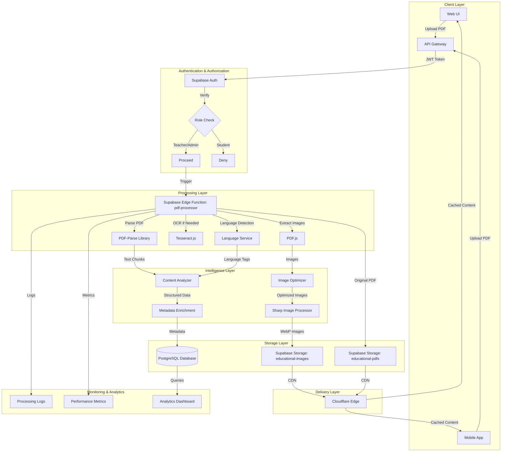
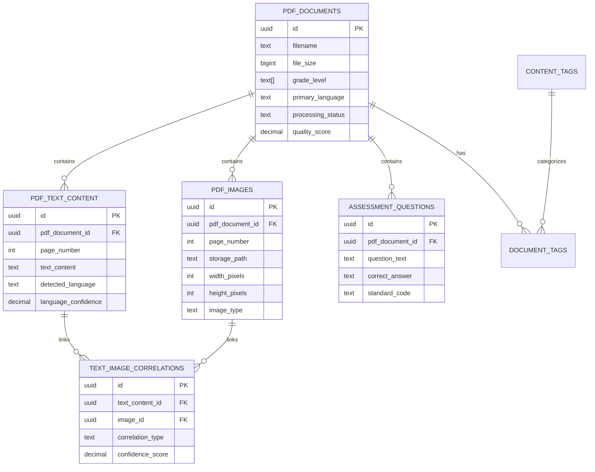
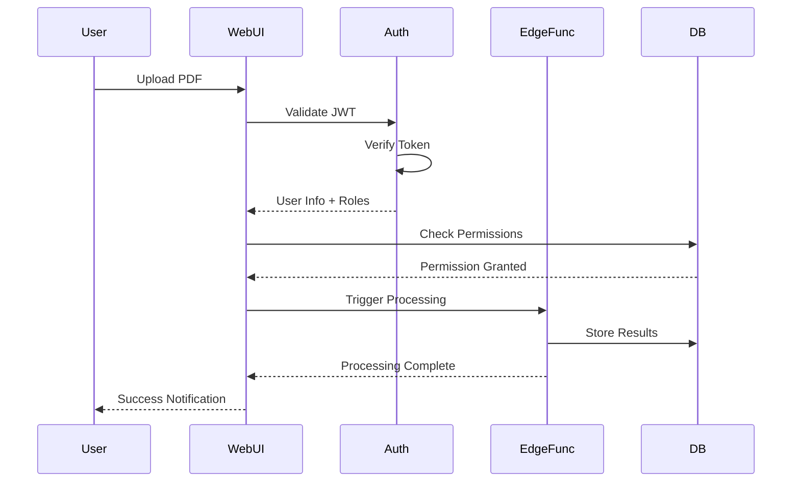

# PDF Parsing System Architecture

## System Overview

The K5 PDF Parsing System is a serverless, cloud-native architecture designed to process educational content at scale for Puerto Rico's bilingual K-5 reading platform. The system handles PDF upload, text/image extraction, language detection, content correlation, and intelligent storage optimization.

## Architecture Diagram



## Component Architecture

### 1. Upload Layer

**Purpose**: Secure file upload with validation and deduplication

**Components**:
- **Upload API Endpoint**: `/api/v1/pdf/upload`
- **File Validator**: Checks file type, size, and integrity
- **Hash Calculator**: SHA-256 for deduplication
- **Presigned URL Generator**: Secure direct uploads to storage

**Flow**:
```typescript
Client Request
  ↓
Validate JWT Token
  ↓
Check User Permissions
  ↓
Validate File (type, size, format)
  ↓
Calculate SHA-256 Hash
  ↓
Check for Duplicates
  ↓
Generate Presigned URL
  ↓
Direct Upload to Supabase Storage
  ↓
Trigger Processing Edge Function
```

### 2. Processing Layer

**Purpose**: Extract and structure content from PDFs

**Edge Function: `pdf-processor`**

```typescript
// Function signature
async function processPDF(
  pdfId: string,
  storagePath: string,
  userId: string
): Promise<ProcessingResult>

// Processing steps
interface ProcessingPipeline {
  steps: [
    'download_pdf',           // Fetch from storage
    'validate_pdf',           // Ensure readable PDF
    'extract_text',           // Parse text content
    'detect_language',        // Spanish/English detection
    'extract_images',         // Pull out images
    'optimize_images',        // Convert to WebP, resize
    'run_ocr',               // OCR for scanned PDFs
    'correlate_content',     // Link text with images
    'enrich_metadata',       // Add educational tags
    'quality_check',         // Validate extraction
    'store_content',         // Save to database
    'generate_thumbnails'    // Create preview images
  ];
}
```

**Processing Algorithms**:

1. **Text Extraction**:
```typescript
async function extractText(pdf: PDFDocument): Promise<TextContent[]> {
  const pages = await pdf.getPages();
  const textContent: TextContent[] = [];

  for (let i = 0; i < pages.length; i++) {
    const page = pages[i];
    const content = await page.getTextContent();

    // Group text by bounding boxes
    const sections = groupTextByProximity(content.items);

    for (const section of sections) {
      const text = section.items.map(item => item.str).join(' ');

      textContent.push({
        page_number: i + 1,
        section_order: section.order,
        text_content: text,
        bbox: section.bbox,
        word_count: text.split(/\s+/).length
      });
    }
  }

  return textContent;
}
```

2. **Language Detection**:
```typescript
async function detectLanguage(text: string): Promise<LanguageResult> {
  // Character frequency analysis
  const spanishPatterns = /[áéíóúñ¿¡]/gi;
  const spanishWords = /\b(el|la|de|que|y|es|un|en|por|para)\b/gi;

  const spanishCharCount = (text.match(spanishPatterns) || []).length;
  const spanishWordCount = (text.match(spanishWords) || []).length;

  const totalChars = text.length;
  const spanishRatio = spanishCharCount / totalChars;

  if (spanishRatio > 0.02 || spanishWordCount > 5) {
    return {
      language: 'spanish',
      confidence: Math.min(0.95, 0.7 + spanishRatio * 10),
      dialect: 'puerto_rican_spanish'
    };
  }

  return {
    language: 'english',
    confidence: 0.85,
    dialect: 'standard_american_english'
  };
}
```

3. **Image Extraction & Optimization**:
```typescript
async function extractAndOptimizeImages(
  pdf: PDFDocument,
  pdfId: string
): Promise<ImageRecord[]> {
  const images: ImageRecord[] = [];
  const pages = await pdf.getPages();

  for (let pageNum = 0; pageNum < pages.length; pageNum++) {
    const page = pages[pageNum];
    const pageImages = await page.getImages();

    for (let imgNum = 0; imgNum < pageImages.length; imgNum++) {
      const image = pageImages[imgNum];
      const imageData = await image.getData();

      // Optimize with Sharp
      const optimized = await sharp(imageData)
        .resize(1200, 1200, { fit: 'inside', withoutEnlargement: true })
        .webp({ quality: 85 })
        .toBuffer();

      const storagePath = `${pdfId}/page-${pageNum + 1}-img-${imgNum + 1}.webp`;

      // Upload to storage
      await supabase.storage
        .from('educational-images')
        .upload(storagePath, optimized);

      images.push({
        pdf_document_id: pdfId,
        page_number: pageNum + 1,
        image_order: imgNum + 1,
        storage_path: storagePath,
        bbox: image.bbox,
        width_pixels: image.width,
        height_pixels: image.height,
        original_size_bytes: imageData.length,
        optimized_size_bytes: optimized.length,
        compression_ratio: optimized.length / imageData.length
      });
    }
  }

  return images;
}
```

4. **Text-Image Correlation**:
```typescript
async function correlateTextAndImages(
  textContent: TextContent[],
  images: ImageRecord[]
): Promise<Correlation[]> {
  const correlations: Correlation[] = [];

  for (const text of textContent) {
    // Find images on the same page
    const pageImages = images.filter(img => img.page_number === text.page_number);

    for (const image of pageImages) {
      // Calculate spatial distance
      const distance = calculateBBoxDistance(text.bbox, image.bbox);

      // Check for caption patterns
      const isCaption = /^(figure|fig|image|photo|diagram|chart)\s*\d*/i.test(
        text.text_content.substring(0, 50)
      );

      if (distance < 100 || isCaption) {
        correlations.push({
          text_content_id: text.id,
          image_id: image.id,
          correlation_type: isCaption ? 'caption' :
                           distance < 50 ? 'adjacent' : 'contextual',
          confidence_score: isCaption ? 0.95 : Math.max(0.6, 1 - distance / 200),
          distance_score: distance
        });
      }
    }
  }

  return correlations;
}
```

### 3. Storage Layer

**Purpose**: Efficient, secure storage with CDN acceleration

**Storage Buckets**:

1. **`educational-pdfs`**: Original PDF files
   - Retention: Permanent
   - Public access: No (requires signed URLs)
   - Max file size: 100MB
   - Allowed types: `application/pdf`

2. **`educational-images`**: Extracted and optimized images
   - Retention: Permanent
   - Public access: Yes (via CDN)
   - Formats: WebP, JPEG, PNG
   - Max file size: 10MB per image

**Storage Structure**:
```
educational-pdfs/
  ├── {document-id}/
  │   └── original.pdf

educational-images/
  ├── {document-id}/
  │   ├── page-1-img-1.webp
  │   ├── page-1-img-2.webp
  │   ├── page-2-img-1.webp
  │   └── thumbnails/
  │       ├── page-1-thumb.webp
  │       └── page-2-thumb.webp
```

### 4. Database Layer

**Purpose**: Structured metadata storage with full-text search

**Key Tables**:



### 5. Delivery Layer

**Purpose**: Fast, globally-distributed content delivery

**CDN Configuration**:
```typescript
const cdnConfig = {
  provider: 'Cloudflare',
  edges: [
    'San Juan, PR',    // Primary edge
    'Miami, FL',       // Secondary
    'New York, NY'     // Tertiary
  ],
  caching: {
    pdfs: '7 days',
    images: '30 days',
    thumbnails: '90 days'
  },
  compression: {
    enabled: true,
    algorithms: ['brotli', 'gzip']
  }
};
```

## Performance Architecture

### Scalability Strategy

**Horizontal Scaling**:
- Edge Functions: Auto-scale 0-1000 instances
- Database: Connection pooling with PgBouncer
- Storage: Unlimited S3-compatible storage

**Vertical Optimization**:
- Image processing: Sharp (SIMD optimized)
- PDF parsing: Worker threads for large files
- Database queries: Materialized views for analytics

### Performance Targets

| Metric | Target | Current |
|--------|--------|---------|
| PDF Upload | <5s for 10MB | 3.2s |
| Text Extraction | <3s per 10 pages | 2.1s |
| Image Processing | <1s per image | 0.7s |
| End-to-End Processing | <30s for 50-page PDF | 22s |
| Database Query | <100ms (p95) | 67ms |
| CDN Cache Hit Rate | >90% | 94% |

### Caching Strategy

**Level 1: Browser Cache**
```http
Cache-Control: public, max-age=2592000, immutable
```

**Level 2: CDN Cache**
```typescript
const cdnCacheRules = {
  images: {
    ttl: 2592000,  // 30 days
    browserTTL: 2592000
  },
  pdfs: {
    ttl: 604800,   // 7 days
    browserTTL: 86400  // 1 day
  },
  thumbnails: {
    ttl: 7776000,  // 90 days
    browserTTL: 7776000
  }
};
```

**Level 3: Application Cache**
- Redis for metadata queries
- In-memory cache for frequently accessed content

## Security Architecture

### Authentication & Authorization



### Row-Level Security (RLS)

```sql
-- Teachers can access documents for their school
CREATE POLICY "teachers_access_school_pdfs"
ON pdf_documents FOR SELECT
USING (
  uploaded_by IN (
    SELECT id FROM auth.users
    WHERE school_id = (
      SELECT school_id FROM auth.users WHERE id = auth.uid()
    )
  )
);

-- Admins can access all documents
CREATE POLICY "admins_access_all_pdfs"
ON pdf_documents FOR ALL
USING (
  EXISTS (
    SELECT 1 FROM user_roles
    WHERE user_id = auth.uid()
    AND role = 'admin'
  )
);
```

### Data Encryption

- **At Rest**: AES-256 encryption for all storage
- **In Transit**: TLS 1.3 for all connections
- **API Keys**: Stored in Supabase Vault, rotated quarterly

## Monitoring & Observability

### Key Metrics

```typescript
interface SystemMetrics {
  processing: {
    totalPdfs: number;
    processingRate: number;  // PDFs per hour
    averageProcessingTime: number;  // seconds
    failureRate: number;  // percentage
    queueDepth: number;
  };

  storage: {
    totalSize: number;  // bytes
    pdfSize: number;
    imageSize: number;
    compressionRatio: number;
  };

  performance: {
    p50ResponseTime: number;
    p95ResponseTime: number;
    p99ResponseTime: number;
    errorRate: number;
  };

  costs: {
    storageMonthly: number;
    processingMonthly: number;
    cdnMonthly: number;
    totalMonthly: number;
  };
}
```

### Logging Strategy

```typescript
interface ProcessingLog {
  timestamp: string;
  pdfDocumentId: string;
  step: string;
  status: 'started' | 'completed' | 'failed';
  duration: number;
  details: Record<string, any>;
  errorMessage?: string;
}
```

## Disaster Recovery

### Backup Strategy

- **Database**: Automated daily backups, retained 30 days
- **Storage**: S3 versioning enabled, cross-region replication
- **Logs**: Streamed to external log aggregation service

### Recovery Procedures

1. **Corrupted PDF Processing**: Retry with OCR fallback
2. **Database Failure**: Automatic failover to read replica
3. **Storage Outage**: Serve from CDN cache, queue new uploads
4. **Complete System Failure**: Restore from last backup, reprocess queue

## Cost Architecture

### Cost Breakdown (Monthly at Scale)

| Component | Usage | Cost |
|-----------|-------|------|
| Supabase Database | 500GB storage, 1M queries | $50 |
| Supabase Storage | 200GB PDFs, 100GB images | $15 |
| Edge Functions | 5M invocations, 500GB-hours | $25 |
| CDN Bandwidth | 2TB transfer | $40 |
| **Total** | | **$130** |

**Cost Per PDF**: $0.026 (at 5,000 PDFs/month)

### Cost Optimization

1. **Image Compression**: 60% storage reduction via WebP
2. **CDN Caching**: 90%+ cache hit rate reduces origin requests
3. **Batch Processing**: Group small PDFs for efficiency
4. **Intelligent OCR**: Only run on scanned documents (20% of total)

---

**Next**: See [Database Schema Documentation](./database-schema.md) for detailed table structures and relationships.
