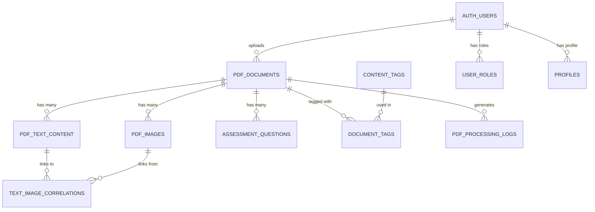

# Database Schema Documentation

## Overview

The PDF parsing system uses a PostgreSQL database hosted on Supabase. The schema is designed for:
- **Performance**: Optimized indexes for fast queries
- **Flexibility**: JSON fields for extensible metadata
- **Integrity**: Foreign keys and constraints
- **Security**: Row-Level Security (RLS) policies

## Entity Relationship Diagram



## Core Tables

### 1. pdf_documents

**Purpose**: Primary table storing metadata for all uploaded PDF files

```sql
CREATE TABLE pdf_documents (
  -- Primary Key
  id UUID PRIMARY KEY DEFAULT gen_random_uuid(),

  -- File Information
  filename TEXT NOT NULL,
  original_filename TEXT NOT NULL,
  file_size BIGINT NOT NULL,
  storage_bucket TEXT NOT NULL DEFAULT 'educational-pdfs',
  storage_path TEXT NOT NULL,
  file_hash TEXT NOT NULL UNIQUE,  -- SHA-256 for deduplication

  -- Content Classification
  content_type TEXT NOT NULL CHECK (content_type IN (
    'reading_passage',
    'assessment',
    'instructional_material',
    'activity_sheet',
    'teacher_guide'
  )),

  -- Educational Metadata
  grade_level TEXT[] NOT NULL,  -- ['K', '1', '2', '3', '4', '5']
  subject_area TEXT[] NOT NULL,  -- ['reading', 'comprehension', 'vocabulary']
  primary_language TEXT NOT NULL CHECK (primary_language IN ('spanish', 'english', 'bilingual')),
  reading_level TEXT,  -- Lexile score or equivalent
  curriculum_standards TEXT[],  -- DEPR standard codes

  -- Processing Status
  processing_status TEXT NOT NULL DEFAULT 'pending' CHECK (processing_status IN (
    'pending',
    'processing',
    'completed',
    'failed',
    'requires_review'
  )),
  processing_started_at TIMESTAMPTZ,
  processing_completed_at TIMESTAMPTZ,
  processing_error TEXT,

  -- Content Statistics
  page_count INTEGER,
  word_count INTEGER,
  image_count INTEGER,
  has_ocr_content BOOLEAN DEFAULT false,

  -- Quality Metrics
  text_extraction_confidence DECIMAL(3,2),  -- 0.00 to 1.00
  language_detection_confidence DECIMAL(3,2),
  quality_score DECIMAL(3,2),

  -- Audit Trail
  uploaded_by UUID REFERENCES auth.users(id),
  created_at TIMESTAMPTZ DEFAULT NOW(),
  updated_at TIMESTAMPTZ DEFAULT NOW(),

  -- Constraints
  CONSTRAINT valid_confidence_scores CHECK (
    text_extraction_confidence BETWEEN 0 AND 1 AND
    language_detection_confidence BETWEEN 0 AND 1 AND
    quality_score BETWEEN 0 AND 1
  )
);
```

**Indexes**:
```sql
CREATE INDEX idx_pdf_docs_status ON pdf_documents(processing_status);
CREATE INDEX idx_pdf_docs_grade ON pdf_documents USING GIN(grade_level);
CREATE INDEX idx_pdf_docs_language ON pdf_documents(primary_language);
CREATE INDEX idx_pdf_docs_content_type ON pdf_documents(content_type);
CREATE INDEX idx_pdf_docs_created ON pdf_documents(created_at DESC);
CREATE INDEX idx_pdf_docs_hash ON pdf_documents(file_hash);
```

**Example Queries**:
```sql
-- Find all Spanish reading passages for Grade 2
SELECT * FROM pdf_documents
WHERE primary_language = 'spanish'
  AND content_type = 'reading_passage'
  AND '2' = ANY(grade_level)
  AND processing_status = 'completed'
ORDER BY created_at DESC;

-- Get processing statistics
SELECT
  processing_status,
  COUNT(*) as count,
  AVG(quality_score) as avg_quality,
  AVG(EXTRACT(EPOCH FROM (processing_completed_at - processing_started_at))) as avg_processing_seconds
FROM pdf_documents
GROUP BY processing_status;
```

### 2. pdf_text_content

**Purpose**: Stores extracted text with page and position information

```sql
CREATE TABLE pdf_text_content (
  id UUID PRIMARY KEY DEFAULT gen_random_uuid(),
  pdf_document_id UUID NOT NULL REFERENCES pdf_documents(id) ON DELETE CASCADE,

  -- Page Information
  page_number INTEGER NOT NULL,
  section_order INTEGER NOT NULL,  -- Order within page

  -- Text Content
  text_content TEXT NOT NULL,
  text_html TEXT,  -- Formatted HTML version

  -- Language Information
  detected_language TEXT NOT NULL CHECK (detected_language IN ('spanish', 'english')),
  language_confidence DECIMAL(3,2) NOT NULL,
  dialect_variant TEXT,  -- 'puerto_rican_spanish', 'standard_american_english'

  -- Positioning (for correlation with images)
  bbox_x1 DECIMAL(10,4),
  bbox_y1 DECIMAL(10,4),
  bbox_x2 DECIMAL(10,4),
  bbox_y2 DECIMAL(10,4),

  -- Content Classification
  content_category TEXT CHECK (content_category IN (
    'title',
    'heading',
    'paragraph',
    'question',
    'answer_choice',
    'instruction',
    'caption',
    'footnote'
  )),

  -- Reading Metrics
  word_count INTEGER NOT NULL,
  sentence_count INTEGER,
  reading_complexity_score DECIMAL(5,2),

  -- Timestamps
  created_at TIMESTAMPTZ DEFAULT NOW(),

  CONSTRAINT pdf_text_content_unique_position
    UNIQUE(pdf_document_id, page_number, section_order)
);
```

**Indexes**:
```sql
CREATE INDEX idx_pdf_text_doc_page ON pdf_text_content(pdf_document_id, page_number);
CREATE INDEX idx_pdf_text_language ON pdf_text_content(detected_language);
CREATE INDEX idx_pdf_text_category ON pdf_text_content(content_category);

-- Full-text search indexes
CREATE INDEX idx_pdf_text_search_es ON pdf_text_content
  USING GIN(to_tsvector('spanish', text_content));
CREATE INDEX idx_pdf_text_search_en ON pdf_text_content
  USING GIN(to_tsvector('english', text_content));
```

**Example Queries**:
```sql
-- Full-text search in Spanish
SELECT
  tc.id,
  tc.text_content,
  tc.page_number,
  pd.filename,
  ts_rank(to_tsvector('spanish', tc.text_content), query) AS rank
FROM pdf_text_content tc
JOIN pdf_documents pd ON tc.pdf_document_id = pd.id
CROSS JOIN plainto_tsquery('spanish', 'lectura comprensión') query
WHERE to_tsvector('spanish', tc.text_content) @@ query
ORDER BY rank DESC
LIMIT 20;

-- Get all text for a document in reading order
SELECT
  page_number,
  section_order,
  text_content,
  content_category
FROM pdf_text_content
WHERE pdf_document_id = '123e4567-e89b-12d3-a456-426614174000'
ORDER BY page_number, section_order;
```

### 3. pdf_images

**Purpose**: Stores extracted images with optimization metadata

```sql
CREATE TABLE pdf_images (
  id UUID PRIMARY KEY DEFAULT gen_random_uuid(),
  pdf_document_id UUID NOT NULL REFERENCES pdf_documents(id) ON DELETE CASCADE,

  -- Image File Information
  storage_bucket TEXT NOT NULL DEFAULT 'educational-images',
  storage_path TEXT NOT NULL,
  original_format TEXT NOT NULL,  -- 'jpeg', 'png', 'svg'
  optimized_format TEXT,  -- 'webp'

  -- Page Location
  page_number INTEGER NOT NULL,
  image_order INTEGER NOT NULL,

  -- Image Positioning (PDF coordinates)
  bbox_x1 DECIMAL(10,4) NOT NULL,
  bbox_y1 DECIMAL(10,4) NOT NULL,
  bbox_x2 DECIMAL(10,4) NOT NULL,
  bbox_y2 DECIMAL(10,4) NOT NULL,

  -- Image Dimensions
  width_pixels INTEGER NOT NULL,
  height_pixels INTEGER NOT NULL,
  aspect_ratio DECIMAL(5,3),

  -- File Sizes
  original_size_bytes BIGINT NOT NULL,
  optimized_size_bytes BIGINT,
  compression_ratio DECIMAL(4,2),

  -- Image Classification
  image_type TEXT CHECK (image_type IN (
    'illustration',
    'photograph',
    'diagram',
    'chart',
    'icon',
    'decorative',
    'text_image'  -- Images containing significant text
  )),

  -- Content Analysis
  contains_text BOOLEAN DEFAULT false,
  ocr_extracted_text TEXT,
  ocr_language TEXT,

  -- Visual Analysis (AI-generated)
  alt_text TEXT,  -- For accessibility
  description TEXT,
  tags TEXT[],  -- ['educational', 'colorful', 'children']

  -- Cultural Relevance
  cultural_context TEXT[],  -- ['puerto_rico', 'caribbean', 'hispanic']

  -- Quality Metrics
  image_quality_score DECIMAL(3,2),
  blur_detection DECIMAL(3,2),

  -- Timestamps
  created_at TIMESTAMPTZ DEFAULT NOW(),

  CONSTRAINT pdf_images_unique_position
    UNIQUE(pdf_document_id, page_number, image_order)
);
```

**Indexes**:
```sql
CREATE INDEX idx_pdf_images_doc_page ON pdf_images(pdf_document_id, page_number);
CREATE INDEX idx_pdf_images_type ON pdf_images(image_type);
CREATE INDEX idx_pdf_images_contains_text ON pdf_images(contains_text);
CREATE INDEX idx_pdf_images_tags ON pdf_images USING GIN(tags);
```

**Example Queries**:
```sql
-- Find all high-quality educational illustrations
SELECT
  pi.*,
  pd.filename
FROM pdf_images pi
JOIN pdf_documents pd ON pi.pdf_document_id = pd.id
WHERE pi.image_type = 'illustration'
  AND pi.image_quality_score > 0.85
  AND 'educational' = ANY(pi.tags)
ORDER BY pi.created_at DESC;

-- Calculate storage savings from image optimization
SELECT
  COUNT(*) as total_images,
  SUM(original_size_bytes) as original_total_bytes,
  SUM(optimized_size_bytes) as optimized_total_bytes,
  SUM(original_size_bytes - optimized_size_bytes) as bytes_saved,
  AVG(compression_ratio) as avg_compression_ratio
FROM pdf_images
WHERE optimized_size_bytes IS NOT NULL;
```

### 4. text_image_correlations

**Purpose**: Links text content with related images

```sql
CREATE TABLE text_image_correlations (
  id UUID PRIMARY KEY DEFAULT gen_random_uuid(),

  -- References
  text_content_id UUID NOT NULL REFERENCES pdf_text_content(id) ON DELETE CASCADE,
  image_id UUID NOT NULL REFERENCES pdf_images(id) ON DELETE CASCADE,

  -- Correlation Details
  correlation_type TEXT NOT NULL CHECK (correlation_type IN (
    'adjacent',     -- Text and image are next to each other
    'caption',      -- Text is caption for image
    'reference',    -- Text references the image
    'contextual',   -- Text provides context for image
    'embedded'      -- Image is embedded within text flow
  )),

  -- Correlation Strength
  confidence_score DECIMAL(3,2) NOT NULL,
  distance_score DECIMAL(10,4),  -- Physical distance in PDF units

  -- Display Hints
  display_order INTEGER,
  layout_suggestion TEXT,  -- 'side-by-side', 'text-below', 'text-above'

  -- Timestamps
  created_at TIMESTAMPTZ DEFAULT NOW(),

  CONSTRAINT text_image_unique_correlation
    UNIQUE(text_content_id, image_id)
);
```

**Indexes**:
```sql
CREATE INDEX idx_correlations_text ON text_image_correlations(text_content_id);
CREATE INDEX idx_correlations_image ON text_image_correlations(image_id);
CREATE INDEX idx_correlations_type ON text_image_correlations(correlation_type);
```

### 5. assessment_questions

**Purpose**: Structured storage for assessment PDFs

```sql
CREATE TABLE assessment_questions (
  id UUID PRIMARY KEY DEFAULT gen_random_uuid(),
  pdf_document_id UUID NOT NULL REFERENCES pdf_documents(id) ON DELETE CASCADE,

  -- Question Identification
  question_number INTEGER NOT NULL,
  page_number INTEGER NOT NULL,

  -- Question Content
  question_text TEXT NOT NULL,
  question_language TEXT NOT NULL CHECK (question_language IN ('spanish', 'english')),

  -- Answer Choices
  choice_a TEXT NOT NULL,
  choice_b TEXT NOT NULL,
  choice_c TEXT,
  choice_d TEXT,
  correct_answer TEXT NOT NULL CHECK (correct_answer IN ('A', 'B', 'C', 'D')),

  -- Educational Metadata
  standard_code TEXT NOT NULL,  -- DEPR curriculum standard
  skill_assessed TEXT NOT NULL,  -- 'comprehension', 'vocabulary'
  difficulty_level TEXT CHECK (difficulty_level IN ('easy', 'medium', 'hard')),

  -- Associated Content
  passage_reference UUID REFERENCES pdf_text_content(id),
  image_reference UUID REFERENCES pdf_images(id),

  -- Timestamps
  created_at TIMESTAMPTZ DEFAULT NOW(),

  CONSTRAINT assessment_unique_question
    UNIQUE(pdf_document_id, question_number)
);
```

**Indexes**:
```sql
CREATE INDEX idx_assessment_doc ON assessment_questions(pdf_document_id);
CREATE INDEX idx_assessment_standard ON assessment_questions(standard_code);
CREATE INDEX idx_assessment_skill ON assessment_questions(skill_assessed);
```

## Support Tables

### 6. content_tags & document_tags

**Purpose**: Flexible tagging system for categorization

```sql
CREATE TABLE content_tags (
  id UUID PRIMARY KEY DEFAULT gen_random_uuid(),
  tag_name TEXT NOT NULL UNIQUE,
  tag_category TEXT NOT NULL CHECK (tag_category IN (
    'subject',
    'skill',
    'theme',
    'cultural',
    'difficulty',
    'activity_type'
  )),
  description TEXT,
  created_at TIMESTAMPTZ DEFAULT NOW()
);

CREATE TABLE document_tags (
  pdf_document_id UUID NOT NULL REFERENCES pdf_documents(id) ON DELETE CASCADE,
  tag_id UUID NOT NULL REFERENCES content_tags(id) ON DELETE CASCADE,
  added_at TIMESTAMPTZ DEFAULT NOW(),
  PRIMARY KEY (pdf_document_id, tag_id)
);
```

### 7. pdf_processing_logs

**Purpose**: Audit trail for debugging and monitoring

```sql
CREATE TABLE pdf_processing_logs (
  id UUID PRIMARY KEY DEFAULT gen_random_uuid(),
  pdf_document_id UUID NOT NULL REFERENCES pdf_documents(id) ON DELETE CASCADE,

  step_name TEXT NOT NULL,
  step_status TEXT NOT NULL CHECK (step_status IN ('started', 'completed', 'failed')),
  step_duration_ms INTEGER,

  log_level TEXT NOT NULL CHECK (log_level IN ('debug', 'info', 'warning', 'error')),
  message TEXT,
  metadata JSONB,

  created_at TIMESTAMPTZ DEFAULT NOW()
);

CREATE INDEX idx_processing_logs_doc ON pdf_processing_logs(pdf_document_id);
CREATE INDEX idx_processing_logs_created ON pdf_processing_logs(created_at DESC);
```

## Row-Level Security (RLS) Policies

### PDF Documents

```sql
-- Enable RLS
ALTER TABLE pdf_documents ENABLE ROW LEVEL SECURITY;

-- Teachers can view documents from their school
CREATE POLICY "teachers_view_school_pdfs"
ON pdf_documents FOR SELECT
USING (
  uploaded_by IN (
    SELECT id FROM auth.users
    WHERE school_id = (
      SELECT school_id FROM auth.users WHERE id = auth.uid()
    )
  )
  OR
  EXISTS (
    SELECT 1 FROM user_roles
    WHERE user_id = auth.uid() AND role = 'teacher'
  )
);

-- Admins can view and modify all documents
CREATE POLICY "admins_full_access"
ON pdf_documents FOR ALL
USING (
  EXISTS (
    SELECT 1 FROM user_roles
    WHERE user_id = auth.uid() AND role = 'admin'
  )
);

-- Teachers can upload new documents
CREATE POLICY "teachers_upload_pdfs"
ON pdf_documents FOR INSERT
WITH CHECK (
  auth.uid() = uploaded_by
  AND EXISTS (
    SELECT 1 FROM user_roles
    WHERE user_id = auth.uid() AND role IN ('teacher', 'admin')
  )
);
```

## Database Functions

### Trigger: Update Timestamp

```sql
CREATE OR REPLACE FUNCTION update_updated_at_column()
RETURNS TRIGGER AS $$
BEGIN
  NEW.updated_at = NOW();
  RETURN NEW;
END;
$$ LANGUAGE plpgsql;

CREATE TRIGGER update_pdf_documents_updated_at
BEFORE UPDATE ON pdf_documents
FOR EACH ROW EXECUTE FUNCTION update_updated_at_column();
```

### Function: Calculate Quality Score

```sql
CREATE OR REPLACE FUNCTION calculate_quality_score(
  p_text_confidence DECIMAL,
  p_language_confidence DECIMAL,
  p_image_count INTEGER,
  p_has_ocr BOOLEAN
)
RETURNS DECIMAL AS $$
BEGIN
  RETURN (
    (p_text_confidence * 0.4) +
    (p_language_confidence * 0.3) +
    (CASE WHEN p_image_count > 0 THEN 0.2 ELSE 0 END) +
    (CASE WHEN NOT p_has_ocr THEN 0.1 ELSE 0 END)
  );
END;
$$ LANGUAGE plpgsql IMMUTABLE;
```

## Database Migrations

### Migration: Initial Schema

```sql
-- migrations/001_initial_schema.sql
BEGIN;

-- Create enums
CREATE TYPE processing_status AS ENUM ('pending', 'processing', 'completed', 'failed', 'requires_review');
CREATE TYPE content_type AS ENUM ('reading_passage', 'assessment', 'instructional_material', 'activity_sheet', 'teacher_guide');
CREATE TYPE language_type AS ENUM ('spanish', 'english', 'bilingual');

-- Create tables (as defined above)
-- ... table creation statements ...

COMMIT;
```

### Migration: Add Full-Text Search

```sql
-- migrations/002_add_fulltext_search.sql
BEGIN;

CREATE EXTENSION IF NOT EXISTS pg_trgm;

CREATE INDEX idx_pdf_text_trgm ON pdf_text_content USING GIN (text_content gin_trgm_ops);

CREATE INDEX idx_pdf_text_search_combined ON pdf_text_content
  USING GIN(
    to_tsvector('spanish'::regconfig, COALESCE(text_content, '')) ||
    to_tsvector('english'::regconfig, COALESCE(text_content, ''))
  );

COMMIT;
```

## Query Performance Guidelines

### Best Practices

1. **Always use indexes**: Query by indexed columns when possible
2. **Limit results**: Use `LIMIT` and `OFFSET` for pagination
3. **Use prepared statements**: Prevent SQL injection and improve performance
4. **Batch operations**: Group multiple inserts/updates
5. **Avoid SELECT ***: Only select needed columns

### Example: Optimized Pagination

```sql
-- ❌ Bad: No index, full table scan
SELECT * FROM pdf_documents
ORDER BY created_at DESC
OFFSET 1000 LIMIT 20;

-- ✅ Good: Use keyset pagination
SELECT * FROM pdf_documents
WHERE created_at < '2025-10-15 00:00:00'
ORDER BY created_at DESC
LIMIT 20;
```

---

**Next**: See [API Reference Documentation](./api-reference.md) for Edge Function endpoints and usage.
